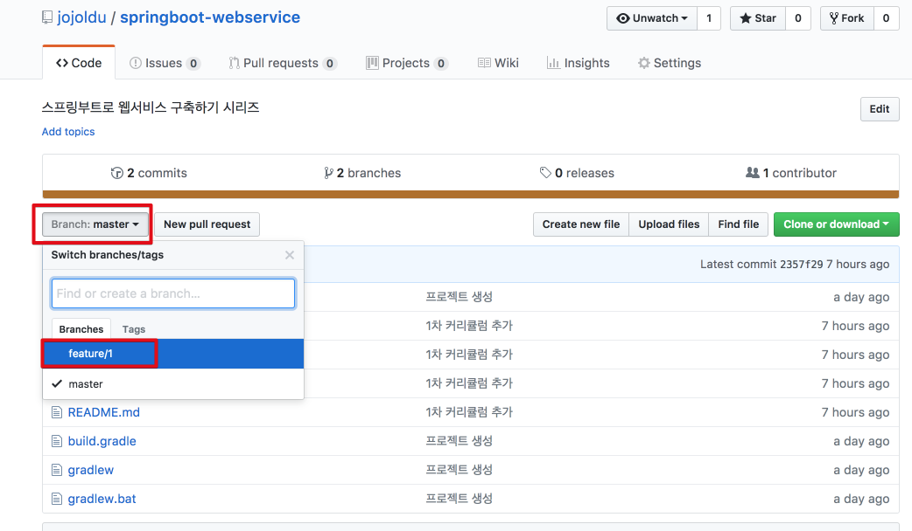

# SpringBoot로 웹서비스 개발하기

많은 웹 서비스 구축하기 강좌들이 Python, NodeJS, Ruby, PHP만 다루고 있습니다.  
반면 국내에서 가장 많이 사용하는 언어인 **Java로 웹서비스 구축강좌는 본적이 없습니다**.  
Java는 대부분 로컬에서 CRUD & localhost:8080으로 게시판 구축하기가 전부였습니다.  
그러다보니 웹 서비스를 시작하는 많은 분들이 Java가 아닌 스크립트 언어로만 진행하십니다.  
분명 국내 웹 환경이나 자료들이 Java & Spring이 많음에도 다른 스크립트 언어들로 시작하는 것은 이런 강좌가 없어서 그럴수 있다고 가정했습니다.  
  
그래서 Java & Spring으로 웹 서비스 구축하기 시리즈를 시작하게 되었습니다.  
도움이 되셨다면 블로그 사이사이에 있는 광고 한번씩 클릭해주시길!? 부탁드립니다.  
(도움이 진짜 많이 되었으면 더 많이 공유해주시고 클릭해주셔두 됩니닷!)  
  
### 개발환경

기본적으로 Git & Github을 써보신걸 가정하고 진행하겠습니다.  
만약 Git을 한번도 안써보셨다면, [생활코딩의 Git 강좌](https://opentutorials.org/course/1492)를 보고 시작하시는걸 추천드립니다.  
  
프로젝트 개발 환경은 다음과 같습니다.

* IDE : IntelliJ IDEA Ultimate
* Git Tools : Source Tree
* OS : Mac OS X
* SpringBoot 1.5.9
* Java8
* Gradle

글 사이사이 캡쳐들이 윈도우 & Eclipse 쓰시는 분들과 조금 차이가 있을수 있습니다.  
이점 감안 부탁드립니다.  

### 커리큘럼

큰 틀에선 아래 커리큘럼에 맞춰 진행합니다.  
각 커리큘럼의 코드는 브랜치로 관리합니다.  

(feature/1은 1과정의 코드가 있습니다.)  
  
1. [SpringBoot & Gradle & Github 프로젝트 생성하기](./tutorial/1_프로젝트생성.md)
2. [SpringBoot & JPA로 간단 API 만들기](./tutorial/2_게시판만들기.md)
3. SpringBoot & Handlebars로 화면 만들기
4. AWS EC2 & AWS RDS 운영 환경 구축
5. Google GSuite & AWS로 도메인, Email 할당 받기
6. Nginx & SSL 설치하기
7. AWS CodeDeploy & TravisCI 무중단 배포 구축하기
8. AWS ElastiCache로 세션공유하기
9. 기타 Tips

진행함에 따라 조금씩 변경이 있을수도 있습니다.  
(책이 아닌 블로그의 장점!?)  
내용을 수정하거나, 추가되거나, 삭제되거나 등이 발생할 수 있습니다.  
언제든지 변경할 수 있기 때문에, 문제를 발견하신 분들은 가감없이 댓글이나 PR을 부탁드리겠습니다.  
