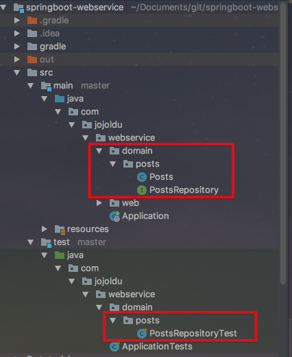
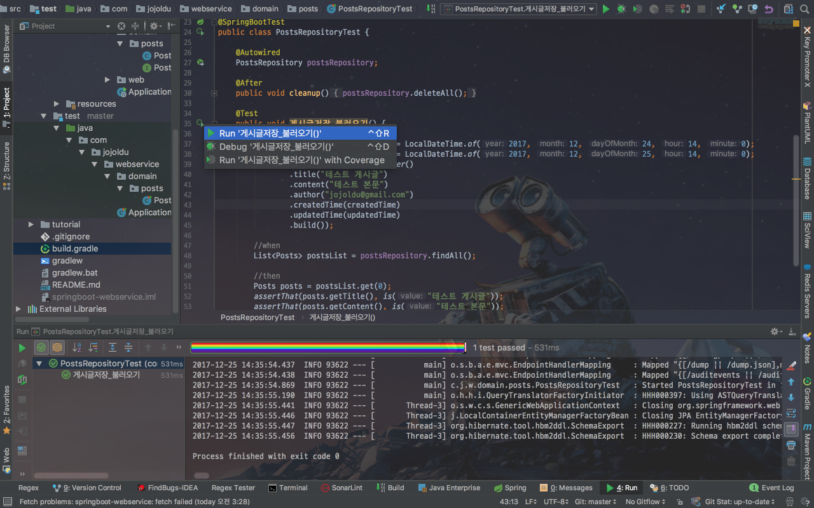
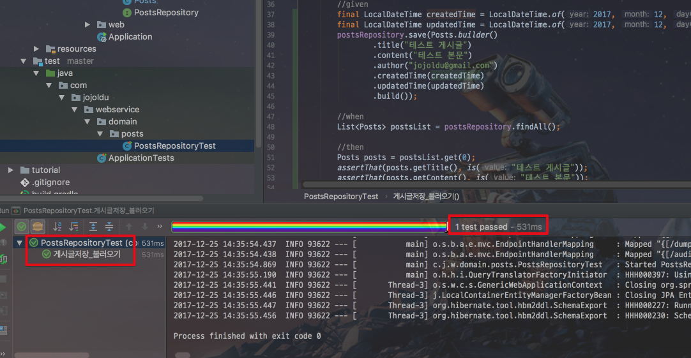
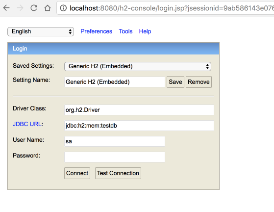
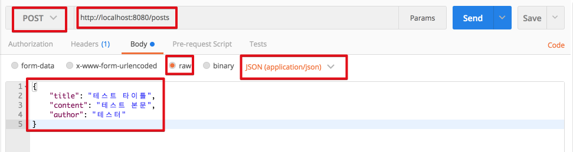
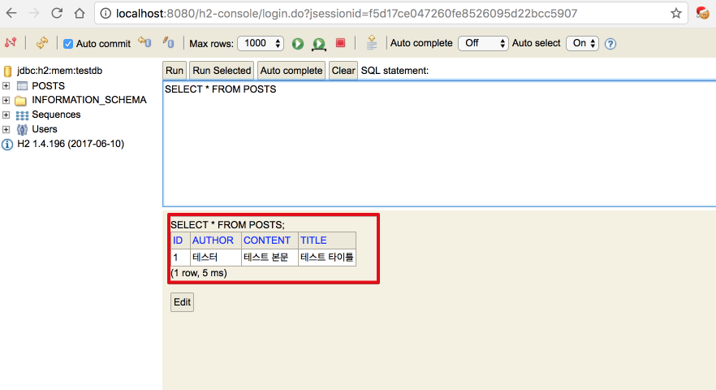
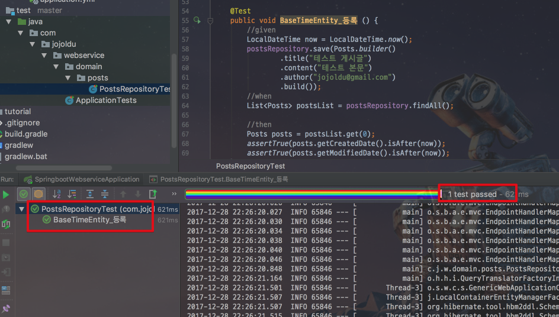

# 2. SpringBoot & JPA로 샘플 만들기 

이번 시간엔 SpringBoot & JPA로 간단한 API를 만들 예정입니다.  
(모든 코드는 [Github](https://github.com/jojoldu/springboot-webservice/tree/feature/2)에 있습니다.) 

> Tip)  
아직 SI 환경에선 Spring & MyBatis 를 많이 사용하지만, 쿠팡/우아한형제들/NHN Entertainment 등 자사 서비스를 개발하는 곳에선 SpringBoot & JPA를 많이 사용하고 있습니다.  
특히 기존 프로젝트 환경을 개편하시는 분들은 거의 위 스택으로 전환하려고 합니다.  
SpringBoot & JPA로 진행하시면 **진짜 집중해야할 비지니스 로직에만 집중**할수 있습니다.  
(Express, Django, Rails 못지않게 생산성이 좋습니다.)  
자사 서비스를 운영하는 회사에선 점점 더 많이 사용되고 있기 때문에 이런 회사로 가고자 하시는 분들은 이번 기회에 꼭! 시작해보셨으면 합니다.

첫번째 기능으로 간단한 API를 진행하겠습니다.  
  
## 2-1. 도메인 코드 만들기

src/main/java/com/jojoldu/webservice 패키지 아래에 domain 패키지를 생성합니다.



위 그림처럼 해당 패키지 아래에 Posts 클래스와 PostsRepository 인터페이스를 생성합니다.  
  
Posts.java

```java
@NoArgsConstructor(access = AccessLevel.PROTECTED)
@Getter
@Entity
public class Posts {

    @Id
    @GeneratedValue
    private Long id;

    @Column(length = 500, nullable = false)
    private String title;

    @Column(columnDefinition = "TEXT", nullable = false)
    private String content;

    private String author;

    @Builder
    public Posts(String title, String content, String author) {
        this.title = title;
        this.content = content;
        this.author = author;
    }
}

```

여기서 Posts 클래스는 실제 DB의 테이블과 매칭될 클래스이며 보통 **Entity클래스**라고도 합니다.  
JPA를 사용하시면 DB 데이터에 작업할 경우 실제 쿼리를 날리기 보다는, 이 Entity 클래스의 수정을 통해 작업합니다.  
  
Posts 클래스에는 JPA에서 제공하는 어노테이션들이 몇개 있습니다.  

* ```@Entity``` 
  * 테이블과 링크될 클래스임을 나타냅니다.
  * 언더스코어 네이밍(```_```)으로 이름을 매칭합니다.
    * ex) SalesManager.java -> sales_manager table
* ```@Id```
  * 해당 테이블의 PK 필드를 나타냅니다.
* ```@GeneratedValue```
  * PK의 생성 규칙을 나타냅니다.
  * 기본값은 AUTO 로, MySQL의 auto_increment와 같이 자동증가하는 정수형 값이 됩니다.
* ```@Column```
  * 테이블의 컬럼을 나타내면, 굳이 선언하지 않더라도 해당 클래스의 필드는 모두 컬럼이 됩니다.
  * 사용하는 이유는, 기본값 외에 추가로 변경이 필요한 옵션이 있을경우 사용합니다.
  * 문자열의 경우 VARCHAR(255)가 기본값인데, 사이즈를 500으로 늘리고 싶거나(ex: ```title```), 타입을 TEXT로 변경하고 싶거나(ex: ```content```) 등의 경우에 사용됩니다.

> Tip)  
웬만하면 Entity의 PK는 Long 타입의 Auto_increment를 추천합니다.  
(MySQL 기준으로 이렇게 하면 bigint 타입이 됩니다.)  
주민등록번호와 같은 비지니스상 유니크키나, 여러키를 조합한 복합키로 PK를 잡을 경우 난감한 상황이 종종 발생합니다.  
(1) FK를 맺을때 다른 테이블에서 복합키 전부를 갖고 있거나, 중간 테이블을 하나더 둬야하는 상황이 발생합니다.  
(2) 인덱스에 좋은 영향을 끼치지 못합니다.  
(3) 유니크한 조건이 변경될 경우 PK 전체를 수정해야하는 일이 발생합니다.  
주민등록번호, 복합키 등은 유니크키로 별도로 추가하시는것을 추천드립니다.   

위에서 소개드린 어노테이션 외에 몇개의 어노테이션들이 더 보입니다.  
(```@NoArgsConstructor```, ```@Getter```, ```@Builder```)  
  
이는 처음 프로젝트 생성시 추가했던 **Lombok 라이브러리의 어노테이션**들입니다.  
어노테이션 이름만 봐도 대략 기능을 예측할수 있습니다.  

* ```@NoArgsConstructor``` : 기본 생성자 자동 추가
  * ```access = AccessLevel.PROTECTED``` : 기본생성자의 접근 권한을 protected로 제한
    * 생성자로 ```protected Posts() {}```와 같은 효과
    * Entity 클래스를 **프로젝트 코드상에서 기본생성자로 생성하는 것은 막되**, **JPA에서 Entity 클래스를 생성하는것은 허용**하기 위해 추가 
* ```@Getter``` : 클래스내 모든 필드의 Getter 메소드를 자동생성
* ```@Builder``` : 해당 클래스의 빌더패턴 클래스를 생성
  * 생성자 상단에 선언시 생성자에 포함된 필드만 빌더에 포함

특히 서비스 구축단계에선 테이블 설계(여기선 Entity설계)가 빈번하게 변경되는데, 이때 Lombok의 어노테이션들은 코드 변경량을 최소화시켜주기 때문에 아주 **강력 추천**하는 라이브러리입니다.  
  
> Tip)  
Lombok은 의존성만 추가해선 IDE에서 바로 사용할수가 없기 때문에 각 IDE 환경에 맞게 Lombok 사용환경 구성이 필요합니다.  
(1) [Eclipse Lombok 설치](http://countryxide.tistory.com/16)  
(2) [IntelliJ Lombok 설치](http://blog.woniper.net/229)  
Lombok은 장점이 굉장히 많은 도구이지만, 조심해야할 부분들이 몇가지 있습니다.  
손권남님께서 정리하신 [Lombok 주의사항](http://kwonnam.pe.kr/wiki/java/lombok/pitfall)을 꼭 참고하시길 바랍니다.  
만약 이것들이 다 귀찮으시다면 직접 Getter와 생성자를 생성하셔도 무방합니다.  
다만 앞으로의 **모든 코드는 Lombok를 사용한것을 가정**하고 진행하기 때문에 코드가 조금 다를수 있다는점 유의바랍니다.  
  
Entity 클래스를 생성하실때, 주의하실것은 **무분별한 setter 메소드 생성**입니다.  
자바빈 규약을 생각하시면서 getter/setter를 무작정 생성하시는 분들이 계시는데요.  
이렇게 되면 해당 클래스의 인스턴스 값들이 **언제 어디서 변해야하는지 코드상으로 명확히 구분할수가 없어, 차후 기능변경시 정말 복잡**해집니다.  
해당 필드의 값 변경이 필요하면 **명확히 그 목적과 의도를 나타낼 수 있는 메소드**를 추가하셔야만 합니다.  
  
예를들어 주문 취소 메소드를 만든다고 가정하면 아래 코드로 비교해보시면 될것 같습니다.

```java

잘못된 사용
public class Order{
    public void setStatus(boolean status){
        this.status = status
    }
}

public void 주문서비스의_취소메소드 (){
   order.setStatus(false);
}

올바른 사용
public class Order{
    public void cancelOrder(){
        this.status = false;
    }
}
public void 주문서비스의_취소메소드 (){
   order.cancelOrder();
}
```

자 그러면 여기서 한가지 궁금한 점이 생길 수 있는데요.  
기본생성자도 ```AccessLevel.PROTECTED```로 막아놓고, **setter 메소드도 없는 이 상황에서 어떻게 값을 채워 DB에 insert 해야할까요?**  

> Tip  
빌더 패턴에 대한 소개와 예제는 [링크](http://using.tistory.com/71)를 참고하시면 좋습니다.  
  
기본적인 구조는 생성자를 통해 최종 값을 채운후 DB에 Insert 하는것이며, 값 변경이 필요한 경우 해당 이벤트에 맞는 public 메소드를 호출하여 변경하는 것을 전제로 합니다.  
여기서 생성자 대신에 ```@Builder```를 통해 제공되는 빌더 클래스를 사용합니다.  
생성자나 빌더나 **생성시점에 값을 채워주는 역할은 똑같습니다**.  
다만, 생성자의 경우 지금 **채워야할 필드가 무엇인지 명확히 지정할수가 없습니다**.  
예를 들어 아래와 같은 생성자가 있다면

```java

public Example(String a, String b){
    this.a = a;
    this.b = b;
}
```

개발자가 ```new Example(b,a)```처럼 a와 b의 위치를 변경 해도 실제로 코드를 실행하기전까진 전혀 문제를 찾을수가 없습니다.  
하지만 빌더를 사용하게 되면 아래와 같이

```java

Example.builder()
    .a(a)
    .b(b)
    .build();
```

**어느 필드에 어떤 값을 채워야 할지** 명확하게 인지할 수 있습니다.
이 부분은 실제로 코드로 보면 더 좋을것 같아 빠르게 다른 부분도 생성하겠습니다.  
  
PostsRepository.java

```java
public interface PostsRepository extends JpaRepository<Posts, Long>{
}
```

보통 ibatis/MyBatis 등에서 **Dao**라고 불리는 DB Layer 접근자입니다.  
JPA에선 Repository라고 부르며 **인터페이스**로 생성합니다.  
단순히 인터페이스를 생성후, ```JpaRepository<Entity클래스, PK타입>```를 상속하면 기본적인 CRUD 메소드가 자동생성 됩니다.  
특별히 **```@Repository```를 추가할 필요도 없습니다**.  
  
자 그럼 잘 작동되는지 간단하게 테스트 코드로 검증해보겠습니다.  

## 2-2. 테스트 코드 작성하기

위에서 작성된 코드가 잘 작동되는지 확인하기 위해 이번엔 src/**test**/java/com/jojoldu/webservice/domain 패키지에 PostsRepositoryTest 클래스를 생성하겠습니다.  

```java
import static org.hamcrest.CoreMatchers.is;
import static org.junit.Assert.assertThat;

@RunWith(SpringRunner.class)
@SpringBootTest
public class PostsRepositoryTest {

    @Autowired
    PostsRepository postsRepository;

    @After
    public void cleanup() {
        /** 
        이후 테스트 코드에 영향을 끼치지 않기 위해 
        테스트 메소드가 끝날때 마다 respository 전체 비우는 코드
        **/
        postsRepository.deleteAll();
    }

    @Test
    public void 게시글저장_불러오기() {
        //given
        postsRepository.save(Posts.builder()
                .title("테스트 게시글")
                .content("테스트 본문")
                .author("jojoldu@gmail.com")
                .build());

        //when
        List<Posts> postsList = postsRepository.findAll();

        //then
        Posts posts = postsList.get(0);
        assertThat(posts.getTitle(), is("테스트 게시글"));
        assertThat(posts.getContent(), is("테스트 본문"));
    }
}
```

위 코드는 JUnit 이란 테스트 프레임워크로 작성된 코드입니다.  
(Junit은 spring-boot-starter-test에 있기 때문에 별도로 build.gradle에 추가하실 필요가 없습니다.)  
JUnit을 통해 **어떤 값을 입력할 경우 어떤 결과가 반환되는지 검증**할수 있습니다.  
  
> Tip)  
JUnit이 처음이시면 자바지기 박재성님의 [JUnit 강좌 영상](https://www.youtube.com/watch?v=tyZMdwT3rIY)을 참고해보세요!

3개의 주석(```//given, //when, //then```)은 다음과 같은 내용을 나타냅니다. 

* given
  * 테스트 기반 환경을 구축하는 단계
  * 여기선 
  * ```@builder```의 사용법도 같이 확인
* when
  * 테스트 하고자 하는 행위 선언
  * 여기선 Posts가 DB에 insert 되는것을 확인하기 위함
* then
  * 테스트 결과 검증
  * 실제로 DB에 insert 되었는지 확인하기 위해 조회후, 입력된 값 확인

> Tip)  
given, when, then은 BDD(Behaviour-Driven Development)에서 사용하는 용어입니다.  
JUnit에선 이를 명시적으로 지원해주지 않아 주석으로 표현했습니다.  
전문 BDD 프레임워크로 Groovy기반의 Spock을 많이들 사용하고 있습니다.  
Spock에 대해 자세히 알고 싶으신 분들은 이전에 작성한 [블로그글](http://jojoldu.tistory.com/228)을 참고하시면 도움이 되실것 같습니다.

자 그럼 위 테스트코드를 한번 실행해보겠습니다.  
테스트 메소드인 ```게시글저장_불러오기```를 실행합니다.



테스트 코드의 결과는 아래와 같이 출력됩니다.



해당 테스트 코드가 성공적으로 통과했음을 확인할 수 있습니다!  

> Tip)  
DB가 설치가 안되어있는데 Repository를 사용할 수 있는 이유는, SpringBoot에서의 **테스트 코드는 메모리 DB인 H2를 기본적으로 사용**하기 때문입니다.  
테스트 코드를 실행하는 시점에 H2 DB를 실행시킵니다.  
테스트가 끝나면 H2 DB도 같이 종료됩니다.  

테스트 코드와 JPA를 처음 접하시는분들 입장에선 눈에 아무것도 보이지 않는데 **진짜 DB에 들어갔는지 안들어갔는지 어떻게 알수 있냐** 라고 하실 수 있습니다.  
항상 웹 어플리케이션 실행후, DB에 GUI 클라이언트로 접속해서 데이터를 확인하셨기 때문에 이런 방식이 생소하시기 때문인데요.  
이런 의문을 해결하기 위해 최대한 빠르게 어플리케이션 코드를 짜서 진짜 DB에 들어가는지 확인해보겠습니다.  
  
## 2-3. Controller & DTO 구현

좀전에 만든 WebRestController를 수정하겠습니다.

```java
@RestController
@AllArgsConstructor
public class WebRestController {

    private PostsRepository postsRepository;

    @GetMapping("/hello")
    public String hello() {
        return "HelloWorld";
    }

    @PostMapping("/posts")
    public void savePosts(@RequestBody PostsSaveRequestDto dto){
        postsRepository.save(dto.toEntity());
    }
}
```

보시면 postsRepository 필드에 ```@Autowired```가 없습니다.  
스프링프레임워크에선 Bean 을 주입받는 방식들이 아래와 같이 있는데요.  

* ```@Autowired```
* setter
* 생성자

이중 가장 권장하는 방식이 **생성자로 주입받는 방식**입니다.  
(```@Autowired```는 **비권장방식**입니다.)
즉, 생성자로 Bean 객체를 받도록 하면 ```@Autowired```와 동일한 효과를 볼 수 있다는 것입니다.  
  
그러면 위에서 생성자는 어디있을까요?  
바로 ```@AllArgsConstructor``` 에서 해결해줍니다.  
모든 필드를 인자값으로 하는 생성자를 Lombok의 ```@AllArgsConstructor```이 대신 생성해 준 것입니다.  
위 코드는 실제로는 아래와 같은 형태입니다.

```java
@RestController
public class WebRestController {

    private PostsRepository postsRepository;

    public WebRestController(PostsRepository postsRepository) {
        this.postsRepository = postsRepository;
    }

    ...
}
```

생성자를 직접 안쓰고 Lombok 어노테이션을 사용한 이유는 간단합니다.  
해당 클래스의 **의존성 관계가 변경될때마다 생성자 코드를 계속해서 수정하는 번거로움을 해결**하기 위함입니다.  
(Lombok 어노테이션이 있으면 해당 컨트롤러에 새로운 서비스를 추가하거나, 기존 컴포넌트를 제거하는 등이 발생해도 생성자 코드는 전혀 손대지 않아도 됩니다. 편리하죠?)  
  
자 이제는 Controller에서 사용할 DTO 클래스를 생성하겠습니다.

```java
@Getter
@Setter
@NoArgsConstructor
public class PostsSaveRequestDto {

    private String title;
    private String content;
    private String author;

    public Posts toEntity(){
        return Posts.builder()
                .title(title)
                .content(content)
                .author(author)
                .build();
    }
}
```

여기서 보면 위에서 얘기했던것과 상반되는 코드가 있습니다.  
바로 ```@Setter``` 입니다.  
Controller에서 ```@RequestBody```로 외부에서 데이터를 받는 경우엔 **기본생성자 + set메소드를 통해서만 값이 할당**됩니다.  
그래서 이때만 setter를 허용합니다.  
  
여기서 Entity 클래스와 거의 유사한 형태임에도 DTO 클래스를 추가로 생성했는데요.  
절대로 테이블과 매핑되는 **Entity 클래스를 Request/ Response 클래스로 사용해서는 안됩니다**.  
Entity 클래스는 가장 Core한 클래스라고 보시면 되는데요.  
수많은 서비스 클래스나 비지니스 로직들이 Entity 클래스를 기준으로 동작합니다.  
**Entity 클래스가 변경되면 여러 클래스에 영향**을 끼치게 되는 반면 Request와 Response용 DTO는 View를 위한 클래스라 정말 자주 변경이 필요합니다.  
View Layer와 DB Layer를 철저하게 역할 분리를 하는게 좋습니다.
실제로 Controller에서 결과값으로 여러 테이블을 조인해서 줘야할 경우가 빈번하기 때문에 Entity 클래스만으로 표현하기가 어려운 경우가 많습니다.  
꼭꼭 **Entity 클래스와 Controller에서 쓸 DTO는 분리**해서 사용하시길 바랍니다.  
  
## 2-4. Postman + 웹 콘솔로 검증

별도로 입력화면이 없기 때문에 [Postman](https://chrome.google.com/webstore/detail/postman/fhbjgbiflinjbdggehcddcbncdddomop)을 통해 Post로 데이터를 전송하여 검증하겠습니다.  
  
Local 환경에선 DB로 H2 를 사용하기 때문에 SpringBoot에서 **H2를 활성화**시키도록 옵션을 추가하겠습니다.  
src/main/resources 에 있는 application.properties를 **application.yml**로 변경후 아래와 같이 코드를 입력합니다.


```yml
spring:
  h2:
    console:
      enabled: true
```

> Tip)  
application.properties를 사용하셔도 무방합니다만, 굳이 yml로 변경한 이유는 properties에 비해 상대적으로 **유연한 구조**를 가졌기 때문입니다.  
yml은 상위 계층에 대한 표현, List 등을 완전하게 표현할수가 있습니다.  
최근의 많은 도구들이 yml 설정을 지원하기 때문에 이참에 시작해보시는 것을 추천드립니다.

application.yml 설정이 끝났다면 다시 Application.java를 실행시키고, 브라우저에서 **http://localhost:8080/h2-console**를 입력합니다.  



이렇게 H2 DB를 관리할 수 있는 웹 클라이언트에 접속할 수 있습니다.  
connect 버튼을 클릭하여 접속하신후, 조회 쿼리를 실행합니다.

```sql
SELECT * FROM POSTS; 
```
 


현재 전혀 데이터가 없는 것이 확인 되었습니다.  
자 그럼 포스트맨을 통해서 데이터를 전송해보겠습니다.



```json
{
	"title": "테스트 타이틀",
	"content": "테스트 본문",
	"author": "테스터"
}
```

Send버튼을 클릭하시고 다시 localhost:8080/h2-console을 확인해보시면!



DB에 정상적으로 데이터가 입력된 것을 확인할 수 있습니다!  
테스트 코드가 통과되니 실제로 어플리케이션을 실행시켜도 결과가 똑같음을 확인할 수 있었습니다.  
이제 좀더 테스트 코드를 신뢰할수 있겠죠?

## 2-5. 생성시간/수정시간 자동화 - JPA Auditing

보통 Entity에는 해당 데이터의 생성시간과 수정시간을 포함시킵니다.  
언제 만들어졌는지, 언제 수정되었는지 등은 차후 유지보수에 있어 굉장히 중요한 정보이기 때문입니다.  
그렇다보니 **매번 DB에 insert하기전, update 하기전에 날짜 데이터를 등록/수정 하는 코드가 여기저기** 들어가게 됩니다.  

```java

// 생성일 추가 코드 예제
public void savePosts(){
    ...
    posts.setCreateDate(new LocalDate());
    postsRepository.save(posts);
    ...
}
```

이런 단순하고 반복적인 코드가 모든 테이블과 서비스 메소드에 포함되어야 한다고 생각하면 어마어마하게 귀찮고 코드가 더러워지겠죠?  
그래서 이 문제를 해결하기 위해 JPA Auditing를 사용하겠습니다.  
  
### LocalDate 사용

여기서부터는 날짜 타입을 사용합니다.  
Java8 부터 LocalDate와 LocalDateTime이 등장했는데요.  
그간 Java의 기본 날짜 타입인 Date의 문제점을 제대로 고친 타입이라 Java8일 경우 무조건 써야한다고 생각하시면 됩니다.  

> Tip)  
Java8이 나오기전까진 JodaTime이라는 오픈소스를 사용해서 문제점들을 피했었고, Java8에선 LocalDate를 통해 해결했습니다.  
자세한 내용은 [Naver D2 - Java의 날짜와 시간 API](http://d2.naver.com/helloworld/645609) 를 참고하시면 좋습니다!

현재 SpringDataJpa 버전에선 LocalDate와 LocalDateTime이 Database 저장시 제대로 전환이 안되는 이슈가 있습니다.  
이 문제를 SpringDataJpa의 코어 모듈인 Hibernate core 5.2.10부터는 해결되었어서 이 부분을 교체해보겠습니다.  
  
build.gradle 파일에서 2줄의 코드를 추가합니다.

```groovy
buildscript {
    ...
	dependencies {
		...
        //추가
		classpath "io.spring.gradle:dependency-management-plugin:1.0.4.RELEASE" 
	}
}

apply plugin: 'java'
apply plugin: 'eclipse'
apply plugin: 'org.springframework.boot'

....

//Spring Boot Overriding
ext['hibernate.version'] = '5.2.11.Final' //추가

dependencies {
...
}
```

SpringDataJpa가 사용하는 Hibernate의 버전만 5.2.11로 변경해서 사용하겠다는 의존성 변경 코드입니다.  
이렇게 하면 LocalDate/LocalDateTime과 Database간 문제는 해결됩니다!  
이제 본격적으로 공용 생성일/수정일 코드를 작성하겠습니다.

### BaseTimeEntity 생성

src/main/java/com/jojoldu/webservice/domain에 아래와 같이 BaseTimeEntity 클래스를 생성하겠습니다.

```java
@Getter
@MappedSuperclass
@EntityListeners(AuditingEntityListener.class)
public abstract class BaseTimeEntity {

    @CreatedDate
    private LocalDateTime createdDate;

    @LastModifiedDate
    private LocalDateTime modifiedDate;

}
```


BaseTimeEntity클래스는 모든 Entity들의 상위 클래스가 되어 **Entity들의 createdDate, modifiedDate를 자동으로 관리**하는 역할입니다.  

* ```@MappedSuperclass```
  * JPA Entity 클래스들이 BaseTimeEntity을 상속할 경우 필드들(```createdDate```, ```modifiedDate```)도 컬럼으로 인식하도록 합니다.
* ```@@EntityListeners(AuditingEntityListener.class)```
  * BaseTimeEntity클래스에 Auditing 기능을 포함시킵니다.
* ```@CreatedDate```
  * Entity가 생성되어 저장될 때 시간이 자동 저장됩니다.
* ```@LastModifiedDate```
  * 조회한 Entity의 값을 변경할 때 시간이 자동 저장됩니다.

그리고 Posts클래스가 BaseTimeEntity를 상속받도록 변경합니다.

```java
...
public class Posts extends BaseTimeEntity {
    ...
}
```

마지막으로 JPA Auditing 어노테이션들을 모두 활성화 시킬수 있도록 Application 클래스에 활성화 어노테이션 하나를 추가하겠습니다.

```java
@EnableJpaAuditing // JPA Auditing 활성화
@SpringBootApplication
public class Application {

	public static void main(String[] args) {
		SpringApplication.run(Application.class, args);
	}
}
```

자 그러면 실제 코드는 완성이 되었습니다.  
기능이 잘 작동하는지 테스트 코드를 작성해보겠습니다.

### JPA Auditing 테스트 코드 작성하기

PostsRepositoryTest 클래스에 테스트 메소드를 하나더 추가하겠습니다.

```java
@RunWith(SpringRunner.class)
@SpringBootTest
public class PostsRepositoryTest {

    @Autowired
    PostsRepository postsRepository;

    @After
    public void cleanup() {
        postsRepository.deleteAll();
    }

    @Test
    public void 게시글저장_불러오기() {
        ...
    }

    @Test
    public void BaseTimeEntity_등록 () {
        //given
        LocalDateTime now = LocalDateTime.now();
        postsRepository.save(Posts.builder()
                .title("테스트 게시글")
                .content("테스트 본문")
                .author("jojoldu@gmail.com")
                .build());
        //when
        List<Posts> postsList = postsRepository.findAll();

        //then
        Posts posts = postsList.get(0);
        assertTrue(posts.getCreatedDate().isAfter(now));
        assertTrue(posts.getModifiedDate().isAfter(now));
    }
}
```

Posts를 저장한뒤, 해당 Posts에 createdDate와 modifiedDate이 있는지 확인해보는 코드입니다.  
이 테스트 코드를 실행시켜보시면!



테스트코드가 성공적으로 통과했습니다!  
  
마지막으로 실제 DB에도 날짜 데이터가 잘 들어갔는지 확인해보겠습니다.  
Application 클래스를 다시 실행시키신뒤 PostMan으로 데이터를 전송하겠습니다.  
그리고 h2 console에서 다시 데이터를 확인해보시면!


기존에 없던 created_date 와 modified_date가 값을 가진채로 추가된것을 확인할 수 있습니다!  
  
앞으로 추가될 Entity들은 더이상 등록일/수정일로 고민할 필요가 없겠죠?  
BaseTimeEntity만 상속받으면 자동으로 해결되기 때문입니다.  
  
SpringBoot를 해보신 분들이라면 쉬우셨을텐데 처음이신분들에겐 다소 장황하게 진행되었을것 같기도해서 걱정입니다.  
그래도 실제로 SpringBoot & JPA를 쓰는 회사에서 사용하는 방법들이니 직접 해보시면서 익혀보셨으면 합니다.  
  
다음 시간엔 View Template을 사용하여 화면을 만들어보겠습니다.  
긴글 끝까지 읽어주셔서 감사합니다^^