# 3. SpringBoot & Handlebars로 화면 만들기 

이번 시간엔 SpringBoot & Handlebars로 간단한 화면을 만들 예정입니다.  
(모든 코드는 [Github](https://github.com/jojoldu/springboot-webservice/tree/feature/3)에 있습니다.)  
  
Handlebars는 흔히 사용하시는 Freemarker, Velocity와 같은 서버 템플릿 엔진입니다.  
JSP는 서버 템플릿 역할만 하지 않기 때문에 JSP와 완전히 똑같은 역할을 한다고 볼순 없지만, 순수하게 **JSP를 View 용으로만 사용하실때는 똑같은 역할**이라고 보시면 됩니다.  
  
결국 URL 요청시, 파라미터와 상태에 맞춰 적절한 HTML 화면을 생성해 전달하는 역할을 하는것으로 보시면 됩니다.

> Tip)  
JSP, Freemarker, Velocity가 몇년동안 업데이트가 안되고 있어 사실상 SpringBoot에선 권장하지 않는 템플릿엔진입니다.  
(Freemarker는 프리뷰버전은 계속나오고 있는데 릴리즈버전이 2015년이 마지막입니다.)  
현재까지도 꾸준하게 업데이트 되고 있는 템플릿 엔진은 Thymeleaf, Handlebars 이며 이 중 하나를 선택하시면 됩니다.  
개인적으로는 Handlebars를 추천합니다.  
(Spring 진영에선 Thymeleaf를 밀고 있습니다.)  
(1) 문법이 다른 템플릿엔진보다 간단하고  
(2) 로직 코드를 사용할 수 없어 **View의 역할과 서버의 역할을 명확하게 제한**할 수 있으며  
(3) Handlebars.js와 Handlebars.java 2가지가 다 있어, 하나의 문법으로 클라이언트 템플릿/서버 템플릿을 모두 사용할 수 있습니다.  
개인적으로 **View 템플릿엔진은 View의 역할에만 충실**하면 된다고 생각합니다.  
너무 많은 기능을 제공하면 API와 View템플릿엔진, JS가 서로 로직을 나눠갖게 되어 유지보수하기가 굉장히 어렵습니다. 

## 3-1. Handlebars 연동

Handlebars는 아직 정식 SpringBoot starter 패키지가 존재하진 않지만, 많은 분들이 사용중이신 라이브러리인 [handlebars-spring-boot-starter](https://github.com/allegro/handlebars-spring-boot-starter)가 있어 이를 사용할 예정입니다.  
(정식 패키지에 포함시켜도 될텐데 SpringBoot에서 왜 안넣는지가 궁금하긴 하네요.)  
  
### 의존성 추가

build.gradle에 다음과 같이 의존성을 추가합니다.

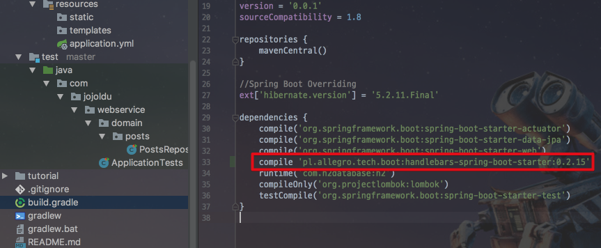

```groovy
compile 'pl.allegro.tech.boot:handlebars-spring-boot-starter:0.2.15'
```

의존성 하나만 추가하면 기존에 다른 스타터 패키지와 마찬가지로 추가 설정없이 설치가 끝입니다.  
다른 서버 템플릿 스타터 패키지와 마찬가지로 Handlebars도 기본 경로는 src/main/resources/templates가 됩니다.  
  
> Tip)  
스프링부트는 디폴트 설정이 굉장히 많습니다.  
기존의 스프링처럼 개인이 **하나하나 설정 코드를 다 작성할 필요가 없습니다**.  
스프링부트를 쓰면 많은 설정을 생략할 수 있습니다.  
영상을 참고하셔서 이런 점들은 숙지하시면 좋을것 같습니다.  
[권용근 - 스프링부트를 대하는 자세](https://www.youtube.com/watch?v=52i6gHnS1_g)

> Tip)  
혹시 IntelliJ를 사용중이시라면 아래와 같이 Handlebars 플러그인을 설치하면 문법체크 등과 같이 많은 지원을 받을 수 있습니다.

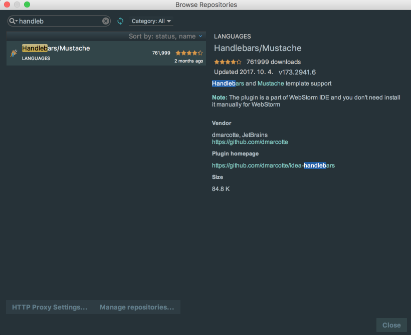

### 메인 페이지 생성

실제로 사용할 Handlebars 파일을 생성하겠습니다.   src/main/resources/templates에 **main.hbs** 파일을 생성합니다.

```html
<!DOCTYPE HTML>
<html>
<head>
    <title>스프링부트 웹서비스</title>
    <meta http-equiv="Content-Type" content="text/html; charset=UTF-8" />
    <meta name="viewport" content="width=device-width, initial-scale=1" />

</head>
<body>
    <h1>스프링부트로 시작하는 웹 서비스</h1>
</body>
</html>
```

메인페이지가 생성되었으니, URL요청시 main.hbs 파일을 호출할수 있도록 Controller을 만들겠습니다.  
web패키지 안에 webController를 만들겠습니다.  

```java
@Controller
@AllArgsConstructor
public class WebController {

    @GetMapping("/")
    public String main() {
        return "main";
    }
}
```

Spring 4.3 부터는 ```@RequestMapping```을 대체할 수 있는 여러 매핑 어노테이션이 추가 되었습니다.  
위에서 나온 ```@GetMapping```은 이전으로 보면 ```@RequestMapping(value="/", method = RequestMethod.GET)```과 동일합니다.  
  
handlebars-spring-boot-starter 덕분에 컨트롤러에서 문자열을 반환할때 앞의 path와 뒤의 파일 확장자는 자동으로 지정됩니다.  
(prefix: src/main/resources/templates, suffix: .hbs)  
즉 여기선 ```"main"```을 반환하니, src/main/resources/templates/main.hbs로 전환되어 View Resolver가 처리하게 됩니다.  
(ViewResolver는 URL 요청의 결과를 전달할 타입과 값을 지정하는 관리자 격으로 보시면 됩니다.)  
  
자 여기까지 코드가 완성되었으니, 잘 되는지 확인해봐야 합니다.  
이전 포스팅과 마찬가지로 이번에도 테스트 코드로 검증해보겠습니다.

### 메인 페이지 테스트 코드

src/**test**/java/com/jojoldu/webservice/web에 WebControllerTest 클래스를 생성하겠습니다.

```java
import static org.assertj.core.api.Assertions.assertThat;
import static org.springframework.boot.test.context.SpringBootTest.WebEnvironment.RANDOM_PORT;

@RunWith(SpringRunner.class)
@SpringBootTest(webEnvironment = RANDOM_PORT)
public class WebControllerTest {

    @Autowired
    private TestRestTemplate restTemplate;

    @Test
    public void 메인페이지_로딩() {
        //when
        String body = this.restTemplate.getForObject("/", String.class);

        //then
        assertThat(body).contains("스프링부트로 시작하는 웹 서비스");
    }
}
```

이번 테스트는 실제로 URL 호출시 제대로 페이지가 호출되는지에 대한 테스트입니다.  
HTML도 결국은 규칙이 있는 문자열입니다.  
TestRestTemplate를 통해 "/"로 호출했을때 **main.hbs에 포함된 코드들이 있는지 확인**하면 됩니다.  
  
전체 코드를 다 찾을 필요는 없으니, ```"스프링부트로 시작하는 웹 서비스"```문자열이 포함되어 있는지만 비교하겠습니다.  
  
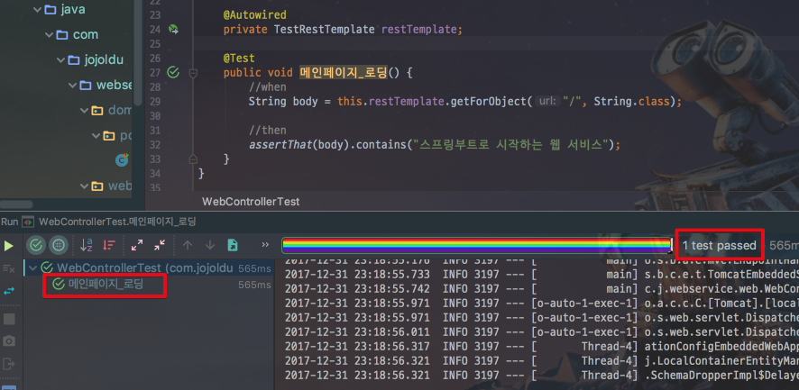

오! 테스트가 통과됐습니다.  
그럼 실제로 화면이 잘 나오는지 한번 보겠습니다.  
Application의 메인메소드를 실행하고 localhost:8080 으로 접속해보겠습니다.

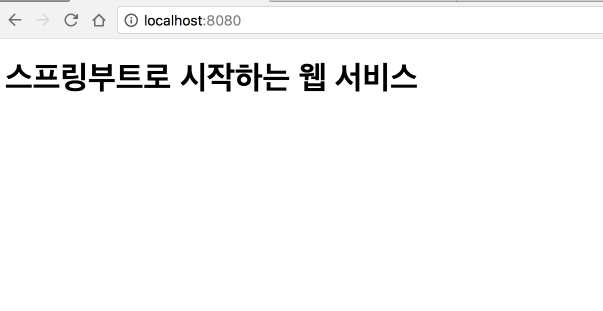

짠 정상적으로 화면이 노출되는게 확인 됩니다!  
기본적인 화면 생성이 완성되었으니, 좀더 다양한 주제로 가겠습니다.

[[ad]]

## 3-2. 게시글 등록 

이번에는 화면에서 게시글 등록 기능을 구현해보겠습니다.  

### service 메소드 구현

지금부터는 Service 메소드도 생성해서 트랜잭션까지 관리하겠습니다.  
  
src/main/java/com/jojoldu/webservice/ 아래에 service 패키지를 생성후, PostsService 클래스를 생성하겠습니다.

```java
@AllArgsConstructor
@Service
public class PostsService {
    private PostsRepository postsRepository;

    @Transactional
    public Long save(PostsSaveRequestDto dto){
        return postsRepository.save(dto.toEntity()).getId();
    }
}
```

호출한쪽에서 저장한 게시글의 id를 알수있도록 리턴 타입을 Long으로 두고, ```.getId()```를 반환값으로 합니다.  
Service 메소드는 Entity를 바로 받지 않고, [이전 포스팅](http://jojoldu.tistory.com/251) 에서 생성한 Save용 DTO인 PostsSaveRequestDto를 받아서 저장합니다.  

> Tip)  
Controller에서 Dto.toEntity를 통해서 바로 전달해도 되는데 굳이 Service에서 Dto를 받는 이유는 간단합니다.  
**Controller와 Service 의 역할을 분리**하기 위함입니다.  
비지니스 로직 & 트랜잭션 관리는 모두 Service에서 관리하고, View 와 연동되는 부분은 Controller에서 담당하도록 구성합니다.
  
> Tip) 트랜잭션?  
일반적으로 DB 데이터를 등록/수정/삭제 하는 Service 메소드는 ```@Transactional```를 필수적으로 가져갑니다.  
이 어노테이션이 하는 일은 간단합니다.  
메소드 내에서 Exception이 발생하면 해당 메소드에서 이루어진 모든 DB작업을 초기화 시킵니다.  
즉, save 메소드를 통해서 10개를 등록해야하는데 5번째에서 Exception이 발생하면 앞에 저장된 4개까지를 전부 롤백시켜버립니다.  
(정확히 얘기하면, **이미 넣은걸 롤백시키는건 아니며**, **모든 처리가 정상적으로 됐을때만 DB에 커밋**하며 그렇지 않은 경우엔 커밋하지 않는것입니다.)  
좀 더 상세한 설명이 필요하신 분들은 [트랜잭션이란 도대체 뭐란 말인가!](http://springmvc.egloos.com/495798)를 참고하세요!


Service 메소드가 생성되었으니, 잘 작동되는지 간단한 테스트 코드를 추가하겠습니다.  
src/**test**/java/com/jojoldu/webservice/service 패키지를 생성후, PostServiceTest 클래스를 생성합니다.  


```java
import static org.assertj.core.api.Assertions.assertThat;

@RunWith(SpringRunner.class)
@SpringBootTest
public class PostServiceTest {

    @Autowired
    private PostsService postsService;

    @Autowired
    private PostsRepository postsRepository;

    @After
    public void cleanup () {
        postsRepository.deleteAll();
    }

    @Test
    public void Dto데이터가_posts테이블에_저장된다 () {
        //given
        PostsSaveRequestDto dto = PostsSaveRequestDto.builder()
                .author("jojoldu@gmail.com")
                .content("테스트")
                .title("테스트 타이틀")
                .build();

        //when
        postsService.save(dto);

        //then
        Posts posts = postsRepository.findAll().get(0);
        assertThat(posts.getAuthor()).isEqualTo(dto.getAuthor());
        assertThat(posts.getContent()).isEqualTo(dto.getContent());
        assertThat(posts.getTitle()).isEqualTo(dto.getTitle());
    }
}

```

테스트 코드가 하는 내용은 간단합니다.  
Dto 클래스가 service.save 메소드에 전달되면, DB에 잘 저장되었는지 검증하는 것입니다.  
  
위 테스트 코드를 돌리실려면 PostsSaveRequestDto에 Builder 가 필요합니다.  
PostsSaveRequestDto에 Builder도 추가하겠습니다.

```java
...
public class PostsSaveRequestDto {

    private String title;

    ....

    @Builder
    public PostsSaveRequestDto(String title, String content, String author) {
        this.title = title;
        this.content = content;
        this.author = author;
    }

    public Posts toEntity(){
        ...
    }
}
```

자 그럼 테스트 코드를 실행해보겠습니다.


테스트 코드가 잘 통과했음을 알 수 있습니다.  
그럼 WebRestController의 save 메소드를 service의 save로 교체하겠습니다.

```java

@RestController
@AllArgsConstructor
public class WebRestController {

    private PostsService postsService;

    ...

    @PostMapping("/posts")
    public Long savePosts(@RequestBody PostsSaveRequestDto dto){
        return postsService.save(dto);
    }
}
```

여기까지 하시면 Java 코드는 완성된 것입니다.  
Handlebars로 입력 화면을 생성해보겠습니다.

### 입력화면

백엔드 개발자가 CSS를 전부 구성하기엔 무리가 있습니다.  
그래서 오픈소스인 [부트스트랩](https://getbootstrap.com/)을 활용하겠습니다.  

> Tip)  
화면을 만드는 상세한 부분은 [인프런](https://www.inflearn.com/), [코드스쿼드](http://codesquad.kr/page/masters.html) 등을 통해서 습득 하시면 될것 같습니다.  
  
부트스트랩, jQuery 등 프론트엔드 라이브러리를 사용할 수 있는 방법은 크게 2가지가 있습니다.  
하나는 외부 CDN을 사용하는 것이고, 다른 하나는 직접 라이브러리를 받아서 사용하는 방법입니다.  
(npm/bower + grunt/gulp/webpack 등을 통한 방법도 후자에 속한다고 보시면 됩니다.)  
  
CDN을 통한 방법이란 아래와 같이

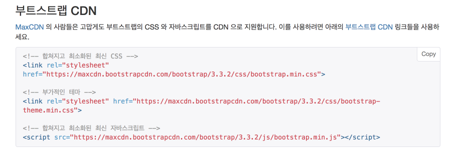

외부 서버를 통해 라이브러리를 받는 방식을 얘기합니다.  
본인의 프로젝트에서 직접 다운받아 사용할 필요도 없고, 사용방법도 HTML/JSP/Handlebars에 코드만 한줄 추가하면 되니 굉장히 간단합니다.  
하지만 이 방법을 실제 서비스에서는 잘 사용하지 않습니다.  
결국은 외부 서비스에 우리 서비스가 의존하게 되버려서, **CDN을 서비스하는 곳에 문제가 생기면 덩달아 같이 문제**가 생기기 때문입니다.  
  
자 그래서 저희가 사용할 2개의 프론트엔드 라이브러리를 다운받겠습니다. 

* [bootstrap](https://getbootstrap.com/)
  * 우측 상단의 Download를 클릭해 4.0 버전을 받습니다.
  * dist 폴더 아래에 있는 css폴더에서 bootstrap.min.css를 src/main/resources/static/**css/lib**로 복사합니다.
  * 마찬가지로 dist 폴더 아래에 있는 bootstrap.min.js를 src/main/resources/static/**js/lib**로 복사합니다.

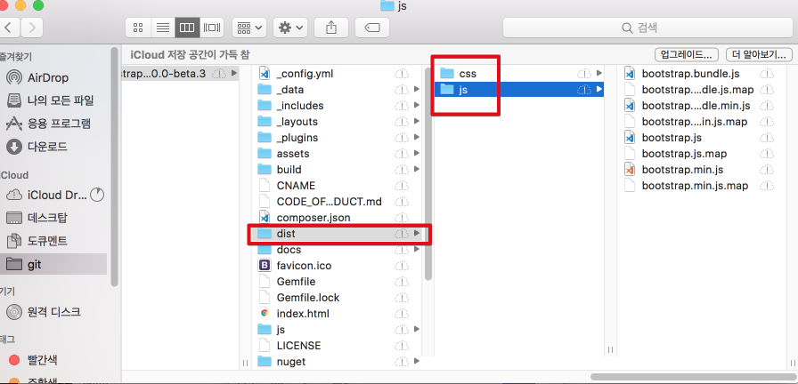

(bootstrap의 압축을 풀고 나온 dist 폴더에서 css 아래의 )
* [jQuery](https://jquery.com/download/)
  * ```Download the compressed, production jQuery 3.2.1``` 을 클릭해 다운받습니다.
  * jquery-3.2.1.min.js -> jquery.min.js 로 이름을 변경
  * src/main/resources/static/**js/lib** 로 복사합니다.

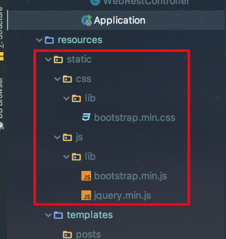

파일을 다 복사하셨으면 main.hbs 파일에 아래와 같이 라이브러리를 추가합니다.

```html
<!DOCTYPE HTML>
<html>
<head>
    <title>스프링부트 웹서비스</title>
    ...

    <!--부트스트랩 css 추가-->
    <link rel="stylesheet" href="/css/lib/bootstrap.min.css">
</head>
<body>
    ...

    <!--부트스트랩 js, jquery 추가-->
    <script src="/js/lib/jquery.min.js"></script>
    <script src="/js/lib/bootstrap.min.js"></script>
</body>
</html>
```

css와 js 호출 주소를 보면 ```/```로 바로 시작하는데요.  
SpringBoot는 기본적으로 src/main/resources/static은 URL에서 ```/``` 로 지정됩니다.  
그래서 src/main/resources/static/js/~~, src/main/resources/static/css/~~ 등은 URL로 호출시엔 도메인/js/~~, 도메인/css/~~ 로 호출할 수 있습니다.  
  
여기서 css와 js의 위치가 서로 다릅니다.  
css는 ```<head>```에, js는 ```<body>``` 최하단에 두었습니다.  
이렇게 하는 이유는 **페이지 로딩속도를 높이기 위함**입니다.  
  
HTML은 최상단에서부터 코드가 실행되기 때문에 **head가 다 실행되고서야 body가 실행**됩니다.  
즉, head가 다 불러지지 않으면 사용자 쪽에선 백지 화면만 노출됩니다.  
특히 js의 용량이 크면 클수록 body 부분의 실행이 늦어지기 때문에 js는 **body 하단에 두어 화면이 다 그려진 뒤에 호출하는것**이 좋습니다.  
  
반면 css는 화면을 그리는 역할을 하기 때문에 head에서 불러오는것이 좋습니다.  
  
추가로, bootstrap.js의 경우 jquery가 꼭 있어야만 하기 때문에 bootstrap보다 먼저 호출되도록 코드를 작성했습니다.  
> Tip)  
보통 위와 같은 상황을 **bootstrap.js가 jquery에 의존**한다고 합니다.  

라이브러리는 다 추가 되었으니, 입력 화면을 만들겠습니다.  
위와 똑같이 main.hbs에 추가하겠습니다.

```html
<!DOCTYPE HTML>
<html>
<head>
    <title>스프링부트 웹서비스</title>
    <meta http-equiv="Content-Type" content="text/html; charset=UTF-8" />
    <meta name="viewport" content="width=device-width, initial-scale=1" />

    <!--부트스트랩 css 추가-->
    <link rel="stylesheet" href="/css/lib/bootstrap.min.css">
</head>
<body>
    <h1>스프링부트로 시작하는 웹 서비스</h1>

    <div class="col-md-12">
        <button type="button" class="btn btn-primary" data-toggle="modal" data-target="#savePostsModal">글 등록</button>
    </div>

    <div class="modal fade" id="savePostsModal" tabindex="-1" role="dialog" aria-labelledby="savePostsLabel" aria-hidden="true">
        <div class="modal-dialog" role="document">
            <div class="modal-content">
                <div class="modal-header">
                    <h5 class="modal-title" id="savePostsLabel">게시글 등록</h5>
                    <button type="button" class="close" data-dismiss="modal" aria-label="Close">
                        <span aria-hidden="true">&times;</span>
                    </button>
                </div>
                <div class="modal-body">
                    <form>
                        <div class="form-group">
                            <label for="title">제목</label>
                            <input type="text" class="form-control" id="title" placeholder="제목을 입력하세요">
                        </div>
                        <div class="form-group">
                            <label for="author"> 작성자 </label>
                            <input type="text" class="form-control" id="author" placeholder="작성자를 입력하세요">
                        </div>
                        <div class="form-group">
                            <label for="content"> 내용 </label>
                            <textarea class="form-control" id="content" placeholder="내용을 입력하세요"></textarea>
                        </div>
                    </form>
                </div>
                <div class="modal-footer">
                    <button type="button" class="btn btn-secondary" data-dismiss="modal">취소</button>
                    <button type="button" class="btn btn-primary" id="btn-save">등록</button>
                </div>
            </div>
        </div>
    </div>

    <!--부트스트랩 js, jquery 추가-->
    <script src="/js/lib/jquery.min.js"></script>
    <script src="/js/lib/bootstrap.min.js"></script>
</body>
</html>
```

자 여기까지 하시면 UI 부분이 완성되었습니다.  
프로젝트를 실행시키시고, localhost:8080으로 접근해보겠습니다.  

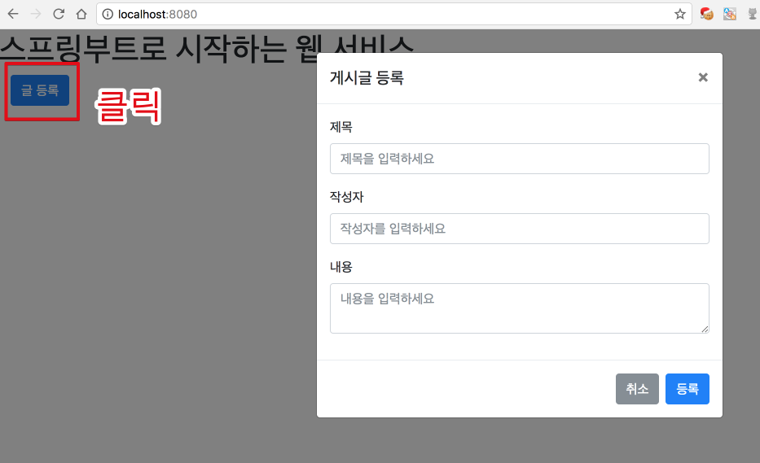

글 등록이라고 되어있는 버튼을 클릭하시면 입력 화면의 Modal이 등장합니다.  
Modal 화면의 등록 버튼은 아직 기능이 없습니다.  
(작성한 JS가 전혀 없기 때문입니다.)  
  
그래서 static/js 아래에 app 디렉토리를 생성후, main.js를 만들겠습니다.

```js
var main = {
    init : function () {
        var _this = this;
        $('#btn-save').on('click', function () {
            _this.save();
        });
    },
    save : function () {
        var data = {
            title: $('#title').val(),
            author: $('#author').val(),
            content: $('#content').val()
        };

        $.ajax({
            type: 'POST',
            url: '/posts',
            dataType: 'json',
            contentType:'application/json; charset=utf-8',
            data: JSON.stringify(data)
        }).done(function() {
            alert('글이 등록되었습니다.');
            location.reload();
        }).fail(function (error) {
            alert(error);
        });
    }

};

main.init();
```

JS 첫 문장에 ```var main = {...}```를 선언했습니다.  
굳이 ```main```이라는 변수의 속성으로 function을 추가한 이유는 뭘까요?  
예를 들어 보겠습니다.  
main.js가 아래와 같이 function을 작성한 상황에서

```js
    var init = function () {
        ....
    };

    var save = function () {
        ...
    };

    init();
```

main.hbs에서 a.js가 추가 된다고 가정하겠습니다.  
여기서 a.js가 init, save function이 없을땐 괜찮은데, a.js도 a.js만의 init function과 save function이 있다면 어떻게 될까요?  
  
브라우저의 scope는 공용으로 쓰이기 때문에 **나중에 불려진 js의 init, save가 먼저 불려진 js의 function을 덮어쓰게** 됩니다.  
  
이런 문제를 피하려고 main.js만의 변수,function 영역으로 ```var main```이란 객체 안에서 function을 선언합니다.  
이렇게 되면 main 객체 안에서만 이름이 유효하기 때문에 다른 JS와 겹칠 위험이 사라집니다.  
  
> Tip)  
프론트엔드의 이런 의존성관리, scope관리 등등의 문제들 때문에 최근에는 JS 개발환경이 급변했습니다.  
Angular, React등은 이미 이런 기능을 프레임워크 레벨에서 지원하고 있습니다.  
IE 대응으로 Angular, React를 사용 못하는 상황이라면, 이전에 포스팅한 [IE 7/8에서 모던하게 JS 개발하기 시리즈](http://jojoldu.tistory.com/44)를 참고하시면 도움 되실것 같습니다.

작성한 main.js를 main.hbs에 추가하겠습니다.  

```html
    <!--부트스트랩 js, jquery 추가-->
    <script src="/js/lib/jquery.min.js"></script>
    <script src="/js/lib/bootstrap.min.js"></script>

    <!--custom js 추가-->
    <script src="/js/app/main.js"></script>

</body>
```

이제 완성되었습니다!  
프로젝트를 다시 실행시키시고 localhost:8080으로 접속해보겠습니다.  
아래와 같이 값을 입력하여 등록을 진행합니다.

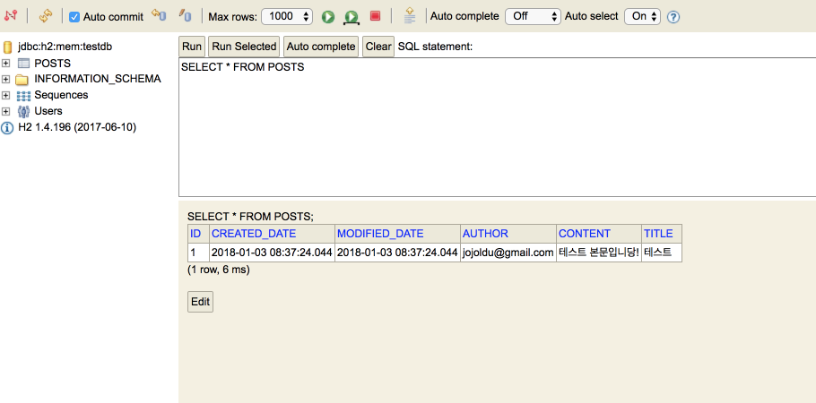

localhost:8080/h2-console에 접속하셔서 실제로 DB에 데이터가 들어갔는지 확인해보시면!


데이터가 잘 들어갔는게 확인됩니다!

[[ad]]

## 3-3. 게시글 목록

이번에는 게시글 목록 출력 기능을 만들겠습니다.

### 목록 출력

실제 코드를 작성하기 전에!  
한가지 추가작업을 진행하겠습니다.  
현재 저희가 사용중인 로컬 DB는 H2입니다.  
H2 DB는 메모리 DB인지라 프로젝트를 실행할때마다 스키마가 새로 생성되어 테이블 구조 변경시 일일이 ```alter table```과 같이 수정할 필요가 없습니다.  
또한, 항상 테이블을 초기화하기 때문에 깨끗한 상태로 로컬 개발을 진행할수있다는 장점도 있습니다.  
하지만 이로 인해, 프로젝트 코드를 수정하고 다시 실행시키면 **이전에 저장해놓은 데이터가 초기화**되버립니다.  
  
게시글 목록의 UI가 잘 나오는지 확인/수정하는 과정에서 **수동 데이터 입력 과정을 제외하기 위한 설정** 작업을 진행하겠습니다.  
resources 아래에 아래와 같이 data-h2.sql 파일을 생성합니다.

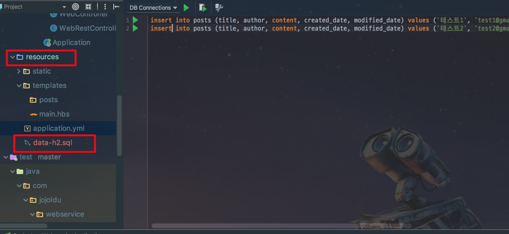

```sql
insert into posts (title, author, content, created_date, modified_date) values ('테스트1', 'test1@gmail.com', '테스트1의 본문', now(), now());
insert into posts (title, author, content, created_date, modified_date) values ('테스트2', 'test2@gmail.com', '테스트2의 본문', now(), now());
```

그리고 위 insert sql파일을 프로젝트 실행시에 자동으로 수행되도록 설정을 추가하겠습니다.  
application.yml의 코드를 아래와 같이 변경합니다.

```yml
spring:
  profiles:
    active: local # 기본 환경 선택

# local 환경
---
spring:
  profiles: local
  datasource:
    data: classpath:data-h2.sql # 시작할때 실행시킬 script
  jpa:
    show-sql: true
    hibernate:
      ddl-auto: create-drop
  h2:
    console:
      enabled: true
```

코드가 대폭 변경되었습니다.  
spring.profile 옵션이 추가되었는데요.  
이 옵션은 특별히 **어플리케이션 실행시 파라미터로 넘어온게 없으면 active 값**을 보게됩니다.  
운영 환경에선 real 혹은 production 등과 같은 profile을 보도록 jar 실행시점에 파라미터를 변경합니다.  
(이 부분은 앞으로 배포 환경 구축시에 자세히 설명할 예정이니, 대충 그렇구나 정도로만 보시면 됩니다.)  
local profile에선 data-h2.sql을 초기 데이터 실행 스크립트로 지정하였습니다.  
그외 환경에선 해당 스크립트가 실행되지 않기 위해 local에 직접 등록한 것입니다.  

> Tip)  
application.yml 에서 --- 를 기준으로 상단은 공통 영역이며, 하단이 각 profile의 설정 영역입니다.  
공통영역의 값은 각 profile환경에 동일한 설정이 있으면 무시되고, 없으면 공통영역의 설정값이 사용됩니다.  
그렇다보니 **공통영역에 설정값을 넣는것에 굉장히 주의**가 필요합니다.  
만약 공통영역에 ```jpa.hibernate.ddl-auto:create-drop```가 있고 운영 profile에 해당 설정값이 없다면 **운영환경에서 배포시 모든 테이블이 drop -> create** 됩니다.  
이때문에 datasource, table 등과 같은 옵션들은 공통영역엔 두지 않고 각 profile마다 별도로 두는것을 추천합니다.

설정이 다 되셨으면 프로젝트를 새로 실행시키신 뒤에 localhost:8080/h2-console에서 데이터가 있는지 확인하겠습니다.

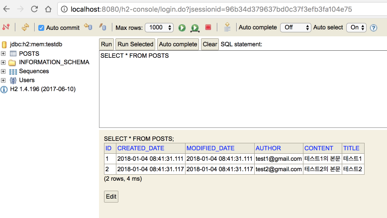

data-h2.sql에 있던 insert쿼리가 잘 수행된 것이 확인됩니다.  
자 그럼 실제 목록 출력에 관한 코드를 작성하겠습니다.  
  
먼저 main.hbs의 UI를 변경하겠습니다.  

```html
<!DOCTYPE HTML>
<html>
<head>
    <title>스프링부트 웹서비스</title>
    <meta http-equiv="Content-Type" content="text/html; charset=UTF-8" />
    <meta name="viewport" content="width=device-width, initial-scale=1" />

    <!--부트스트랩 css 추가-->
    <link rel="stylesheet" href="/css/lib/bootstrap.min.css">
</head>
<body>
    <h1>스프링부트로 시작하는 웹 서비스</h1>
    <div class="col-md-12">
        <button type="button" class="btn btn-primary" data-toggle="modal" data-target="#savePostsModal">글 등록</button>
        <br/>
        <br/>
        <!-- 목록 출력 영역 -->
        <table class="table table-horizontal table-bordered">
            <thead class="thead-strong">
                <tr>
                    <th>게시글번호</th>
                    <th>제목</th>
                    <th>작성자</th>
                    <th>최종수정일</th>
                </tr>
            </thead>
            <tbody id="tbody">
            {{#each posts}}
                <tr>
                    <td>{{id}}</td>
                    <td>{{title}}</td>
                    <td>{{author}}</td>
                    <td>{{modifiedDate}}</td>
                </tr>
            {{/each}}
            </tbody>
        </table>
    </div>

    <!-- Modal 영역 -->
    <div class="modal fade" id="savePostsModal" tabindex="-1" role="dialog" aria-labelledby="savePostsLabel" aria-hidden="true">
        <div class="modal-dialog" role="document">
            <div class="modal-content">
                <div class="modal-header">
                    <h5 class="modal-title" id="savePostsLabel">게시글 등록</h5>
                    <button type="button" class="close" data-dismiss="modal" aria-label="Close">
                        <span aria-hidden="true">&times;</span>
                    </button>
                </div>
                <div class="modal-body">
                    <form>
                        <div class="form-group">
                            <label for="title">제목</label>
                            <input type="text" class="form-control" id="title" placeholder="제목을 입력하세요">
                        </div>
                        <div class="form-group">
                            <label for="author"> 작성자 </label>
                            <input type="text" class="form-control" id="author" placeholder="작성자를 입력하세요">
                        </div>
                        <div class="form-group">
                            <label for="content"> 내용 </label>
                            <textarea class="form-control" id="content" placeholder="내용을 입력하세요"></textarea>
                        </div>
                    </form>
                </div>
                <div class="modal-footer">
                    <button type="button" class="btn btn-secondary" data-dismiss="modal">취소</button>
                    <button type="button" class="btn btn-primary" id="btn-save">등록</button>
                </div>
            </div>
        </div>
    </div>

    <!--부트스트랩 js, jquery 추가-->
    <script src="/js/lib/jquery.min.js"></script>
    <script src="/js/lib/bootstrap.min.js"></script>

    <!--custom js 추가-->
    <script src="/js/app/main.js"></script>

</body>
</html>
```

handlebars 문법은 특별한게 없습니다.  
 ```{{#each posts}}```는 posts라는 리스트를 순회하는 하나씩 꺼내 각각의 필드값을 채워서 테이블에 출력시킵니다.  
  
그럼 Controller, Service, Repository 코드를 작성하겠습니다.  
먼저 Repository부터,  
기존에 있던 PostsRepository 인터페이스에 쿼리가 추가됩니다.

```java
public interface PostsRepository extends JpaRepository<Posts, Long>{

    @Query("SELECT p " +
            "FROM Posts p " +
            "ORDER BY p.id DESC")
    Stream<Posts> findAllDesc();
}
```

실제로 위 코드는 SpringDataJpa에서 제공하는 기본 메소드만으로 해결할 수 있는데요.  
굳이 ```@Query```를 쓴 이유는, SpringDataJpa에서 제공하지 않는 메소드는 위처럼 쿼리로 작성해도 되는것음 보여주기 위함입니다.  

> Tip)  
규모가 있는 프로젝트에서의 데이터 조회는 FK의 조인, 복잡한 조건등으로 인해 이런 Entity 클래스만으로 처리하기 어려워 **조회용 프레임워크를 추가로 사용**합니다.  
대표적 예로 querydsl, jooq, MyBatis 등이 있습니다.  
조회는 위 3가지 프레임워크중 하나를 통해 조회하고, 등록/수정/삭제 등은 SpringDataJpa를 통해 진행합니다.  
(개인적으로는 querydsl를 강추합니다.)  
JPA, querydsl에 대한 더 자세한 내용은 [김영한님의 자바 ORM 표준 JPA 프로그래밍](http://www.yes24.com/24/goods/19040233) 을 참고하시면 아주 좋습니다.

Repository 다음으로 PostsService 코드를 변경하겠습니다.  

```java

@AllArgsConstructor
@Service
public class PostsService {
    private PostsRepository postsRepository;

    ...

    @Transactional(readOnly = true)
    public List<PostsMainResponseDto> findAllDesc() {
        return postsRepository.findAllDesc()
                .map(PostsMainResponseDto::new)
                .collect(Collectors.toList());
    }
}

```

findAllDesc 메소드의 트랜잭션 어노테이션(```@Transactional```)에 옵션이 하나 추가되었습니다.  
옵션(```readOnly = true```)을 주면 트랜잭션 범위는 유지하되, **조회 기능만 남겨두어 조회 속도가 개선**되기 때문에 특별히 등록/수정/삭제 기능이 없는 메소드에선 사용하시는걸 추천드립니다.  
메소드 내부의 코드에선 람다식을 모르시면 조금 생소한 코드가 있으실텐데요.  

 ```.map(PostsMainResponseDto::new)```는 실제로는 ```.map(posts -> new PostsMainResponseDto(posts))```와 같습니다.  
repository 결과로 넘어온 Posts의 Stream을 map을 통해 PostsMainResponseDto로 변환 -> List로 반환하는 메소드입니다.  
  
아직 PostsMainResponseDto 클래스가 없기 때문에 이 클래스 역시 생성합니다.  
위치는 dto패키지입니다.

```java

@Getter
public class PostsMainResponseDto {
    private Long id;
    private String title;
    private String author;
    private String modifiedDate;

    public PostsMainResponseDto(Posts entity) {
        id = entity.getId();
        title = entity.getTitle();
        author = entity.getAuthor();
        modifiedDate = toStringDateTime(entity.getModifiedDate());
    }

    /**
     * Java 8 버전
     */
    private String toStringDateTime(LocalDateTime localDateTime){
        DateTimeFormatter formatter = DateTimeFormatter.ofPattern("yyyy-MM-dd HH:mm:ss");
        return Optional.ofNullable(localDateTime)
                .map(formatter::format)
                .orElse("");
    }

    /**
     * Java 7 버전
     */
    private String toStringDateTimeByJava7(LocalDateTime localDateTime){
        if(localDateTime == null){
            return "";
        }

        DateTimeFormatter formatter = DateTimeFormatter.ofPattern("yyyy-MM-dd HH:mm:ss");
        return formatter.format(localDateTime);
    }
}

```

modifiedDate는 LocalDate를 하지 않고, String을 사용하였습니다.  
**View영역에선 LocalDateTime 타입**을 모르기 때문에 인식할수 있도록 toStringDateTime을 통해 문자열로 날짜형식을 변경해서 등록하였습니다.  
(Java8이 생소하신 분들이 계실것 같아 Java7코드도 아래에 추가하였습니다.)  


> Tip)  
Entity가 ```toDto```와 같은 메소드로 dto를 반환하면 되지 않나? 라고 의문이 드실수 있습니다.  
그렇게 하시면 절대 안됩니다.  
**DTO는 Entity를 사용해도 되지만, Entity는 DTO에 대해 전혀 모르게 코드를 구성**해야합니다.  
Entity는 말 그대로 가장 core한 클래스인 반면, DTO는 View 혹은 외부 요청에 관련 있는 클래스입니다.  
Entity가 DTO를 사용하게 되면, 그때부터 View/외부요청에 따라 DTO뿐만 아니라 Entity까지 변경이 필요하게 됩니다.  
또한, 다른 DTO도 필요하다고 하면 다시 Entity에 ```toDto2```와 같은 메소드가 추가되는데, 모든 변화에 맞춰 Entity 변경이 필요하게 됩니다.  
프로젝트 규모가 커져 프로젝트를 분리해야할때도 Entity가 DTO를 의존하고 있으면 분리하기가 굉장히 어렵기 때문에 DTO가 Entity에 의존하도록 코드를 꼭꼭 작성하시길 바랍니다.

마지막으로 Controller를 변경하겠습니다.  
기존에 생성해둔 WebController 클래스를 아래와 같이 변경합니다.

```java
@Controller
@AllArgsConstructor
public class WebController {

    private PostsService postsService;

    @GetMapping("/")
    public String main(Model model) {
        model.addAttribute("posts", postsService.findAllDesc());
        return "main";
    }
}
```

> Tip)  
목록 출력에 사용된 Repository와 Service의 테스트 코드를 작성해보시길 추천드립니다.  
등록된 데이터가 역순으로 잘 정렬되서 노출되는지로 검증하시면 되겠죠?

자 코드가 모두 완성되었으니 한번 프로젝트를 재실행하겠습니다.  
브라우저로 접속해보시면!!

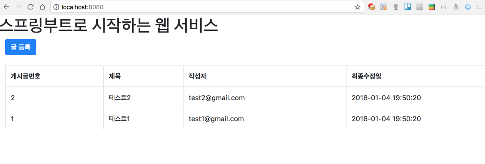

짠! 목록과 입력 기능이 완성된 화면이 노출됩니다.  
글 등록 기능을 이용해서 값을 더 추가하시면서 테스트 해보시는것도 좋습니다!  
  
## 마무리

여기까지 간단한 게시판 기능을 완성하였습니다.  
이 시리즈는 CRUD 전체 기능을 완성하는 시리즈가 아닌, 웹 서비스 구축 시리즈이니, 게시판 코드 작성은 여기까지가 끝입니다.  

> Tip)  
스프링부트 CRUD 게시판 기능을 좀 더 추가하고 싶으신 분들은 [박재성님의 SpringBoot & JPA로 질문/답변 게시판 만들기](https://www.youtube.com/watch?v=JUKehW-c484&list=PLqaSEyuwXkSppQAjwjXZgKkjWbFoUdNXC), [밀키님의 블로그 만들기](http://millky.com/@origoni/post/1100?language=ko_kr)를 참고하시길 추천드립니다.  

다음 시간부터는 AWS 서버 구축, 배포환경 구축, 도메인 등록 등을 진행하겠습니다.  
긴 글 끝까지 읽어주셔서 감사합니다!

