# 4. AWS 운영환경 구축하기

이번 시간엔 SpringBoot를 운영할 AWS 환경을 구축하겠습니다.
(모든 코드는 [Github](https://github.com/jojoldu/springboot-webservice/tree/feature/4)에 있습니다.)  

> Tip)  
운영 서버는 크게 클라우드 서비스(AWS, Azure 등) 과 호스팅 서비스(Cafe24, 코리아호스팅 등)을 이용하시면 됩니다.  
비용은 일반적으로 호스팅 서비스가 훨씬더 저렴합니다.  
(24시간중 특정 시간에만 트래픽이 급격히 올라가는 경우가 아니라, **전반적으로 일정한 트래픽이 유지**된다는 가정하에 입니다.)  
하지만 여기서는 호스팅 서비스를 쓰지 않고 클라우드 서비스인 AWS를 사용하겠습니다.  
많은 서비스 기업들이 **클라우드 환경으로 이전중**이기 때문에 이직하실때도 큰 도움이 되실꺼라 생각합니다.

## 4-1. AWS EC2 생성하기

기본적으로 AWS 계정이 있다는 가정하에 시작합니다.  
혹시나 AWS 자체가 처음이시라면 [생활코딩 AWS 강좌](https://opentutorials.org/course/2717)를 꼭꼭! 참고하시길 추천드립니다.  
최대한 스크린샷으로 따라하기 쉽게 진행하겠습니다.

### 1) 인스턴스 생성

AWS에 가입하신뒤, 로그인 하시면 아래와 같은 화면이 등장합니다.  
우측 상단의 Region을 확인하시고, 서울이 아니라면 **서울**로 변경합니다.  

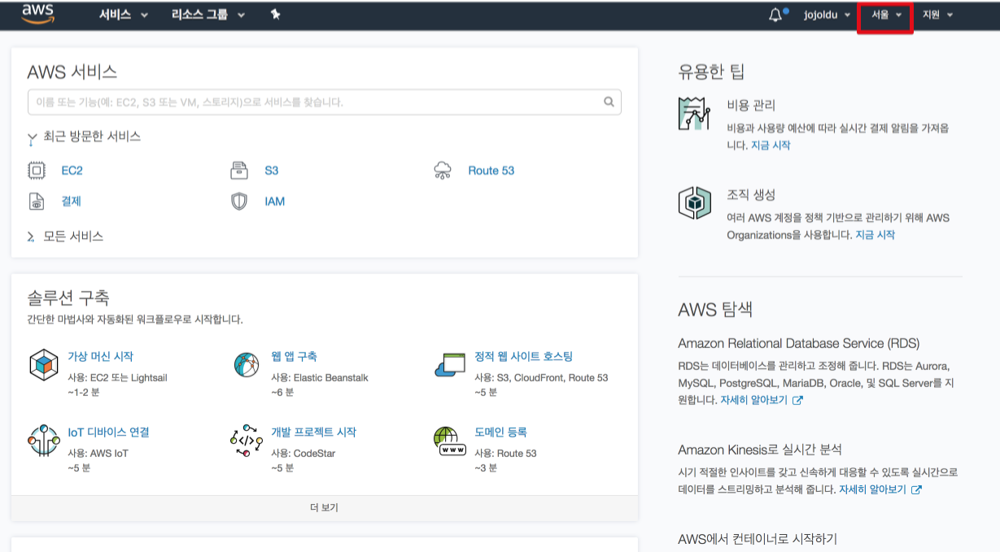

AWS 서비스에서 EC2를 검색해서 EC2 대시보드로 이동합니다.

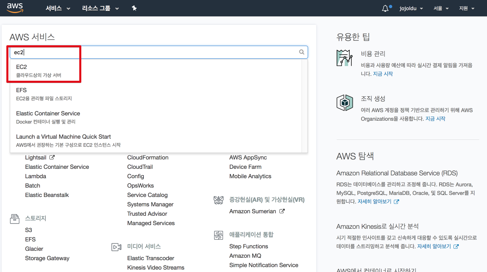

EC2 대시보드 중앙에 있는 **인스턴스 시작** 버튼을 클릭해서 생성페이지로 이동합니다.

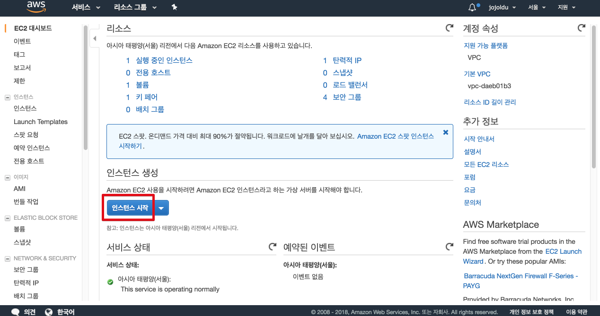

EC2의 운영체제를 선택하는 화면인데, 여기서 저희는 Amazon Linux를 선택합니다.  
(내부적으로 Centos와 동일하기 때문에 Centos라고 보셔도 됩니다.) 


인스턴스 유형은 프리티어를 지원하는 **t2.micro**를 선택하고, **다음:인스턴스 세부 정보 구성** 버튼을 클릭합니다.


네트워크, 서브넷에선 디폴트값을 그대로 사용합니다.  
**다음:스토리지 추가**를 클릭합니다.


스토리지란, 로컬PC의 디스크와 같은 저장장치를 얘기합니다.  
기본값으로 8GB가 되어있을텐데요.  
30GB까지가 프리티어로 사용할수 있기 때문에 **30**으로 변경합니다.  
변경하셨으면 **다음:태그 추가** 버튼을 클릭합니다.


태그는 인스턴스에 할당하는 키 값을 얘기합니다.  
여러 인스턴스들이 있을 경우 이를 태그별로 구분하면 검색이나 그룹짓기 편하기 때문에 여기서 본인 서비스의 인스턴스를 나타낼 수 있는 값으로 등록합니다.  
**다음:보안 그룹 구성**을 클릭합니다.

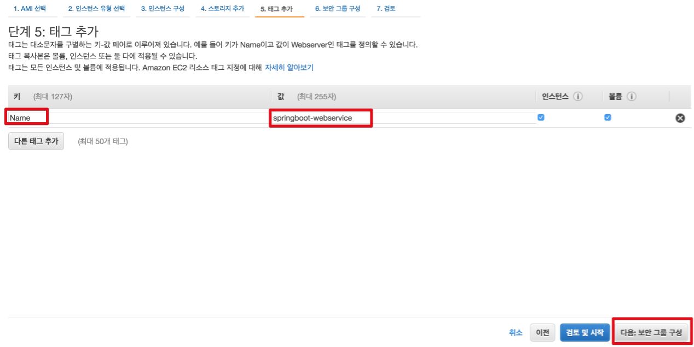

이 보안그룹 부분이 굉장히 중요한 부분입니다.  
보통 AWS 요금이 100만원, 300만원이 넘게 청구되는 대부분의 경우가 이 보안그룹을 잘못설정해서 타인이 무단으로 접속하여 발생한 경우입니다.  
유형 SSH, 22포트는 AWS EC2에 터미널로 접속할때를 얘기합니다.  
지정된 IP외에는 접근을 차단하기 때문에 귀찮다고 전체 오픈 (```0.0.0.0/0, ::/0```)해버리면 바로 외국분들의 비트코인 채굴이 본인 EC2 서버에서 진행되고 있음을 확인할 수 있습니다.  
그래서 본인 집의 IP를 기본적으로 추가하고 (내 IP를 선택하면 현재 접속한 장소의 IP가 자동 지정됩니다.)  
카페와 같은 **집 외에 다른 장소에서 접속하실땐 해당 장소의 IP를 다시 SSH 규칙을 추가**하시는게 안전합니다.  

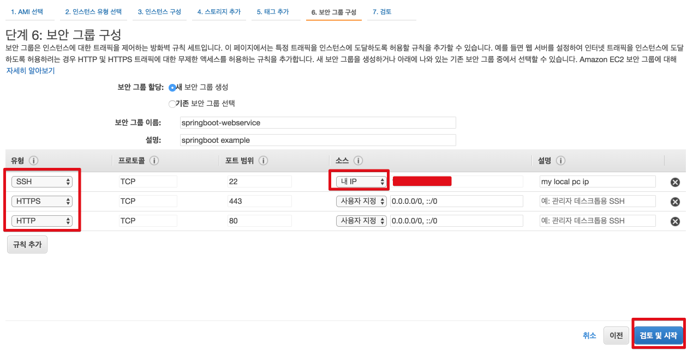

HTTPS, HTTP는 외부에서 이 사이트의 웹서비스 접근할때 사용하는 유형이기 때문에 80, 443 포트를 열어놓습니다.  
(이걸 닫으면 외부에서 서비스에 접근을 못하게 됩니다.)  
  
보안 규칙이 다 등록되셨으면 **검토 및 시작** 버튼을 클릭합니다.  
  
아래와 같이 등록 정보를 잘 확인후, **시작** 버튼을 클릭합니다.

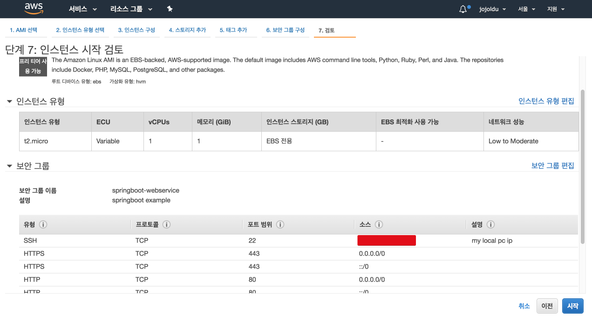

**시작** 버튼을 클릭하시면 키페어 생성 Modal이 등장합니다.  
이 키페어를 갖고 있어야만 해당 인스턴스에 접근이 가능하기 때문에 잘 보관하셔야 합니다.  

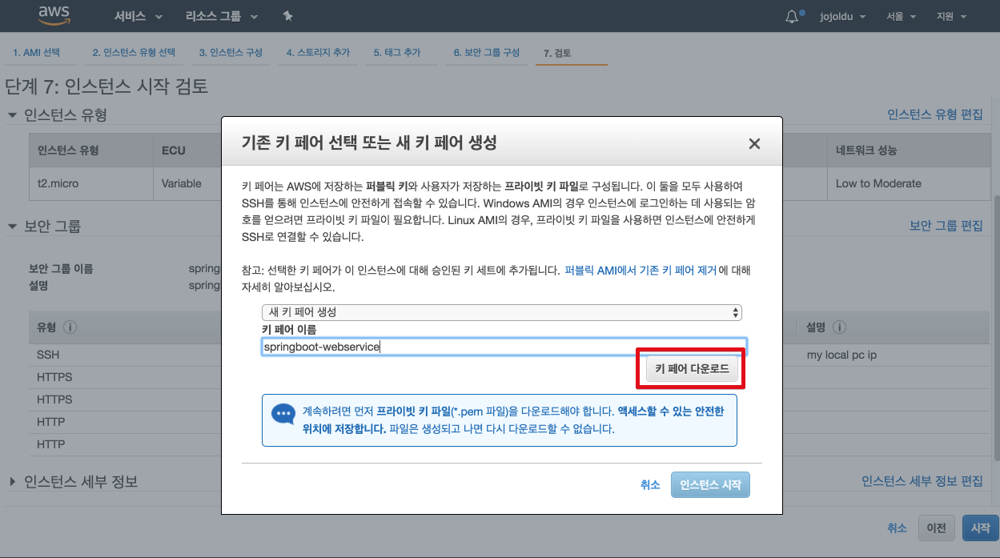

pem키를 다운 받으신뒤, **인스턴스 시작** 버튼을 클릭합니다.  
아래와 같이 인스턴스 ID를 클릭하시면 생성한 인스턴스 페이지로 이동합니다.  

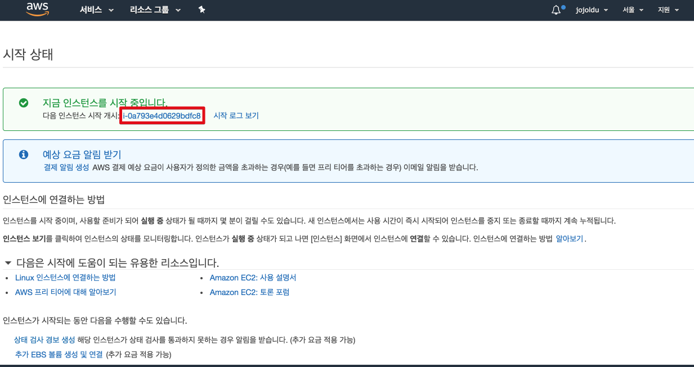 

짠 이렇게 인스턴스 상태가 running가 되면 정상적으로 인스턴스가 생성 & 실행된것입니다.

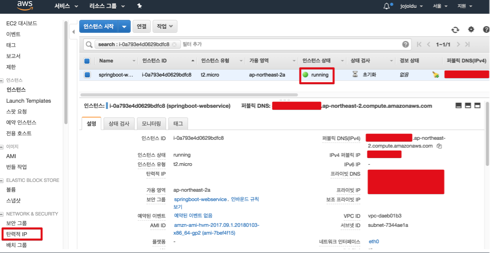 

이대로 두면 EC2 인스턴스에 고정 IP가 할당된 상태가 아니라서, **인스턴스를 재시작할때마다 새 IP가 할당**되서 도메인 연결을 할수가 없게 됩니다.  
그래서 고정 IP를 할당하겠습니다.

### 2) EIP 등록

AWS의 고정 IP를 Elastic IP라고 하는데요.  
EC2 인스턴스 페이지의 좌측을 보시면 **탄력적IP**라고 있습니다.  
해당 버튼을 클릭하겠습니다.  
  
**새주소 할당** 버튼을 클릭합니다.


**할당** 버튼을 클릭합니다.  


그럼 아래와 같이 고정 IP가 생성됩니다.


**닫기** 버튼을 클릭하신뒤, 방금 생성한 탄력적 IP를 우클릭하신뒤 **주소 연결**을 선택합니다.

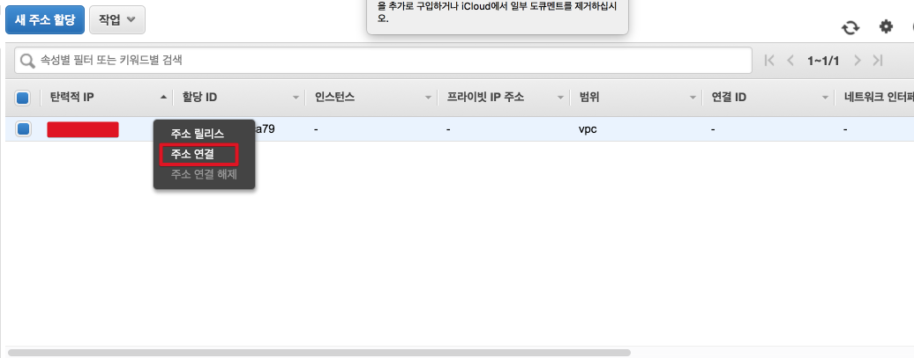

아래와 같이 **인스턴스에는 방금 생성한 EC2 인스턴스를** 선택하고, **프라이빗 IP에는 방금 생성한 탄력적 IP**를 선택하신뒤, **연결**버튼을 클릭합니다.


자 연결이 완료되셨으면, 인스턴스 탭을 클릭하셔서 탄력적 IP가 할당되었는지 확인합니다.

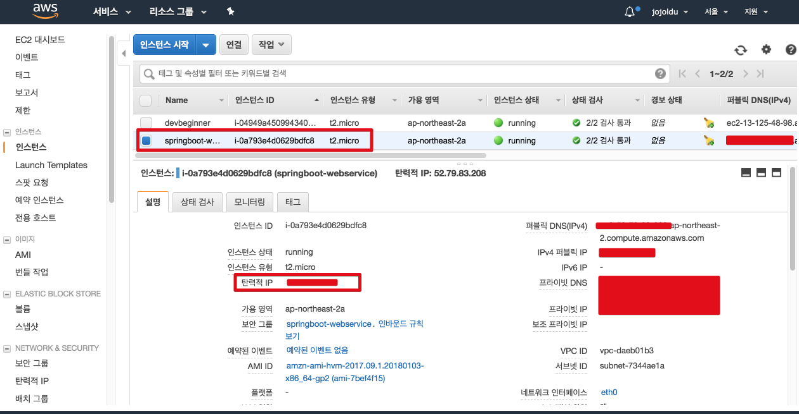

여기까지 하셨으면 EC2 인스턴스 생성과정은 끝났습니다!  
자 이제 그럼 로컬 PC에서 EC2 인스턴스로 접속해보겠습니다.

### 3) EC2 터미널 접속

여기서부터는 맥북을 기준으로 진행됩니다.  
맥, 리눅스가 아닌 윈도우 PC를 사용중이시라면 아래 링크를 참고하셔서 환경 설정을 진행하시면 됩니다.  

* [Window에서 EC2 접근하기](http://pyrasis.com/book/TheArtOfAmazonWebServices/Chapter07/02)

AWS와 같은 외부 서버로 SSH 접속을 하기 위해선 매번 ```ssh -i pem키 외부 IP```를 입력해야합니다.  
상당히 귀찮기 때문에 쉽게 ssh 접속을 할수있도록 설정하겠습니다.  

좀전에 받은 키페어 pem파일을 ```~/.ssh/```로 복사합니다.

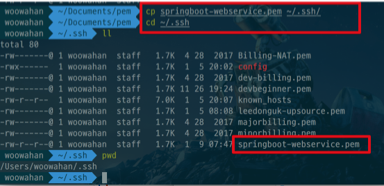

그리고 pem 키 권한을 변경합니다.

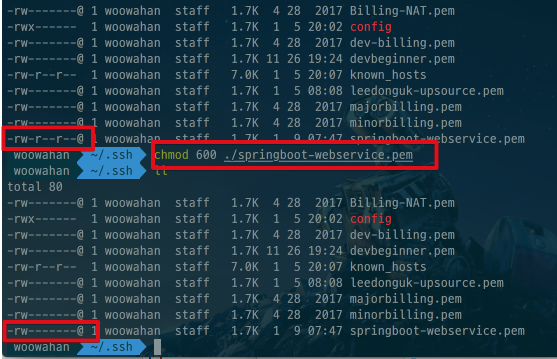

```bash
chmod 600 본인pem키위치
```

pem키가 있는 ```~/.ssh``` 디렉토리에 ```config```파일을 생성합니다.  
(아무런 확장자가 없습니다.)

```bash
vim config
```

아래와 같이 본인이 원하는 Host로 등록합니다.  
Host가 앞으로 접속할 키값으로 보시면 됩니다.  
(예를 들어 ```Host abc```로 등록하시면 ```ssh abc```로 해당 EC2로 접속할수 있게 됩니다.)  
Host외에 **HostName은 탄력적 IP** 주소를 쓰시면 됩니다.

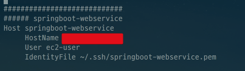

```bash
 ############################
 ###### springboot-webservice
 Host 본인이 원하는 이름
       HostName 탄력적IP
       User ec2-user
       IdentityFile ~/.ssh/pem키
```

(AWS에서 Ubuntu를 선택하셨으면 기본 사용자가 ubuntu이며, 그외에는 ec2-user입니다.)  

작성이 끝나셨으면 ```:wq```로 저장 & 종료 하신뒤, 아래처럼 config 파일이 생성되었으면 성공입니다!

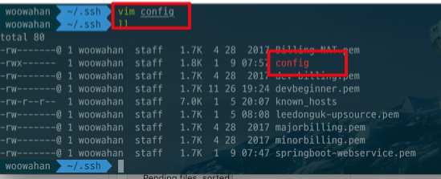

자 그럼 한번 EC2 인스턴스에 접속해보겠습니다.  
터미널에서 아래와 같이 ssh 접속을 시도합니다.

```bash
ssh 등록한Host값
```

> Tip)  
혹시나 오랜시간 접속이 안되거나, 권한이 없어서 안된다고 메세지가 나온다면  
(1) HostName값이 정확히 탄력적IP로 되어있는지  
(2) EC2 인스턴스가 running 상태인지  
(3) EC2 인스턴스의 보안그룹 -> 인바운드 규칙에서 현재 본인의 IP가 등록되어있는지  
확인해보시길 추천드립니다.

이렇게 EC2 인스턴스에 접속되는것을 확인할 수 있습니다!

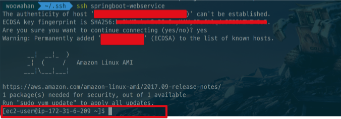

멜트다운 때문인지 커널 업데이트 하라는 메세지가 보이니, 업데이트를 진행합니다.

```bash
sudo yum update
```

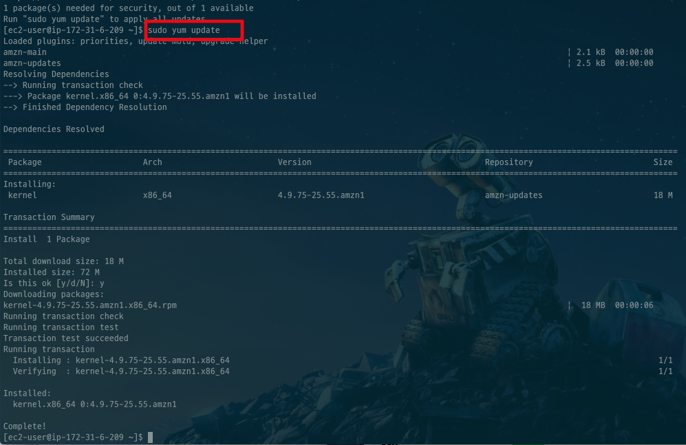

EC2 관련된 설정이 모두 끝이났습니다!  
바로 RDS 설정을 진행하겠습니다.

[[ad]]

## 4-2. AWS RDS 설정하기

이제 AWS의 Database 서비스인 RDS를 생성하겠습니다.  

### 1) RDS 생성하기

AWS 웹 페이지에 접속하셔서 RDS를 검색해서 클릭합니다.  
아래와 같은 화면이 나오면 **지금 시작** 버튼을 클릭합니다.


(만약 안보이시면 좌측 상단의 **인스턴스** -> **DB 인스턴스 시작**을 클릭하시면 됩니다.)  
  
여기서 DB엔진을 저희는 MariaDB를 사용하겠습니다.


> Tip)  
MariaDB가 MySQL을 기반으로 만들어졌기 때문에 쿼리를 비롯한 전반적인 사용법은 MySQL과 유사하니 크게 걱정하지 않으셔도 됩니다.  
참고: [MYSQL에서 MariaDB로 마이그레이션 해야할 10가지 이유](https://xdhyix.wordpress.com/2016/03/24/mysql-%EC%97%90%EC%84%9C-mariadb-%EB%A1%9C-%EB%A7%88%EC%9D%B4%EA%B7%B8%EB%A0%88%EC%9D%B4%EC%85%98-%ED%95%B4%EC%95%BC%ED%95%A0-10%EA%B0%80%EC%A7%80-%EC%9D%B4%EC%9C%A0/)

Aurora가 좀더 많은 기능을 제공하지만, **프리티어가 없으며**, 최저 비용이 **월 10만원이상**이기 때문에 시작하는 단계에서 선택하기엔 부담스러운 면이 있습니다.  
그래서 MariaDB로 일단 시작하겠습니다.

> Tip)  
차후 서비스 규모가 커지시면 Maria DB에서 Aurora로 이전하시는 것을 추천드립니다.  
참고: [Aurora vs Maria DB vs MySQL](http://blog.dramancompany.com/2016/01/rds-mysql%EC%97%90%EC%84%9C-rds-aurora%EB%A1%9C-db%EC%9D%B4%EC%A0%84-%EB%8B%A4%EC%9A%B4%ED%83%80%EC%9E%84%EC%9D%84-%EC%B5%9C%EC%86%8C%ED%99%94-%ED%95%98%EA%B8%B0/#comment-36)  
서비스가 일정 수준으로 커지신다면 고가용성을 필수적으로 고려해야되니 어느정도 **금전적인 비용을 감당할정도**가 되시면 꼭 이전하시길 추천드립니다.

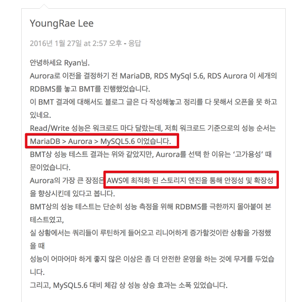

(링크에 있는 Aurora로 이전한 이유 댓글)  
  


비용 절감을 위해 초기에는 DB 인스턴스 클래스를 t2.micro로 선택합니다.  

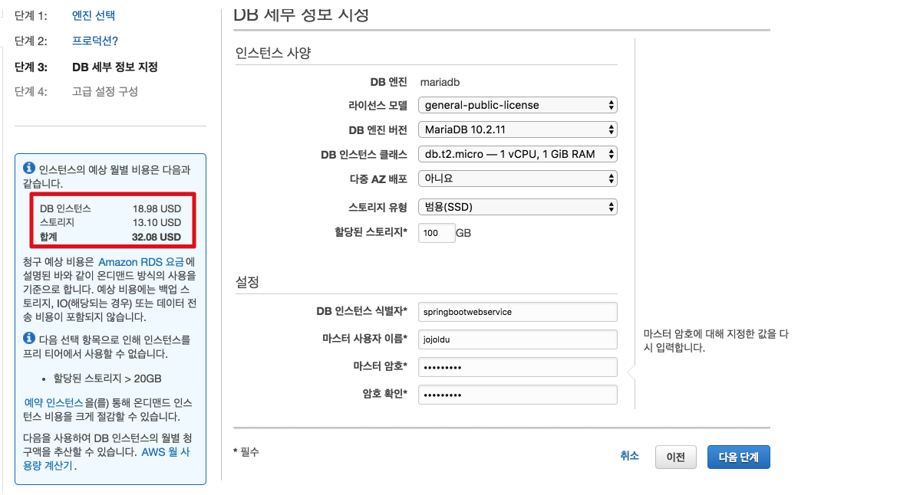

(프리티어에선 할당된 스토리지에 20G만 쓸수있습니다.  
그 이상 할당하시면 비용이 청구됩니다.  
저는 이미 **프리티어가 끝나서 넉넉하게 100G**를 할당한것입니다.)
설정의 마스터 **사용자 이름**과 **비밀번호**, **데이터베이스 이름** 이 3가지는 외부에서 접근할때 사용될 정보이기 때문에 별도로 기억하셔야만 합니다.

> Tip)  
시간 되실때 마스터 사용자로 **읽기 권한만 있는 계정**과 **읽기/수정 권한을 모두 갖고 있는 계정** 2개를 생성해서 사용하시길 추천드립니다.

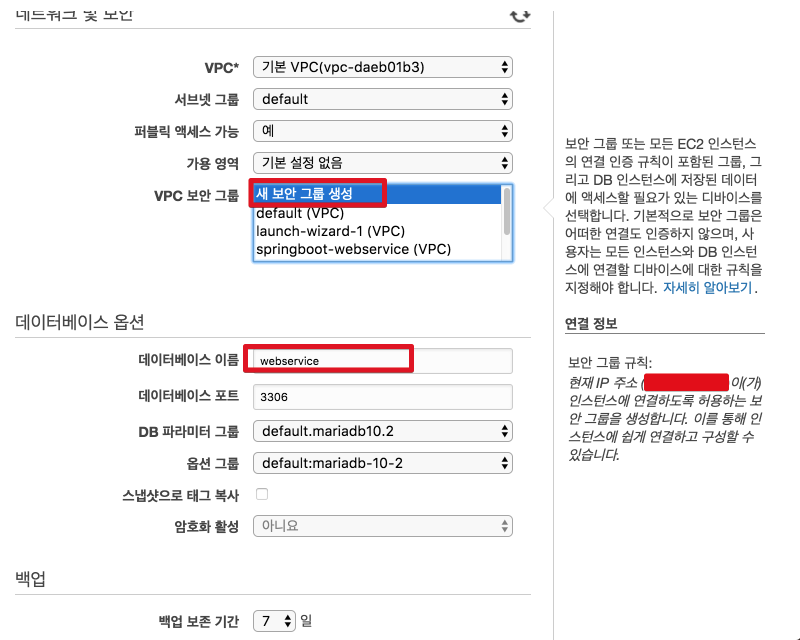

생성이 완료 되면 다음과 같이 **사용 가능**으로 상태가 변경됩니다.  

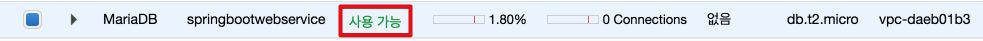

MariaDB 인스턴스를 클릭 -> 우측의 탐색 탭을 클릭해보시면 아래와 같이 상세 정보가 등장합니다.  

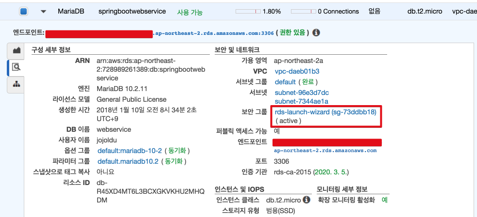

여기서 보안 그룹의 값으로 할당된 링크를 (```rds-launch-wizard```) 클릭하시면 보안그룹 페이지로 이동합니다.  
여기서 검색을 통해 이전에 만들어놓은 **EC2 인스턴스의 보안 그룹을 찾아서 그룹 ID를 복사**합니다.  
그리고 **보안그룹 생성** 버튼을 클릭합니다.

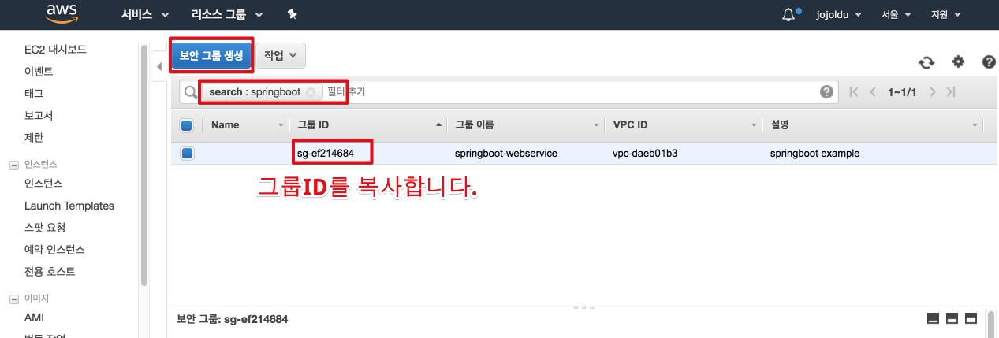

보안그룹과 이름은 RDS 보안그룹을 나타낼 수 있는 이름을 사용하시고,  
인바운드 규칙에서는 MYSQL/Aurora로 2개를 입력합니다.

* 사용자 지정으로 방금 복사한 **EC2 인스턴스의 보안 그룹 ID**를 입력합니다.
  * EC2 서버와 RDS간의 통신을 위함입니다.
* 내 IP로 현재 접속한 IP를 등록합니다.
  * 로컬 PC에서 DB Client Tool (Workbench, Sequel Pro 등)으로 RDS에 접속하기 위함입니다.

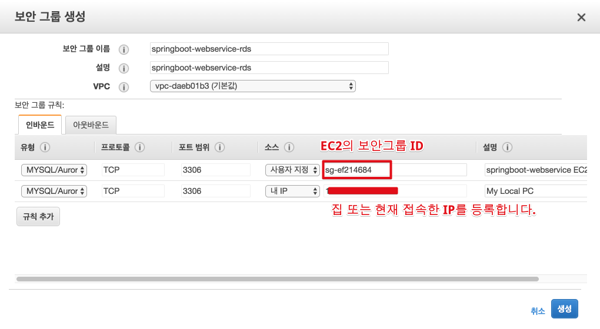

생성하셨으면 다시 RDS 페이지로 이동하셔서 RDS의 보안그룹 변경을 진행합니다.  

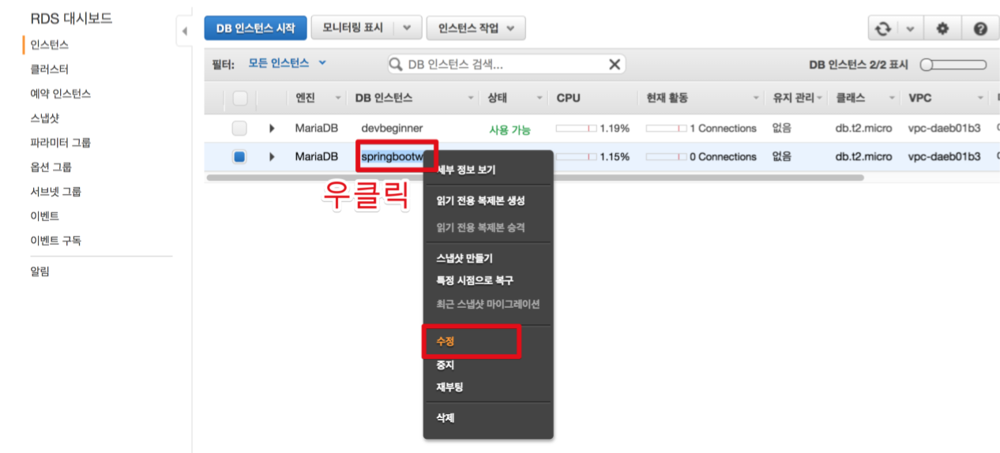

수정 페이지에서 보안그룹을 좀전에 생성한 **springboot-webservice-rds**로 선택합니다.  

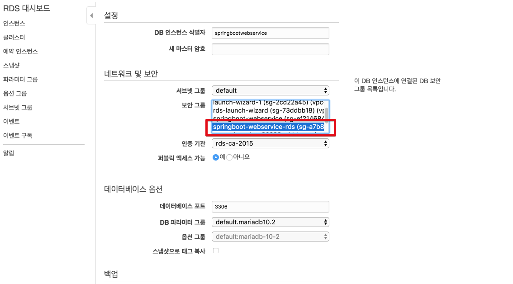

수정이 완료되면 아래와 같이 보안그룹이 반영되었음을 확인할 수 있습니다.

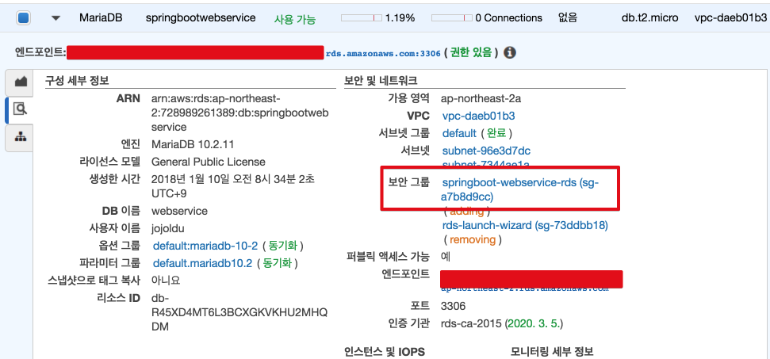

### 2) 로컬PC에서 RDS 접근 확인 

RDS가 생성되었으니, 설정이 잘되었는지 확인해보겠습니다.  
본인의 PC OS에 맞춰 MySQL 혹은 범용적인 DB 클라이언트를 사용하시면 됩니다.  

* [MySQL Workbench](http://cloud.hosting.kr/mysql-workbench-%ED%94%84%EB%A1%9C%EA%B7%B8%EB%9E%A8%EC%9C%BC%EB%A1%9C-mysql-%EC%A0%91%EC%86%8D-%EA%B0%80%EC%9D%B4%EB%93%9C/)
* [Sequel Pro (Mac OS용)](http://geniusdo.tistory.com/9)

여기서는 Mac용 클라이언트 프로그램인 **Sequel Pro**를 사용하겠습니다.  
  
RDS 인스턴스 페이지에서 방금 생성한 RDS 인스턴스를 클릭하시면 **엔드포인트** 항목이 보입니다.  
이 주소가 외부에서 RDS로 붙을수있는 Host 주소입니다.  
주소를 복사합니다.

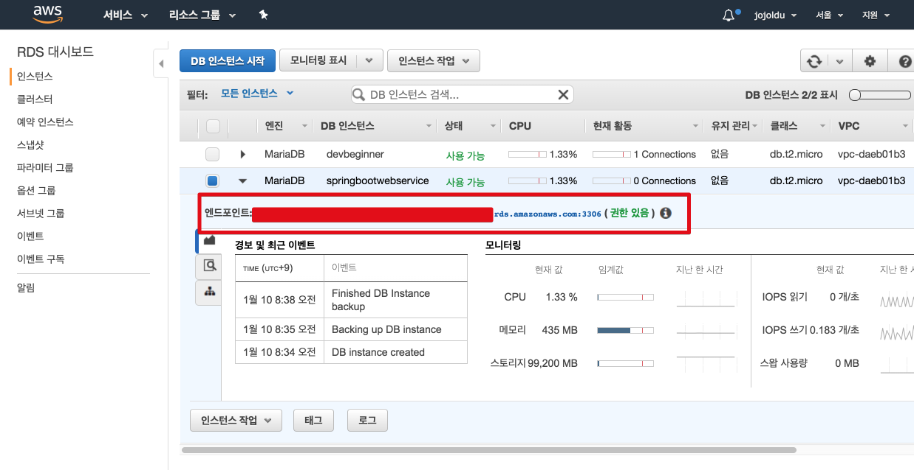

복사한 Host주소와 RDS 생성시 등록했던 사용자 이름, 비밀번호, 데이터베이스 이름 등을 등록하신뒤 Save 및 Connect 해보겠습니다.

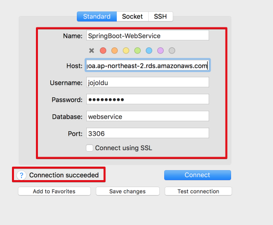

성공적으로 접속되셨나요?  
접속 되셨으면 아래 명령어를 한번 실행해보겠습니다.

```sql
show variables like 'c%';
```

아래와 같이 DB의 character-set 관련 설정을 볼 수 있습니다. 
 
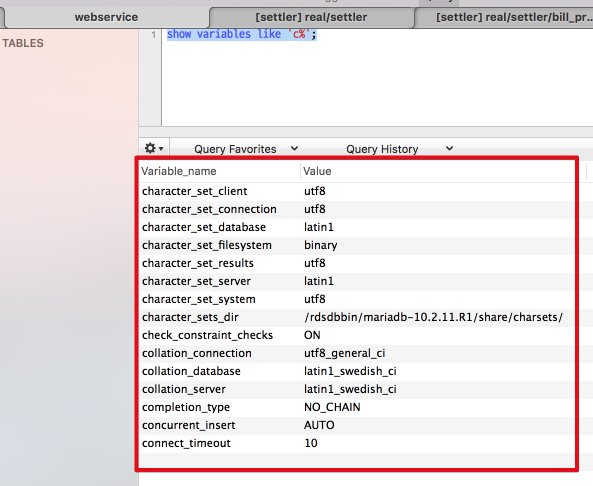

보시는것처럼 기본 설정으로 다되어있어, utf8이 아닌 **latin1**로 되었습니다.  
이렇게 되면 한글이 모두 다 깨져버리기 때문에 utf8로 설정을 변경하겠습니다.  
  
RDS 설정 페이지에서 좌측에 있는 **파라미터 그룹**을 클릭하겠습니다.

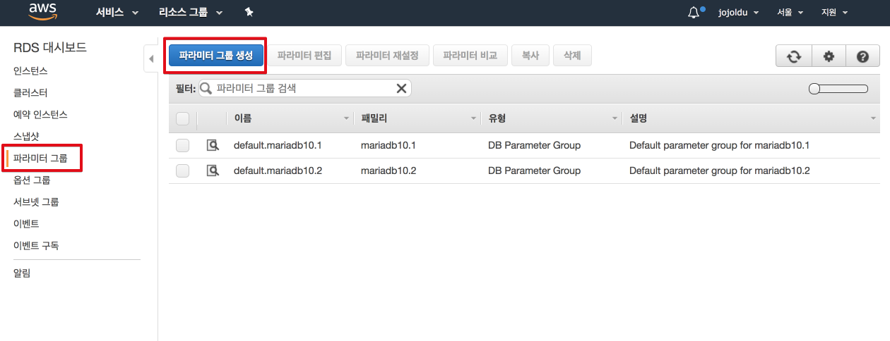

**default 파라미터 그룹은 수정이 불가능**하기 때문에 새로운 파라미터 그룹을 생성합니다.  
아래와 같이 본인의 서비스에 맞게 값을 설정하신뒤, 생성합니다.

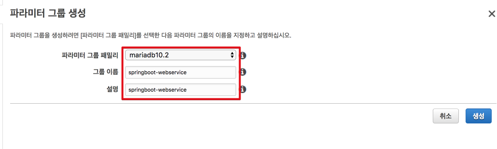

생성한 파라미터 그룹을 선택하시고, **파라미터 편집**을 클릭합니다.

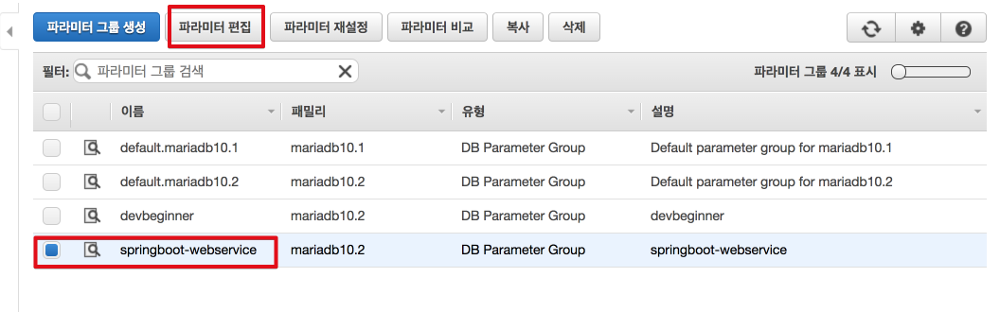

굉장히 많은 설정값이 나오는데요.  
알파벳 순으로 (a,b,c..)으로 정렬되어 있기 때문에 조금만 내려보시면 character set 관련 항목을 찾을 수 있습니다. 

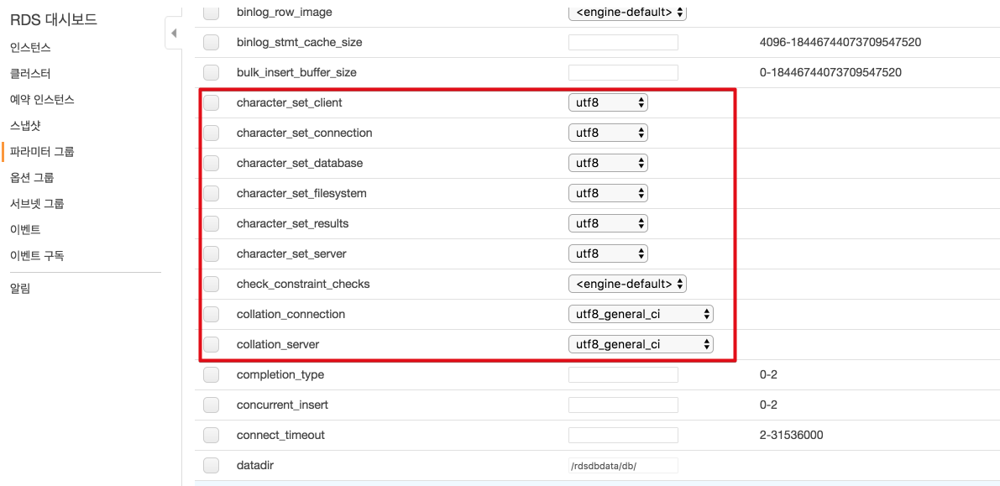

**변경사항을 저장**하신 뒤, RDS에 해당 파라미터 그룹을 적용하겠습니다.  
RDS 인스턴스 수정 페이지로 이동하신뒤,

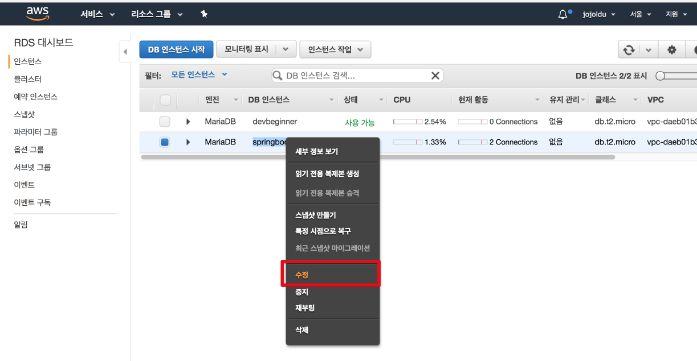

파라미터 그룹을 좀전에 생성한 파라미터 그룹으로 변경합니다.  
바로 적용하기 위해 최하단 즉시 적용을 체크하신뒤 **다음**을 클릭하시면 됩니다.

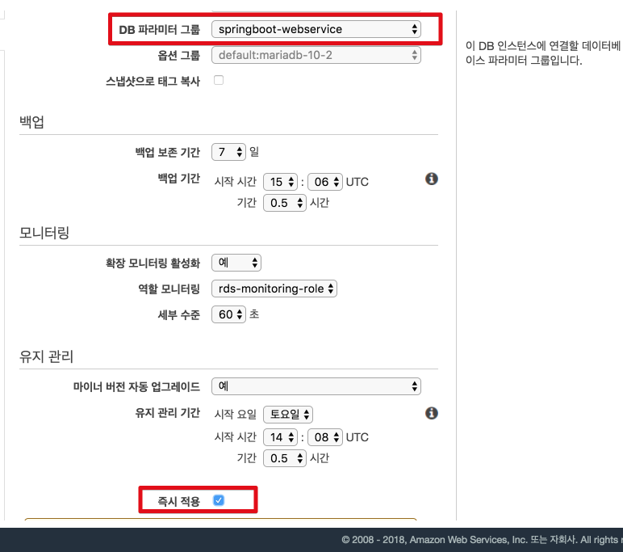

DB 인스턴스 수정이 완료 되시면 설정 적용을 위해 **재부팅**합니다.

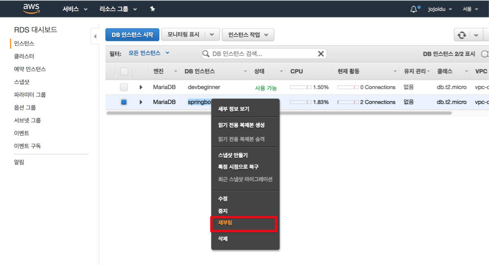

재부팅이 완료되시면 클라이언트 툴에서도 다시 재접속해서 설정값을 확인해봅니다.

```sql
show variables like 'c%';
```

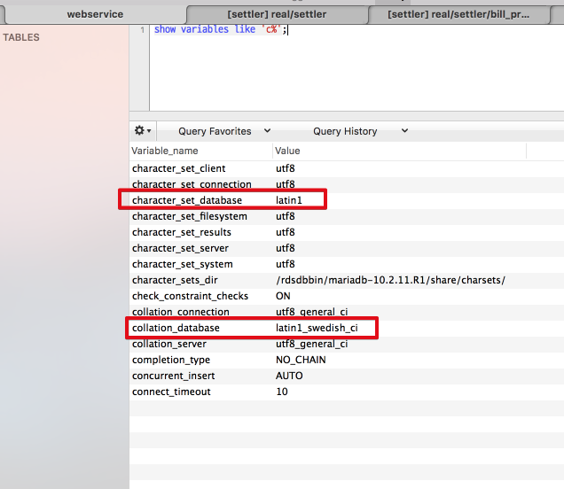

위 사진을 보시면 아직 database 관련 설정에선 utf8이 적용 안된것을 알수 있습니다.  
이 부분은 파라미터 그룹으로 해결이 안되고, 직접 설정값을 적용해야만 합니다. (참고: [링크](http://tiveloper.tistory.com/entry/Amazon-RDS-MariaDB-UTF8-%EB%B3%80%EA%B2%BD))  
  
그래서 직접 명령어를 실행시킵니다.

```sql
ALTER DATABASE 본인database
CHARACTER SET = 'utf8'
COLLATE = 'utf8_general_ci';
```

짠! utf8이 모두 적용된 것이 확인됩니다.

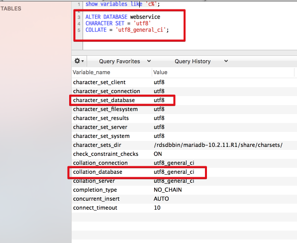

깔끔한 적용을 위해 **재부팅**을 다시 실행해주시면 끝!  
  
자 그럼 실제로 한번 테스트 해보겠습니다.  
로컬의 클라이언트에서 다음의 쿼리를 하나씩 실행해보겠습니다.

```sql

CREATE TABLE test (
  id bigint(20) NOT NULL AUTO_INCREMENT,
  content varchar(255) DEFAULT NULL,
  PRIMARY KEY (`id`)
) ENGINE=InnoDB;

insert into test(content) values ('테스트');

select * from test;
```

그러면!

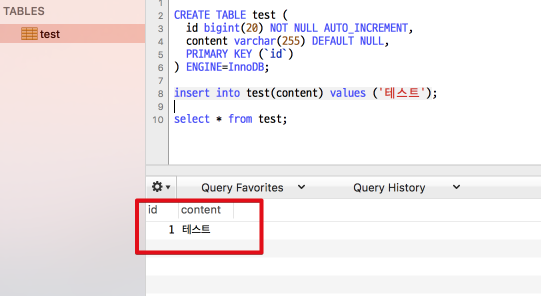

쿼리가 잘 수행되고, 한글 노출이 잘되는 것까지 확인됩니다!
마지막으로 EC2에서 접근이 잘되는지 확인하겠습니다.

### 3) EC2에서 RDS에서 접근 확인 

기존에 생성해둔 EC2 서버로 ssh 접속합니다.

```bash
ssh config에 지정한 이름
```

그리고 mysql CLI 설치를 위해 mysql을 EC2에 설치하겠습니다.  
(실제 EC2의 MySQL을 설치해서 쓰는게 아닌, 커맨드 라인만 쓰기 위한 설치입니다.)  

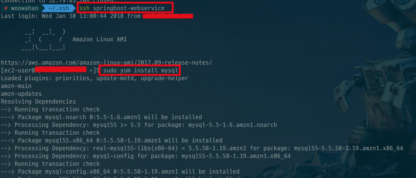

```bash
sudo yum install mysql
```

설치가 다 되셨으면 로컬에서 접근하듯이 계정, 비밀번호, 호스트 주소를 사용해 RDS에 접속합니다.

```bash
mysql -u 계정 -p -h Host주소
```

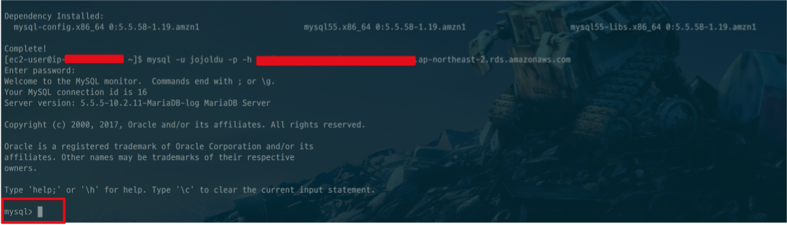

RDS에 접속되셨으면 실제로 생성한 RDS가 맞는지 간단한 쿼리를 한번 실행해보겠습니다.

```sql
show databases;
```

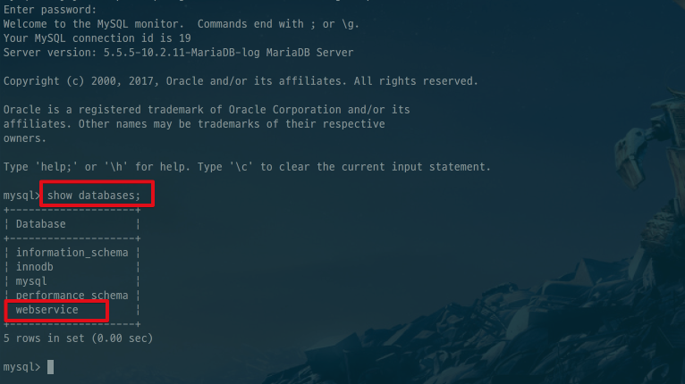

제가 생성했던 webservice라는 database가 있음을 확인하였습니다!  
  
이번 시간에는 EC2와 RDS 생성 및 기본적인 설정을 진행했습니다.  
직접 코드를 치는게 아니라서 아무래도 지루하셨을수도 있을것 같습니다.  
그럼에도 끝까지 읽어주셔서 감사합니다.  
다음 시간에는 1~3차에서 생성한 **스프링부트 프로젝트를 EC2 서버에 간단하게나마 배포**하고, **RDS에 접근하는 방법**을 진행하겠습니다.  
  
그럼 다음에 뵙겠습니다!  
감사합니다^^


