# 5. TravisCI & AWS CodeDeploy로 배포자동화 구축하기

이번 시간엔 개발한 배포 자동화 환경을 구축하겠습니다.
(모든 코드는 [Github](https://github.com/jojoldu/springboot-webservice/tree/feature/5)에 있습니다.)  


## 5-1. AWS에 스프링부트 수동 배포하기

간단하게 EC2에 저희의 스프링 부트 프로젝트를 배포할 수 있도록 스크립트를 하나 만들겠습니다.  
(계속 이렇게 하진 않습니다. 차후 과정에서 좀 더 편안한 방법을 소개드리겠습니다.)

### 5-1-1. scp 스크립트 생성

먼저 저희 프로젝트를 Build 하는 명령어를 추가하겠습니다.  
프로젝트 내부에 scp.sh 파일을 하나 생성해서 다음과 같은 내용을 추가합니다.

```bash
#!/bin/bash

../gradlew build
```

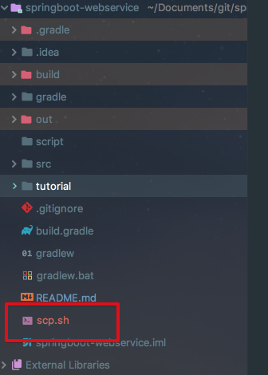

그리고 scp.sh 파일을 실행시킬수 있도록 권한을 추가합니다.  

```bash
chmod 755 ./scp.sh
```

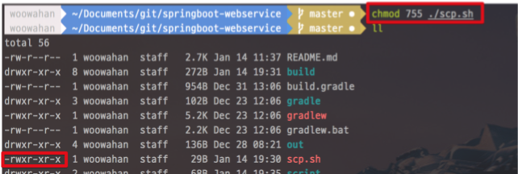

> Tip)  
chmod의 자세한 내용을 알고싶으시다면 [유닉스 파일 권한 변경하기(chmod)](http://ohgyun.com/327)를 참고하세요!

스크립트가 생성되었으니 한번 실행해보겠습니다.

```bash
./scp.sh
```

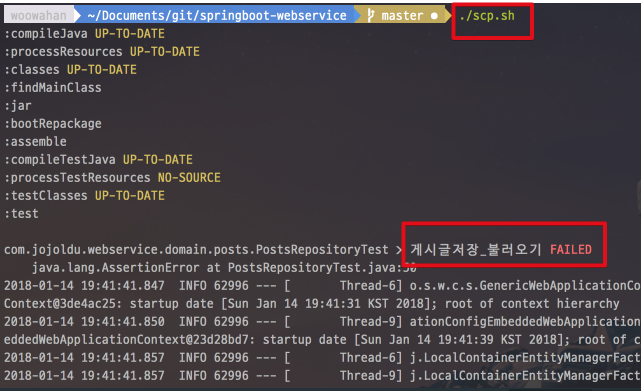

앗 테스트가 깨져서 Build가 실패했습니다.  
왜 테스트가 깨졌을까요?

### 5-1-2. 깨진 테스트 수정

이전 시간에 WebController를 테스트하기 위해 저희는 application.yml에 다음과 같이 ```insert``` 쿼리를 실행시키도록 옵션을 추가했습니다.  
  
src/**main**/resources/application.yml

```yaml
...
# local 환경
---
spring:
  profiles: local
  datasource:
    data: classpath:data-h2.sql # 시작할때 실행시킬 script
  ...
```

스프링부트에서는 src/test/resources/application.yml이 없을 경우 main의 application.yml 옵션을 그대로 가져와서 사용하게 됩니다.  
테스트 코드는 **외부의 영향 없이 수행**되야하기 때문에 이 부분을 수정하겠습니다.  
  
src/**test/resources/application.yml을 생성해서 다음과 같이 작성합니다.

```yaml
# Test
spring:
  profiles:
    active: local # 기본 환경 선택

# local 환경
---
spring:
  profiles: local
  jpa:
    show-sql: true
```

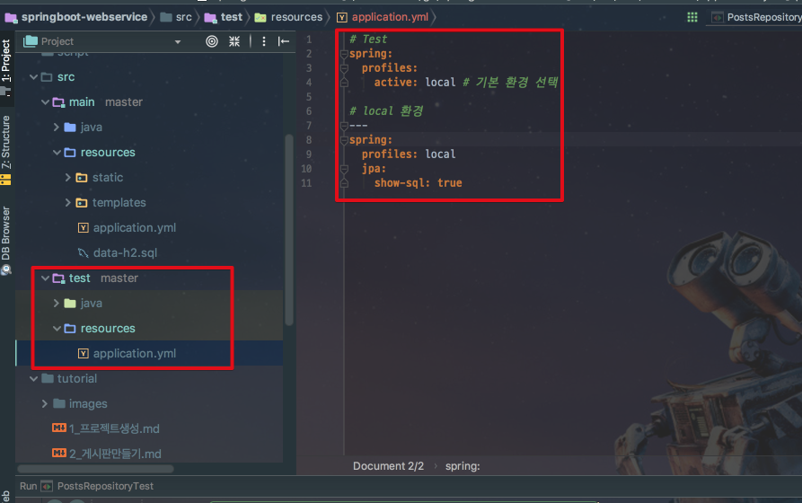

수정후 다시 scp.sh 파일을 실행시키면!

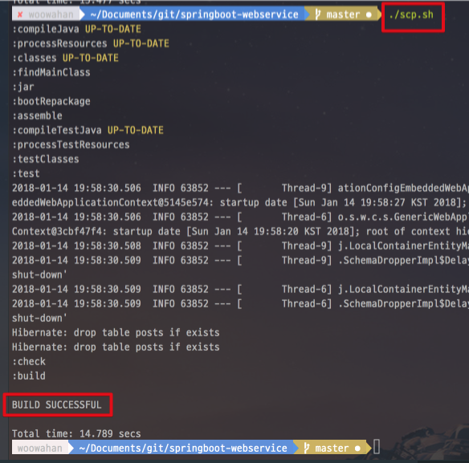

Build가 성공됩니다.  
Build가 성공되시면 build 디렉토리가 생성되고, **build/libs/프로젝트-버전.jar 라는 Build 파일이 생성**됩니다.

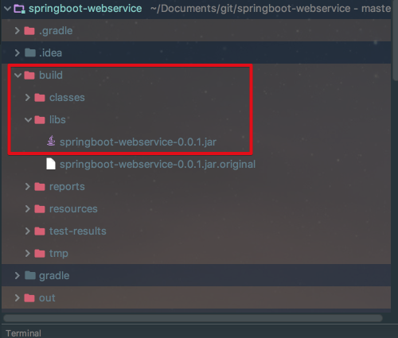

이 jar파일을 EC2 서버에 전송해서 실행시키면 프로젝트가 운영 서버에 배포된 것입니다.  

> Tip)  
실제 회사에서 이렇게 수행하진 않습니다.  
어디까지나 극적인 효과를 위해 지금은 수동으로 진행중이니 조금만 참아주세요!

### 5-1-3. build 파일 EC2에 전송

build 파일을 보관할 수 있도록 EC2 서버에 디렉토리 하나를 생성하겠습니다.  
EC2 서버에 접속하시고,

```bash
ssh springboot-webservice
```

아래 명령어로 ```/home/ec2-user/app/build``` 디렉토리를 생성합니다.

```bash
mkdir app
mkdir app/build
```

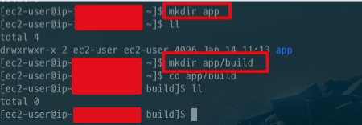

자 그리고 다시 로컬의 프로젝트로 돌아와서 scp.sh에 다음과 같은 명령어를 추가합니다.

```bash
#!/bin/bash

./gradlew build

echo "Build가 완료되었습니다. EC2에 전송합니다."

scp -i ~/.ssh/본인의 EC2 pem키 위치 ./build/libs/*.jar ec2-user@EC2 탄력적IP(EIP)주소:/home/ec2-user/app/build/
```

scp는 ssh 통신으로 파일을 복사하는 명령어 입니다.  

* ```-i``` 옵션으로 pem키 파일 위치를 전달
  * Ex) ```~/.ssh/springboot-webservice.pem```
* ```*.jar``` 로 지정해, build 파일명이 변경(ex: 버전업 등)되도 실행될수 있도록 .jar확장자를 가지면 대상이 되도록 지정
* 좀전에 만든 EC2서버의 /app/build/ 디렉토리에 jar 복사

작성이 완료되셨으면 아래처럼 scp.sh 파일을 다시 실행해봅니다.

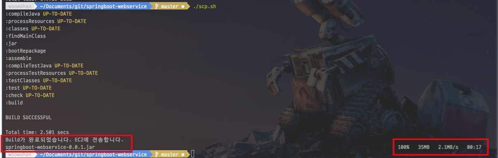

전송이 완료되셨으면, EC2 서버에 jar 파일이 잘 도착했는지 확인해봅니다.

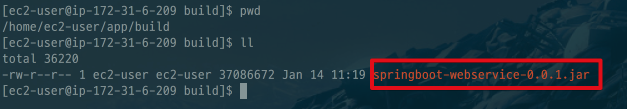

전송이 잘 된것이 확인됩니다!  
그럼 한번 실행해보겠습니다.  

### 5-1-4. Java 8 설치

현재(2018.01.14) EC2가 Java7이 기본버전이라 Java8로 버전업하겠습니다.  
  
AWS EC2에 접속하셔서 아래 명령어를 실행 합니다.

```bash
sudo yum install -y java-1.8.0-openjdk-devel.x86_64
```

설치가 완료되셨으면 인스턴스의 Java 버전을 8로 변경하겠습니다.

```bash
sudo /usr/sbin/alternatives --config java
```


버전이 변경되셨으면 사용하지 않는 Java7을 삭제합니다.

```bash
sudo yum remove java-1.7.0-openjdk
```

현재 버전이 Java8이 되었는지 확인합니다.

```bash
java -version
```

### 5-1-5. Jar 실행

Java8까지 설치되었으니 복사한 jar를 실행시켜보겠습니다.

```bash
nohup java -jar /home/ec2-user/app/build/springboot-webservice-0.0.1.jar &
```

> Tip)  
스프링부트의 장점 중 하나로, 특별히 외장 톰캣을 설치할 필요가 없습니다.  
내장 톰캣을 사용해서 jar 파일만 있으면 바로 웹 어플리케이션 서버가 실행할수 있습니다.  
좀 더 자세한 스프링부트의 장점을 알고 싶으시면 이전에 작성한 [SpringBoot의 깨알같은 팁](http://jojoldu.tistory.com/43)을 참고하시면 도움되실것 같습니다.

일반적으로 Java를 실행시킬때는 ```java -jar```라는 명령어를 사용하지만, 이렇게 할 경우 **사용자가 터미널 접속을 끊을 경우 어플리케이션도 같이 종료**가 됩니다.  
그래서 어플리케이션 실행자가 터미널을 종료시켜도 어플리케이션은 계속 구동될 수 있도록 ```nohup```명령어를 사용합니다.  
  
nohup은 실행시킨 jar파일의 로그 내용을 **nohup.out** 이란 파일에 남깁니다.  

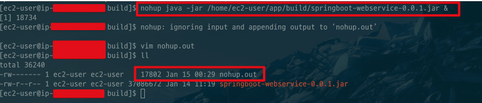

nohup.out 파일이 생성되신게 확인 되시면, 아래 명령어로 잘 수행되었는지 확인합니다. 

```bash
tail -f /home/ec2-user/app/build/nohup.out
```

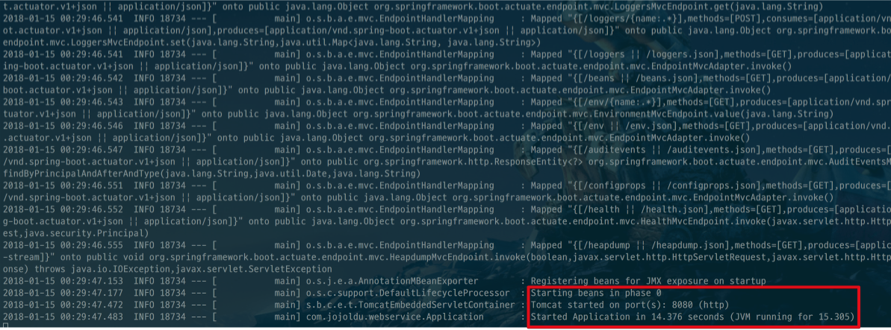

로컬에서 SpringBoot를 실행했을때와 마찬가지로 실행 로그를 확인할 수 있습니다.  
자 그러면 실제로 외부에서 접근해보겠습니다.


### 5-1-6. 외부에서 서비스 접속

일단 EC2의 스프링부트는 8080 포트로 실행되었습니다.  
그럼 우리의 EC2 인스턴스도 8080 포트가 외부에서 접근 가능하도록 열려있어야만 합니다.  
AWS EC2 인스턴스 페이지 -> 보안그룹 -> 현재 프로젝트의 인스턴스 -> 인바운드 탭을 클릭 합니다.

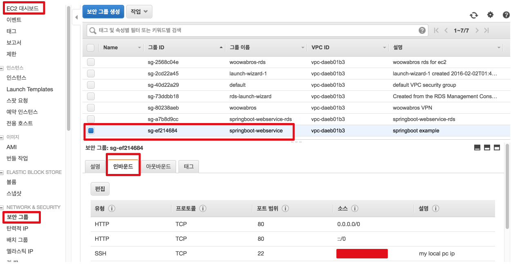

인바운드 **편집** 버튼을 클릭해서 다음과 같이 사용자지정(TCP), 8080 포트를 추가합니다.


> Tip)  
차후 Nginx 설치 과정이 끝나면 8080 포트는 제거하고, 80/443 포트만 열어놓습니다.  
Nginx를 통하지 않고, Tomcat에 바로 연락오는 요청은 모두 무시합니다.  

편집이 완료되셨으면 인스턴스의 퍼블릭 DNS로 브라우저에 접근해봅니다.

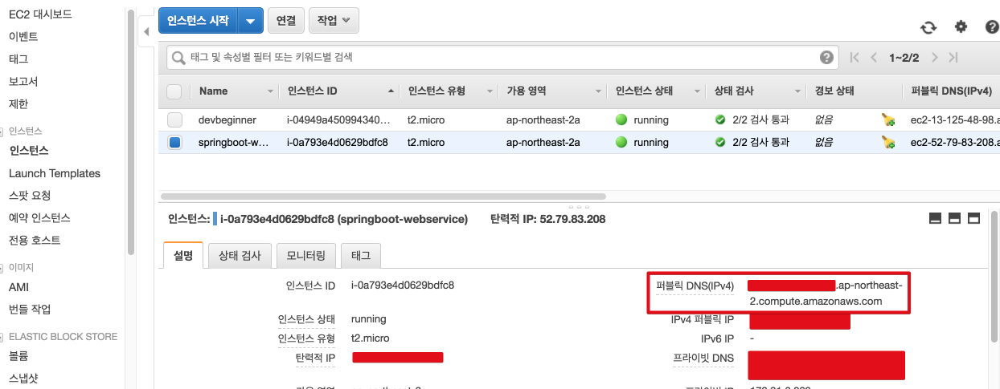

스프링부트가 8080포트로 열려있기 때문에 퍼블릭 DNS 뒤에 8080 포트를 붙여 접근합니다.


우리의 서비스가 드이어 외부에 노출되었습니다!

### 5-1-7. 문제?

여기까지 간단하게나마 개발한 스프링부트 프로젝트를 EC2에 배포해보았습니다.  

* 로컬 Build
* 수동 SpringBoot 실행 및 종료

보통 이런 과정을 배포 자동화라고 합니다.  
코드 버전 관리를 하는 VCS 시스템에 PUSH가 되면, 자동으로 Test, Build가 수행되고 Build 결과를 운영서버에 배포까지 자동으로 진행되는 이 과정을   

## 5-2. Travis CI 연동하기

Travis CI는 Github에서 제공하는 무료 CI 서비스입니다.  
CI는 

> Tip)  
아직 많은 회사에선 CI없이 소스 통합 일자, 빌드 일자 등을 정해서 그날 단체로 모든 코드를 통합하기도 합니다.  

## 5-3. AWS Code Deploy 연동하기