# 5. EC2에 배포 해보기

이번 시간엔 지금까지 개발한 내용을 EC2에 배포 해보겠습니다.
(모든 코드는 [Github](https://github.com/jojoldu/springboot-webservice/tree/feature/5)에 있습니다.)  


## 5-1. EC2에 Git 설치 및 프로젝트 Clone

배포에 앞서 기반작업이 되는 Java와 Git을 EC2에 설치하겠습니다.
  
### 5-1-1. Java 8 설치

현재(2018.01.14) EC2가 **Java7이 기본**버전이라 Java8로 버전업하겠습니다.  
  
AWS EC2에 접속하셔서 아래 명령어를 실행 합니다.

```bash
sudo yum install -y java-1.8.0-openjdk-devel.x86_64
```

설치가 완료되셨으면 인스턴스의 Java 버전을 8로 변경하겠습니다.

```bash
sudo /usr/sbin/alternatives --config java
```


버전이 변경되셨으면 사용하지 않는 Java7을 삭제합니다.

```bash
sudo yum remove java-1.7.0-openjdk
```

현재 버전이 Java8이 되었는지 확인합니다.

```bash
java -version
```

### 5-1-2. Git 설치 및 Clone

Java8 설치가 끝나셨으면 다음으로 Git을 설치하겠습니다.  
EC2 인스턴스로 ssh 접속하신뒤, yum패키지 매니저를 통해 아래 명령어를 실행하신뒤 진행중 나오는 질문에는 ```y```를 입력하시면 됩니다.  

```bash
sudo yum install git
```

설치가 완료되셨으면 아래 명령어로 설치 상태도 확인합니다.

```bash
git --version
```

git이 성공적으로 설치되셨으면 git clone으로 프로젝트를 저장할 디렉토리를 생성하겠습니다.

```bash
mkdir app
mkdir app/git
```

생성된 ```git```디렉토리로 이동하고,

```bash
cd ~/app/git
```

본인의 github 웹페이지에서 ssh 주소를 복사합니다.


복사한 ssh 주소를 통해 ```git clone```을 진행합니다.

```bash
git clone https://github.com/프로젝트주소.git
```

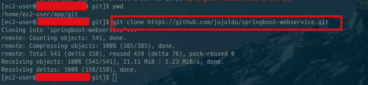

git clone이 끝나셨으면 clone된 프로젝트로 이동(```cd 프로젝트명```) 해서 ```ll``` 혹은 ```ls -al```로 파일들이 잘 복사되었는지 확인합니다.  

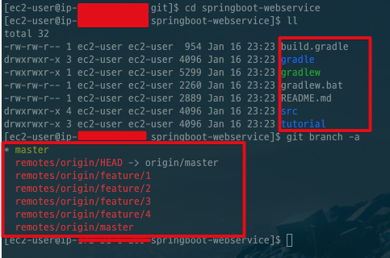

(```git branch -a```를 하시면 현재 브랜치도 확인할 수 있습니다.  
현재 master 브랜치로 되어있습니다.)  
  
자 그럼 프로젝트가 잘 받아졌는지 확인하기 위해 테스트를 수행해보겠습니다.

```bash
./gradlew test
```

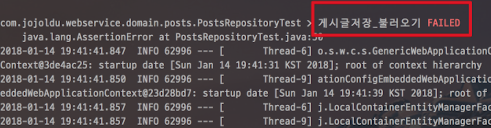

앗 테스트가 깨졌습니다.  
왜 깨졌을까요?

### 5-1-3. 깨진 테스트 수정

[지난 3번째 과정](http://jojoldu.tistory.com/255)에서 WebController를 테스트하기 위해 저희는 application.yml에 다음과 같이 ```insert``` 쿼리를 실행시키도록 옵션을 추가했습니다.  
  
src/**main**/resources/application.yml

```yaml
...
# local 환경
---
spring:
  profiles: local
  datasource:
    data: classpath:data-h2.sql # 시작할때 실행시킬 script
  ...
```

스프링 부트에서는 src/test/resources/application.yml이 없을 경우 main의 application.yml 옵션을 그대로 가져와서 사용하게 됩니다.  
테스트 코드는 **외부의 영향 없이 수행**되야하기 때문에 이 부분을 수정하겠습니다.  
**로컬PC에서 프로젝트 코드를 수정**합니다.  
(EC2에서 고치는게 아닙니다.)  
  
src/**test**/resources/application.yml을 생성해서 다음과 같이 작성합니다.

```yaml
# Test
spring:
  profiles:
    active: local # 기본 환경 선택

# local 환경
---
spring:
  profiles: local
  jpa:
    show-sql: true
```


수정후 다시 master 브랜치로 commit & push 합니다.  
push가 끝나시면 다시 EC2로 이동해 git pull을 받습니다.

```bash
cd ~/app/git/프로젝트명
git pull
```

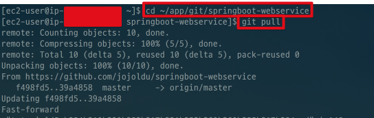

pull이 끝났으니 다시 테스트를 실행해봅니다.

```bash
./gradlew test
```

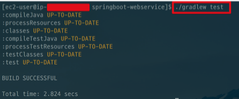

테스트가 잘 통과됐습니다!  
git을 통해 프로젝트를 **clone & pull**까지 잘 진행되었습니다.  
이제 이 프로젝트의 Test, Build, Run까지 진행하겠습니다.

> Tip)  
현재 **EC2엔 Gradle을 설치하지 않았습니다**.  
하지만 Gradle Task(ex: ```test```)를 수행할 수 있습니다.  
이는 프로젝트 내부에 포함된 ```gradlew```파일 때문인데요.  
Gradle이 설치되지 않은 환경 혹은 Gradle 버전이 다른 상황에서도 **해당 프로젝트에 한해서** Gradle을 쓸 수 있도록 지원하는 Wrapper 파일입니다.  
좀더 자세한 설명이 보고싶으신 분들은 [권남님의 wiki](http://kwonnam.pe.kr/wiki/gradle/wrapper)를 참고해보세요!

## 5-2. 배포 스크립트 생성

작성한 코드를 실제 서버에 반영하는것을 **배포**라고 합니다.  
여기서는 배포라 하면 다음의 과정을 모두 합친 뜻이라고 보시면 됩니다.

* git clone 혹은 git pull을 통해 새 버전의 프로젝트 받음
* Gradle / Maven을 통해 프로젝트 Test & Build
* EC2 서버에서 해당 프로젝트 실행 및 재실행

위 과정을 **배포시마다 개발자가 하나하나 명령어**를 실행하는 것은 불편함이 많습니다.  
그래서 이를 쉘 스크립트로 작성해 스크립트만 실행하면 위 과정이 차례로 진행되도록 하겠습니다.

### 5-2-1. deploy 스크립트 생성

EC2 인스턴스의 ```~/app/git/```에 ```deploy.sh``` 파일을 하나 생성합니다.

```bash
vim ~/app/git/deploy.sh
```

그리고 다음의 코드를 추가합니다.

```bash
#!/bin/bash

REPOSITORY=/home/ec2-user/app/git

cd $REPOSITORY/springboot-webservice/

echo "> Git Pull"

git pull

echo "> 프로젝트 Build 시작"

./gradlew build

echo "> Build 파일 복사"

cp ./build/libs/*.jar $REPOSITORY/

echo "> 현재 구동중인 애플리케이션 pid 확인"

CURRENT_PID=$(pgrep -f springboot-webservice)

echo "$CURRENT_PID"

if [ -z $CURRENT_PID ]; then
    echo "> 현재 구동중인 애플리케이션이 없으므로 종료하지 않습니다."
else
    echo "> kill -2 $CURRENT_PID"
    kill -9 $CURRENT_PID
    sleep 5
fi

echo "> 새 어플리케이션 배포"

JAR_NAME=$(ls $REPOSITORY/ |grep 'springboot-webservice' | tail -n 1)

echo "> JAR Name: $JAR_NAME"

nohup java -jar $REPOSITORY/$JAR_NAME &
```

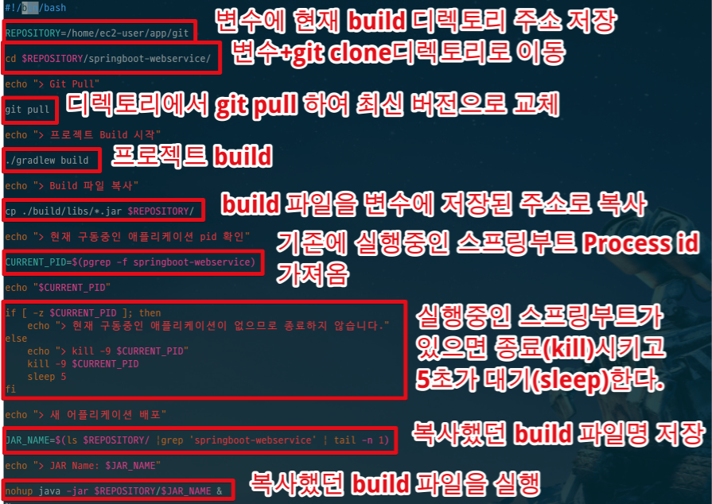

하나씩 설명드리겠습니다.

* ```REPOSITORY=/home/ec2-user/app/git```
  * 프로젝트 디렉토리 주소는 스크립트 내에서 자주 사용하는 값이기 때문에 이를 **변수**로 저장합니다.
  * 쉘에선 **타입 없이** 선언하여 저장을 합니다.
  * 쉘에선 ```$변수명```으로 변수를 사용할 수 있습니다.
* ```cd $REPOSITORY/springboot-webservice/```
  * 제일 처음 git clone 받았던 디렉토리로 이동합니다.
  * 바로 위의 쉘 변수 설명처럼 ```$REPOSITORY```으로 ```/home/ec2-user/app/git```을 가져와 ```/springboot-webservice/```를 붙인 디렉토리 주소로 이동합니다.
* ```git pull```
  * 디렉토리 이동후, ```master```브랜치의 최신 내용을 받습니다.
* ```./gradlew build```
  * 프로젝트 내부의 ```gradlew```로 build를 수행합니다.
* ```cp ./build/libs/*.jar $REPOSITORY/```
  * build의 결과물인 jar파일을 복사해 jar파일을 모아둔 위치로 복사합니다.
* ```CURRENT_PID=$(pgrep -f springboot-webservice)```
  * 기존에 수행중이던 스프링부트 어플리케이션을 종료합니다.
  * ```pgrep```은 process id만 추출하는 명령어입니다.
  * ```-f``` 옵션은 프로세스 이름으로 찾습니다.
  * 좀 더 자세한 옵션을 알고 싶으시면 [공식 홈페이지](https://linux.die.net/man/1/pgrep)를 참고하시면 좋습니다.
* ```if ~ else ~ fi```
  * 현재 구동중인 프로세스가 있는지 없는지 여부를 판단해서 기능을 수행합니다.
  * process id값을 보고 프로세스가 있으면 해당 프로세스를 종료합니다.
* ```JAR_NAME=$(ls $REPOSITORY/ |grep 'springboot-webservice' | tail -n 1)```
  * 새로 실행할 jar 파일명을 찾습니다.
  * 여러 jar파일이 생기기 때문에 ```tail -n ```로 가장 나중의 jar파일(최신 파일)을 변수에 저장합니다.
* ```nohup java -jar $REPOSITORY/$JAR_NAME &```
  * 찾은 jar파일명으로 해당 jar파일을 ```nohup```으로 실행시킵니다.
  * 스프링부트의 장점으로 특별히 외장 톰캣을 설치할 필요가 없습니다.  
    * 내장 톰캣을 사용해서 jar 파일만 있으면 바로 웹 어플리케이션 서버가 실행할수 있습니다.  
    * 좀 더 자세한 스프링부트의 장점을 알고 싶으시면 이전에 작성한 [SpringBoot의 깨알같은 팁](http://jojoldu.tistory.com/43)을 참고하시면 좋습니다.
  * 일반적으로 Java를 실행시킬때는 ```java -jar```라는 명령어를 사용하지만, 이렇게 할 경우 **사용자가 터미널 접속을 끊을 경우 어플리케이션도 같이 종료**가 됩니다.  
  * 어플리케이션 실행자가 터미널을 종료시켜도 어플리케이션은 계속 구동될 수 있도록 ```nohup```명령어를 사용합니다.  


> Tip)  
리눅스 쉘 스크립트가 부담스러우시다면 [만화로 배우는 리눅스 시스템 관리](http://book.naver.com/bookdb/book_detail.nhn?bid=10995037)를 꼭 읽어보시고 실습해보시길 추천드립니다.  
백엔드 개발자가 이클립스에서 Java 코드만 작성하는 직업이 아닙니다.  
서버에 문제가 발생할때, 반복작업을 자동화시킬때 등 리눅스와 쉘 스크립트가 필요한 경우가 너무나 많기 때문에 피할수가 없습니다.

nohup은 실행시킨 jar파일의 로그 내용을 **nohup.out** 이란 파일에 남깁니다.  


nohup.out 파일이 생성되신게 확인 되시면, 아래 명령어로 잘 수행되었는지 확인합니다. 

```bash
tail -f /home/ec2-user/app/build/nohup.out
```


로컬에서 SpringBoot를 실행했을때와 마찬가지로 실행 로그를 확인할 수 있습니다.  
  
이 스크립트를 실행하기 위해 실행권한을 주겠습니다.

```bash
chmod 755 ./deploy.sh
```

자 그럼 프로젝트의 버전을 변경합니다.

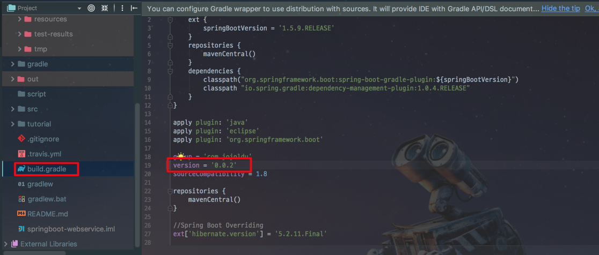

그리고 이를 푸시하고 스크립트를 실행해보겠습니다.

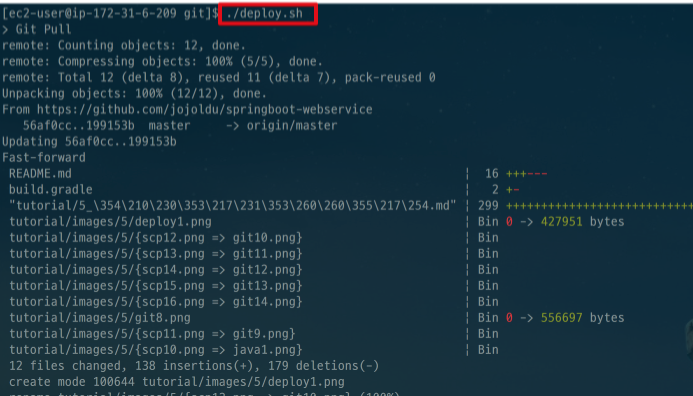

스크립트 내용이 차례로 실행되는 것이 끝나면 아래 명령어로 ```springboot-webservice```로 실행되는 프로세스가 어떤것이 있는지 확인합니다.

```bash
ps -ef|grep springboot-webservice
```

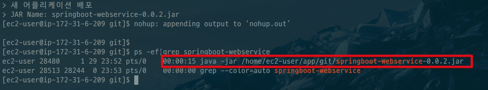

springboot-webservice-0.0.2.jar가 실행되는게 보입니다!
  
이제 이 서비스를 직접 외부에서 접속해보겠습니다!

## 5-3. 외부에서 서비스 접속

일단 EC2의 스프링부트는 8080 포트로 실행되었습니다.  
그럼 우리의 EC2 인스턴스도 8080 포트가 외부에서 접근 가능하도록 열려있어야만 합니다.  
AWS EC2 인스턴스 페이지 -> 보안그룹 -> 현재 프로젝트의 인스턴스 -> 인바운드 탭을 클릭 합니다.


인바운드 **편집** 버튼을 클릭해서 다음과 같이 사용자지정(TCP), 8080 포트를 추가합니다.

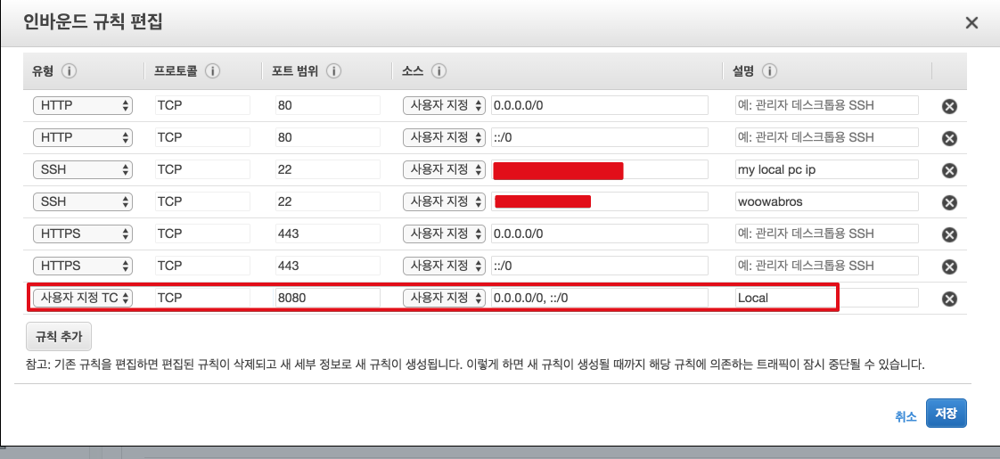

> Tip)  
차후 Nginx 설치 과정이 끝나면 8080 포트는 제거하고, 80/443 포트만 열어놓습니다.  
Nginx를 통하지 않고, Tomcat에 바로 연락오는 요청은 모두 무시합니다.  

편집이 완료되셨으면 인스턴스의 퍼블릭 DNS로 브라우저에 접근해봅니다.


스프링부트가 8080포트로 열려있기 때문에 퍼블릭 DNS 뒤에 8080 포트를 붙여 접근합니다.

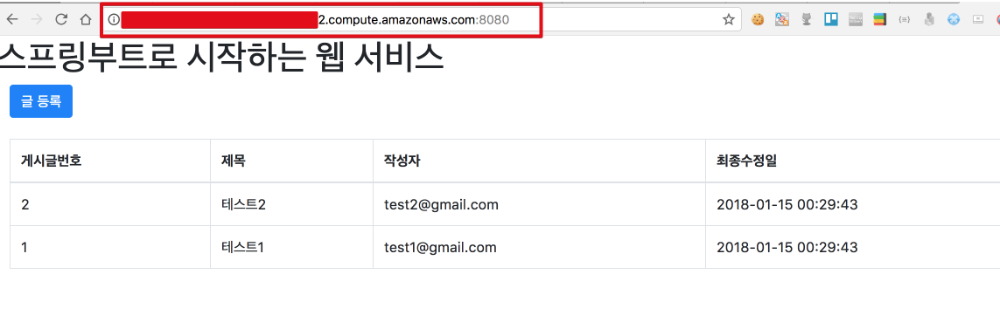

드디어 프로젝트가 외부에 노출되었습니다!  


## 5-4. 문제점?

간단하게나마 스프링부트 프로젝트를 EC2에 배포해보았습니다.  
스크립트를 작성해 간편하게 빌드와 배포를 진행한것 같은데 불편한 점을 느끼셨나요?  
현재 방식은 몇가지 문제가 있습니다.

* 수동 Test 
  * 본인이 짠 코드가 다른 개발자의 코드에 영향을 끼치지 않는지 확인하기 위해 전체 테스트를 수행해야만 합니다.
  * 현재 상태에선 항상 개발자가 작업을 진행할때마다 **수동으로 전체 테스트를 수행**해야만 합니다.
* 수동 Build
  * 다른 사람이 작성한 브랜치와 제가 작성한 브랜치가 합쳐졌을때(Merge) 이상이 없는지는 Build를 수행해야만 알수 있습니다.
  * 이를 매번 개발자가 직접 실행해봐야만 됩니다.

그래서!  
다음 시간에는 이런 수동 Test & Build를 자동화 시키는 작업을 진행하겠습니다.  
**Git에 푸시를 하면 이후엔 전혀 개발자가 신경쓰지 않아도** 되도록 개선하는 과정을 진행하겠습니다.  
끝까지 봐주셔서 감사합니다!