# 6. TravisCI & AWS CodeDeploy로 배포 자동화 구축하기

이번 시간엔 배포 자동화 환경을 구축하겠습니다.
(모든 코드는 [Github](https://github.com/jojoldu/springboot-webservice/tree/feature/6)에 있습니다.)  


## 6-1. CI?

[이전 시간](http://jojoldu.tistory.com/263)에 저희는 스프링부트 프로젝트를 간단하게나마 EC2에 배포해보았습니다.  
스크립트를 개발자가 직접 실행시킴으로써 발생하는 불편을 경험했습니다.  
  
그래서 이번 시간엔 CI 환경을 구축해보려고 합니다.  
코드 버전 관리를 하는 VCS 시스템에 PUSH가 되면 **자동으로 Test, Build가 수행**되고 Build 결과를 운영 서버에 배포까지 자동으로 진행되는 이 과정을 CI (지속적 통합)이라고 합니다.  
  
단순히 **CI 툴을 도입했다고 해서 CI를 하고 있는 것은 아닙니다**.  
[마틴 파울러의 블로그](https://www.martinfowler.com/articles/originalContinuousIntegration.html)를 가보시면 CI에 대해 다음과 같은 4가지 규칙을 이야기합니다.

* 모든 소스 코드가 살아있고(현재 실행되고) **어느 누구든 현재의 소스를 접근할 수 있는 단일 지점**을 유지할 것
* 빌드 프로세스를 자동화시켜서 **어느 누구든 소스로부터 시스템을 빌드하는 단일 명령어를 사용**할 수 있게 할 것
* **테스팅을 자동화**시켜서 단일 명령어를 통해서 언제든지 시스템에 대한 건전한 테스트 수트를 실핼할 수 있게 할 것
* 누구나 현재 실행 파일을 얻으면 지금까지 최고의 실행파일을 얻었다는 확신을 하게 만들 것

여기서 특히나 중요한 것은 **테스팅 자동화**입니다.  
지속적으로 통합하기 위해선 무엇보다 이 프로젝트가 **완전한 상태임을 보장하기 위해 테스트 코드가 구현**되어 있어야만 합니다.  
(2장과 3장에서 계속 테스트 코드를 작성했던 것을 다시 읽어보시는것도 좋습니다.)  

> Tip)  
테스트코드 작성, TDD에 대해 좀 더 자세히 알고 싶으신 분들은 명품강의로 유명한 [백명석님의 클린코더스 - TDD편](https://www.youtube.com/watch?v=wmHV6L0e1sU&index=7&t=1538s&list=PLagTY0ogyVkIl2kTr08w-4MLGYWJz7lNK)을 꼭 다 보시길 추천합니다.

CI가 어떤건지 조금 감이 오시나요?  
그럼 실제 CI 툴을 하나씩 적용해보겠습니다.

## 6-2. Travis CI 연동하기

[Travis CI](https://travis-ci.org/)는 Github에서 제공하는 무료 CI 서비스입니다.  
젠킨스와 같은 CI 툴도 있지만, 젠킨스는 **설치형**이기 때문에 이를 위한 **EC2 인스턴스가 하나더 필요**합니다.  
이제 시작하는 서비스에서 배포를 위한 EC2 인스턴스는 부담스럽기 때문에 오픈소스 웹 서비스인 Travis CI를 사용하겠습니다.  
  
> Tip)  
AWS에서 Travis CI와 같은 CI 툴로 [CodeBuild](https://aws.amazon.com/ko/codebuild/)를 제공합니다.  
하지만 **빌드시간만큼 과금**되는 구조라 초기에 사용하기엔 부담스러운면이 있습니다.  
실제 서비스되는 EC2/RDS/S3외엔 비용 부분을 최소화해서 진행하는 것이 초기 서비스 출시에 도움된다고 생각되어 TravisCI를 사용합니다.

### 6-2-1. Travis 웹 서비스 설정

Github 계정으로 [Travis CI](https://travis-ci.org/)에 로그인을 하신뒤, 우측 상단의 계정명 -> Accounts를 클릭합니다.

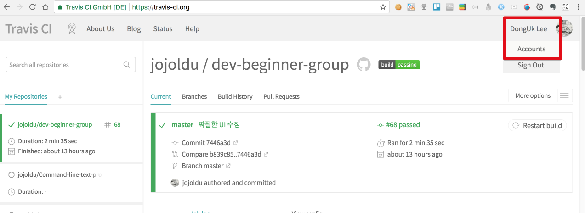

프로필 페이지로 이동하시면 하단의 Github 저장소 검색창에 프로젝트명을 입력해서 찾아, 좌측의 상태바를 활성화 시킵니다.  

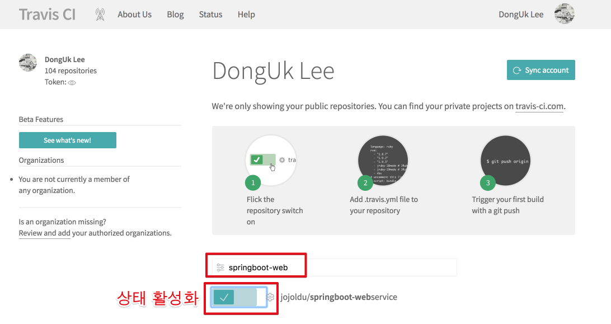

활성화시킨 저장소를 클릭하면 아래와 같이 저장소 빌드 히스토리 페이지로 이동합니다.

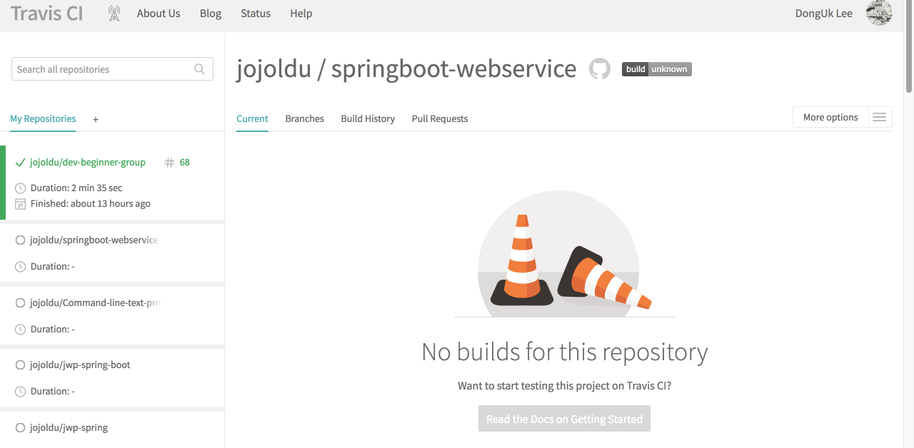

Travis CI 웹사이트에서의 설정은 이게 끝입니다.  
상세한 설정은 프로젝트의 yml파일로 진행해야하니, 프로젝트로 돌아가겠습니다.

### 6-2-2. 프로젝트 설정

TravisCI는 상세한 CI 설정은 프로젝트에 존재하는 ```.travis.yml```로 할수있습니다.  
프로젝트에 ```.travis.yml```을 생성후 아래 코드를 추가합니다.

```yaml
language: java
jdk:
  - openjdk8

branches:
  only:
    - master

# Travis CI 서버의 Home
cache:
  directories:
    - '$HOME/.m2/repository'
    - '$HOME/.gradle'

script: "./gradlew clean build"

# CI 실행 완료시 메일로 알람
notifications:
  email:
    recipients:
      - xxx@gmail.com 
```

옵션명만 봐도 충분히 이해하기 쉬운 구조입니다.  

* branches
  * 오직 **master**브랜치에 push될때만 수행됩니다.
* cache
  * Gradle을 통해 의존성을 받게 되면 이를 해당 디렉토리에 캐시하여, 같은 의존성은 다음 배포때부터 다시 받지 않도록 설정합니다.
* script
  * master 브랜치에 PUSH 되었을때 수행하는 명령어입니다.
  * 여기선 프로젝트 내부에 둔 gradlew을 통해 **clean & build 를 수행**합니다.  
* notifications
  * Travis CI 실행 완료시 자동으로 알람이 가도록 설정합니다.
  * Email외에도 Slack이 있으니, 관심있으신 분들은 [링크1](http://deptno.github.io/posts/2016/github-travis-ci/), [링크2](https://blog.travis-ci.com/2014-03-13-slack-notifications)를 참고하여 Slack도 추가하시는걸 추천드립니다.

자 그럼 여기까지 하신뒤, master 브랜치에 commit & push 하신뒤, 좀전의 Travis CI 저장소 페이지를 확인합니다.

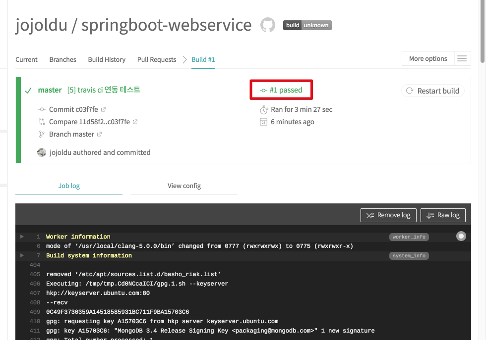

빌드가 성공했습니다!  
빌드가 성공했는걸 확인했으니, 알람도 잘 왔는지```.travis.yml```에 등록한 Email을 확인합니다.


빌드가 성공했는것을 메일로도 잘 전달된것을 확인했습니다!  
여기까지만 하기엔 조금 아쉬우니 다른 오픈소스들처럼 라벨을 추가해보겠습니다.

### 6-2-3. Travis CI 라벨 추가

오픈소스들을 보면 build passing 이란 라벨이 README.md에 표시된것을 종종 볼수있습니다.  
이건 travis ci에서 제공하는 라벨입니다.  
우리의 서비스에도 이와 같은 라벨을 한번 붙여보겠습니다.  
방금전 build 확인을 했던 페이지에서 우측 상단을 보시면 build 라벨을 보실 수 있습니다.  
이걸 클릭하시면 아래와 같은 modal이 등장합니다.


여기서 타입을 Markdown으로 선택하신뒤, 아래에 나오는 코드를 복사하셔서 라벨이 나오길 원하는 위치에 코드를 복사합니다.


자 이렇게 하신뒤 (master브랜치에서) commit & push 하신뒤 Github 페이지로 가보시면!


라벨이 붙어있는것을 확인할 수 있습니다!  
  
음.. 근데 뭔가 하나 빠진것 같지 않나요?  
이건 **테스트와 빌드만 자동화** 된것이지, **배포까지 자동화**되진 않았습니다.  
배포가 자동화 되어야만 개발자가 정말 편해지겠죠?  
배포 자동화를 진행하겠습니다.

## 6-3. AWS Code Deploy 연동하기

Travis CI는 결국 CI 툴입니다.  
Test & Build까지는 자동화 시켜주었지만, 빌드된 파일을 원하는 서버로 전달까지 해주진 않습니다.  
**TravisCI로 Build된 파일을 EC2 인스턴스로 전달**하기 위해 AWS CodeDeploy를 사용하겠습니다.  

### 6-3-1. 전체구조

AWS Code Deploy까지 적용되면 전체 구조는 아래와 같습니다.

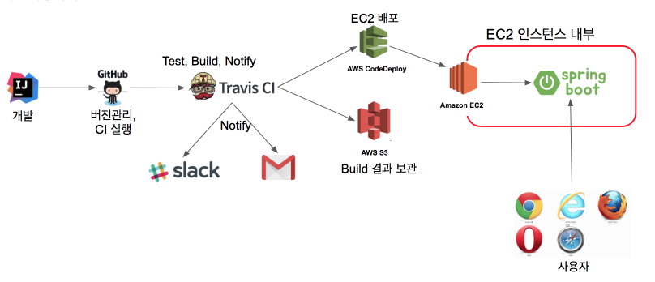

(배포 자동화 구조)  
  
이 그림이 최종 인프라 스트럭처 구조는 아닙니다.  
단지 이번 시간에 구축될 그림이니 한번 머릿속에 넣으시고 진행하시면 도움되실것 같습니다.

### 6-3-2. AWS Code Deploy 계정 생성

먼저 Travis CI가 사용할 수 있는 **AWS Code Deploy용 계정**을 하나 추가하겠습니다.  
(현재 로그인한 계정은 루트 사용자라 모든 권한을 갖고 있기 때문에 외부에 노출하면 안됩니다.)  
  
AWS의 서비스 검색에서 **IAM**을 선택합니다.  
**사용자** 탭 클릭-> **사용자 추가** 버튼을 클릭 합니다.  

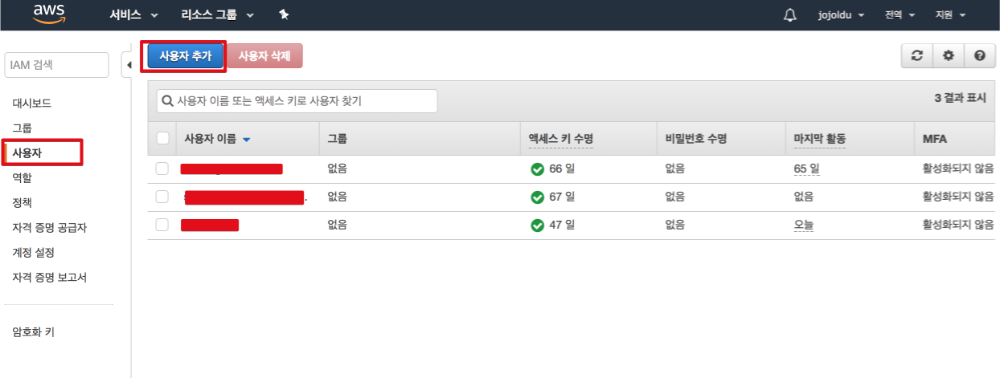

원하는 계정명으로 사용자 이름을 입력하시고, **프로그래밍 방식 엑세스**에 체크합니다.  


해당 계정이 사용할 수 있는 정책들을 선택하는 페이지입니다.  
저희는 **CodeDeploy**와 **S3** (Build 파일 백업용) 권한만 할당 받겠습니다. 

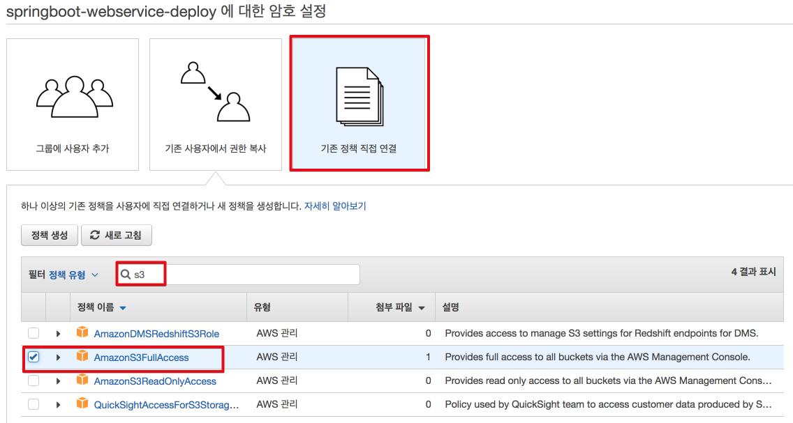


최종적으로 아래와 같이 **AmazonS3FullAccess**, **AWSCodeDeployFullAccess** 정책이 포함되면 됩니다.


완성 되시면 엑세스키와 비밀(Secret) 키가 생성됩니다.  
좌측의 **.csv 다운로드** 버튼을 클릭해 csv로 키를 저장해놓습니다.  


자 이제 Travis CI를 위한 계정이 생성되었습니다.  
이 계정은 앞으로 Travis CI에서 AWS CodeDeploy와 S3를 사용해서 저희의 배포를 진행할 예정입니다!

### 6-3-3. AWS S3 버킷 생성

다음으로 Build 된 jar 파일을 보관할 S3 버킷을 생성하겠습니다.  
  
AWS 관리 페이지에서 서비스 -> S3 검색 -> **버킷 만들기** 버튼을 클릭합니다.  

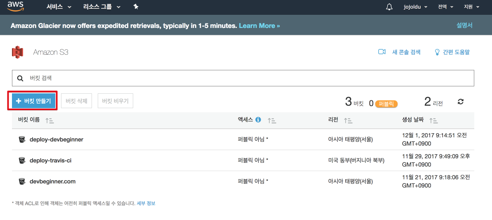

본인이 원하는 버킷 이름과 리전을 선택합니다.

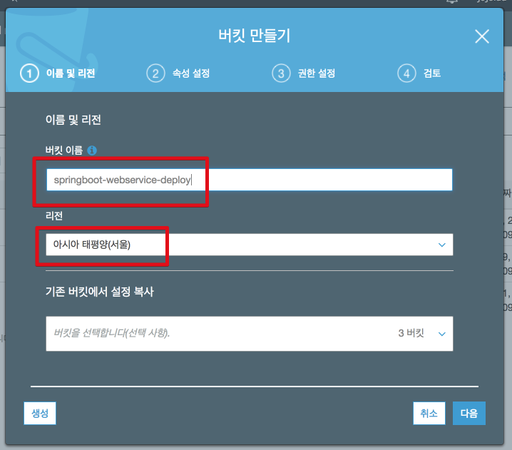

추가 옵션 없이 **다음**을 계속 진행해서 버킷 생성을 완료합니다.  
S3 생성은 이게 끝입니다.  
간단하죠?  

### 6-3-4. IAM Role 추가

이번에는 사용자를 대신에 access key & secret key를 사용해 원하는 기능을 진행하게할 AWS Role (이하 역할)을 생성하겠습니다.
EC2와 CodeDeploy를 위한 역할을 생성합니다.  

> Tip)  
역할(Role)에 대해 좀 더 자세한 설명은 [AWS 공식 가이드](https://docs.aws.amazon.com/ko_kr/IAM/latest/UserGuide/id_roles_create_for-service.html)를 참고하시면 좋습니다.

**6-3-2**때와 마찬가지로 **IAM**을 검색해서 이동합니다.  
좌측 화면의 **역할**을 클릭합니다.

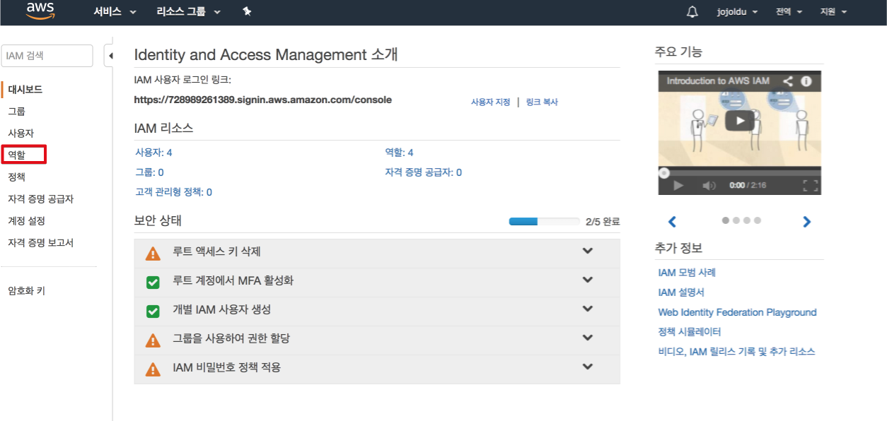

**역할 만들기** 버튼을 클릭합니다.

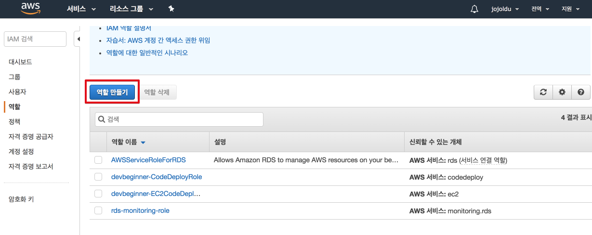

**AWS 서비스** -> EC2 -> 하단의 **사용사례선택**에서 EC2를 선택하신 후, **다음:권한** 버튼을 클릭합니다.

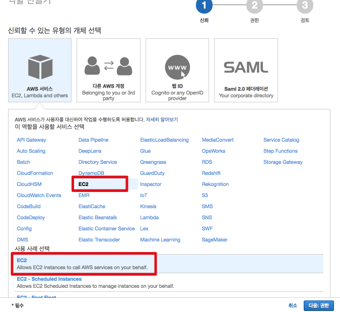

많은 정책중, **AmazonEC2RoleforAWSCodeDeploy**를 검색하셔서 체크합니다.


본인이 원하시는 역할 이름을 선택합니다.  
보통은 서비스명-EC2CodeDeployRole 으로 짓습니다.

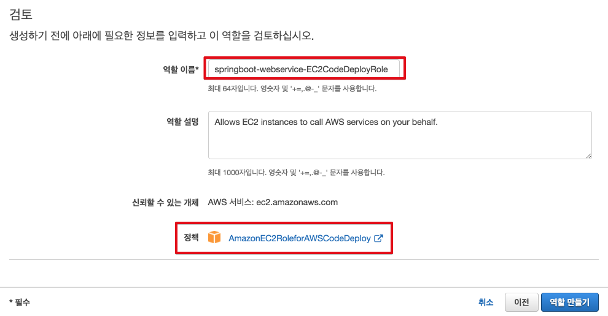

자 그리고 여기서 한가지 Role을 추가합니다.  
CodeDeploy가 사용자를 대신해 배포를 진행하는 Role입니다.  
똑같이 IAM -> 역할 -> 역할만들기로 생성합니다.  

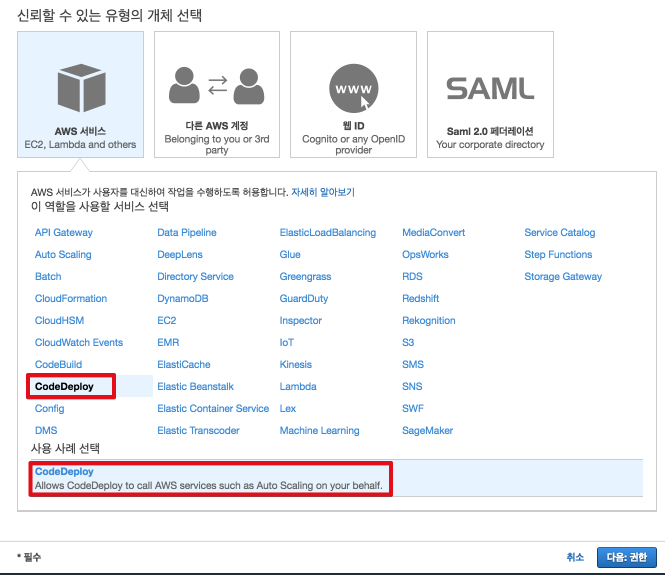

CodeDeploy Role은 하나밖에 없어서 별다른 체크 없이 바로 다음으로 넘어갑니다.

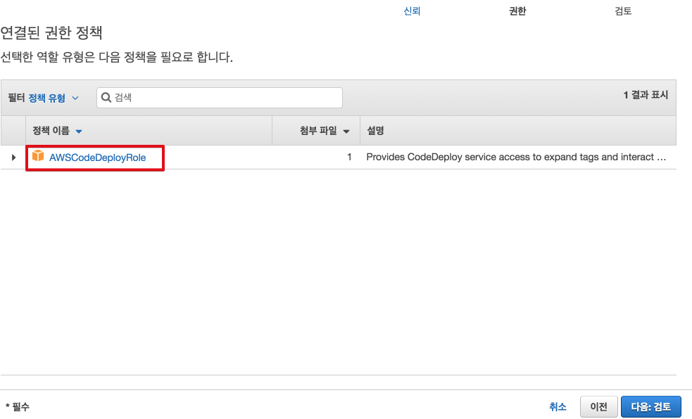

역할 이름은 서비스명-CodeDeployRole로 지었습니다.

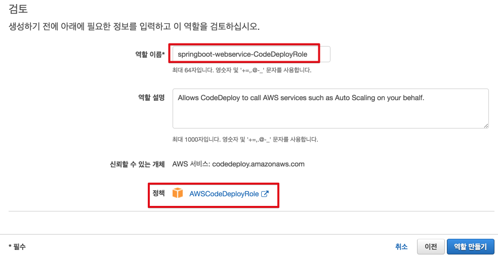

자 그럼 생성한 이 역할(Role)들을 AWS 서비스에 하나씩 할당해보겠습니다.

### 6-3-5. EC2에 Code Deploy Role 추가

서비스 -> EC2로 이동하셔서 저희가 생성했던 EC2 인스턴스를 우클릭합니다.  
**IAM 역할 연결/바꾸기**를 선택합니다.

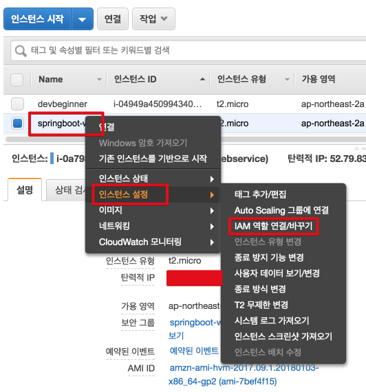

그리고 좀전에 생성한 EC2CodeDeployRole을 선택합니다.

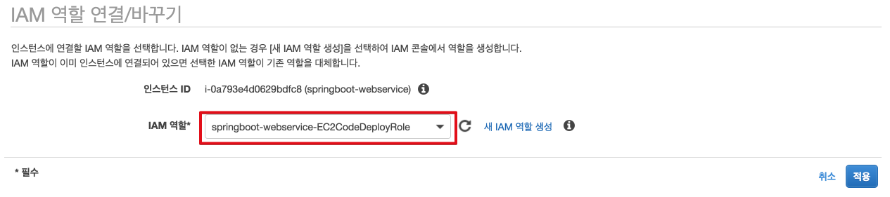

자 이제 우리의 EC2 인스턴스에 Code Deploy Agent를 설치하러 가보겠습니다.

### 6-3-6. EC2에 CodeDeploy Agent 설치

**EC2에서 CodeDeploy에서 실행하는 이벤트를 받아서 처리**할 수 있도록 Agent를 설치하겠습니다.  
EC2에 ssh 접속후, **AWS를 커맨드로** 다루기 위해 AWS CLI를 설치합니다.

```bash
sudo yum -y update

sudo yum install -y aws-cli
```

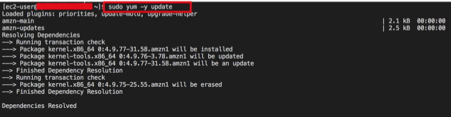

CLI 설치가 완료되셨으면 ```/home/ec2-user/```로 이동하신 뒤, AWS CLI에 accessKey secretKey를 입력합니다.  
이때 필요한 키값은 **6-3-2**에 생성한 CodeDeploy용 계정의 accessKey와 secretKey입니다.  
다운 받은 CSV파일을 열어서 해당 값을 복사해 입력합니다.

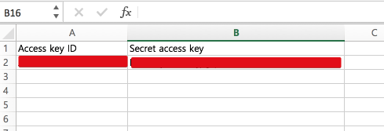

그리고 EC2 인스턴스에서 아래 명령어를 입력합니다.

```bash
cd /home/ec2-user/

sudo aws configure
```

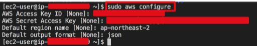

* Access Key
* Secret Access Key
* region name
  * ```ap-northeast-2```
  * 서울 리전을 얘기합니다.
* output format
  * ```json```

차례로 입력이 완료되셨으면 CLI의 기본설정이 완료되었습니다.  
자 그럼 AWS Code Deploy CLI를 설치하겠습니다.  
아래 명령어를 ```/home/ec2-user/```에서 실행합니다.

```bash
aws s3 cp s3://aws-codedeploy-ap-northeast-2/latest/install . --region ap-northeast-2
```

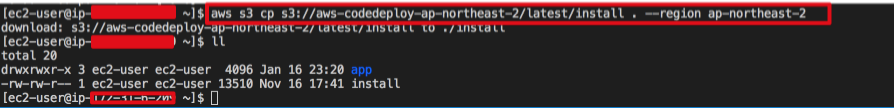

다운로드가 끝나면 ```install``` 파일이 생성됩니다.  
해당 파일을 실행할수 있는 권한을 추가합니다.

```bash
chmod +x ./install
```

> Tip)  
리눅스에서 x권한은 실행권한을 얘기합니다.

그리고 이 ```./install``` 파일을 이용해 AWS CodeDeploy Agent를 설치 & 실행합니다.

```bash
sudo ./install auto
```

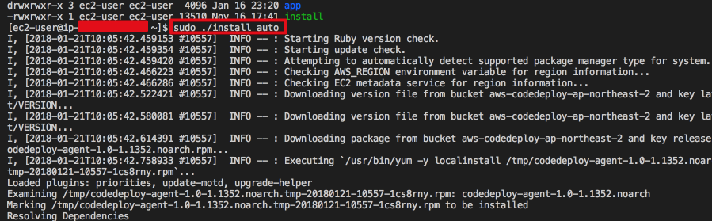

설치가 완료되셨으면 아래 명령어로 Agent가 실행중인지 확인합니다.

```bash
sudo service codedeploy-agent status
```

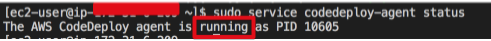

마지막으로 **EC2 인스턴스가 부팅되면 자동으로 AWS CodeDeploy Agent가 실행**될 수 있도록 ```/etc/init.d/```에 쉘 스크립트 파일을 하나 생성하겠습니다.  

> Tip)  
리눅스에서 ```/etc/init.d/```에 스크립트 파일이 있으면 부팅시 자동으로 실행됩니다.

```bash
sudo vim /etc/init.d/codedeploy-startup.sh
```

스크립트 파일에 아래의 내용을 추가합니다.

```bash
#!/bin/bash

echo 'Starting codedeploy-agent'
sudo service codedeploy-agent start
```

스크립트 파일을 저장(```:wq```) 하시면 AWS의 설정이 끝납니다!  

## 6-4. .travis.yml & appspec.yml 설정

Travis CI와 AWS CodeDeploy 둘 모두 젠킨스와 같은 설치형이 아니라서, 상세한 설정은 **프로젝트 내에 존재**하는 ```.yml```로 관리합니다.  


### 6-4-1. Travis CI & S3 연동

CodeDeploy는 저장 기능이 없습니다.  
그래서 **Travis CI가 Build 한 결과물을 받아서 CodeDeploy가 가져갈 수 있도록 보관할 수 있는 공간**이 필요합니다.  
보통은 이럴때 **AWS S3**를 이용합니다.  
프로젝트 내부에 ```.travis.yml```파일을 생성하고 아래의 코드를 추가합니다.

```yaml
deploy:
  - provider: s3
    access_key_id: $AWS_ACCESS_KEY # Travis repo settings에 설정된 값
    secret_access_key: $AWS_SECRET_KEY # Travis repo settings에 설정된 값
    bucket: springboot-webservice-deploy # 6-3-3에서 생성한 S3 버킷
    region: ap-northeast-2
    skip_cleanup: true
    acl: public_read
    wait-until-deployed: true
    on:
      repo: jojoldu/springboot-webservice #Github 주소
      branch: master

```

여기 설정값을 보시면 ```$AWS_ACCESS_KEY```, ```$AWS_SECRET_KEY```가 있습니다.  
이는 저희가 csv로 받았던 access key와 secret key를 나타내는데요.  
가장 간단하게 구현한다면 여기에 직접 값을 할당해도 됩니다.  
하지만 그렇게 할 경우 Github에 AWS access key와 secret key가 노출되기 때문에 절대 그렇게 하시면 안됩니다.  
대신에, Travis CI에서 이런 중요한 키 값을 관리하도록 두고, Travis CI가 실행시점에 값을 사용할 수 있도록 지정한것이 ```$AWS_ACCESS_KEY```, ```$AWS_SECRET_KEY``` 라고 보시면 됩니다.  
  
Travis CI로 가셔서 우측 상단의 **More Options** -> **Settings**을 클릭합니다.

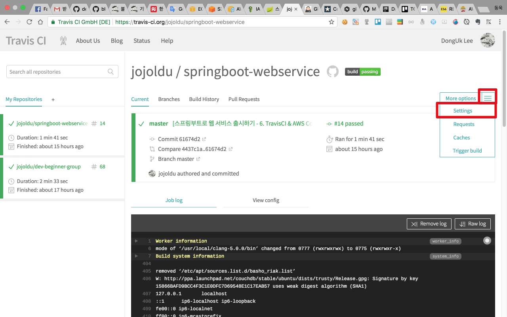

설정화면을 아래로 조금 내려보시면 **Environment Variables** 항목이 있습니다.  
여기에 ```AWS_ACCESS_KEY```, ```AWS_SECRET_KEY```를 변수로 해서 **6-3-2**에서 받은 키 값들을 등록합니다.

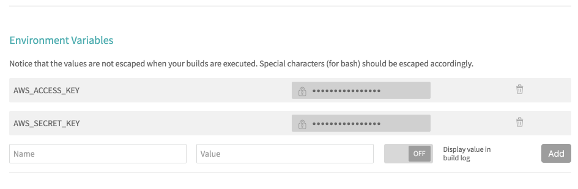

여기에 등록된 값들은 이제 ```.travis.yml``` 에서 ```$AWS_ACCESS_KEY```, ```$AWS_SECRET_KEY```란 이름으로 사용할 수 있습니다.  
(쉘 스크립트에서 변수를 사용했던것과 비슷하죠?)  
  
여기까지만 진행후, 실제로 연동되는지 테스트를 한번 해보겠습니다.  
Travis와는 이미 연동된 상태이니, 현재까지 내용을 담아 master 브랜치로 Commit & Push 하겠습니다.  
그러면 TravisCI가 Build가 실행되니, 성공적으로 끝나면

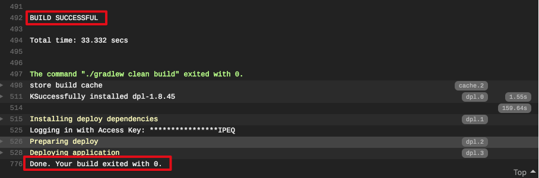

AWS S3에 저희가 지정한 버킷 (```springboot-webservice-deploy```)에 build 결과가 전송되었음을 알 수 있습니다.

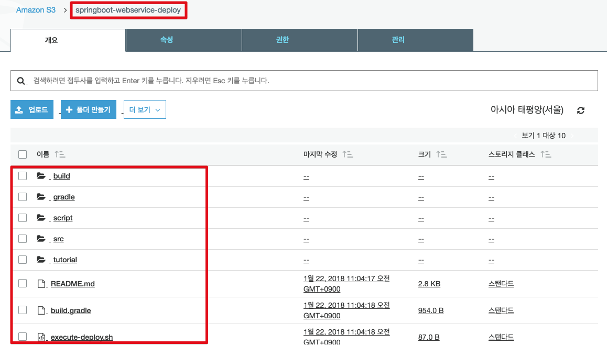

여기서! 매번 Travis CI에서 파일을 하나하나 복사하는건 복사시간이 많이 걸리기 때문에 **프로젝트 폴더 채로 압축**해서 S3로 전달하도록 설정을 조금 추가하겠습니다.

```yaml

...
before_deploy:
  - zip -r springboot-webservice *
  - mkdir -p deploy
  - mv springboot-webservice.zip deploy/springboot-webservice.zip

deploy:
  - provider: s3
    ...
    local_dir: deploy # before_deploy에서 생성한 디렉토리
    ...
```

* ```before_deploy```
  * ```zip -r springboot-webservice```
    * 현재 위치의 모든 파일을 ```springboot-webservice```이름으로 압축(zip)
  * ```mkdir -p deploy```
    * deploy라는 디렉토리를 Travis CI가 실행중인 위치에서 생성
  * ```mv springboot-webservice.zip deploy/springboot-webservice.zip```
    * springboot-webservice.zip 파일을 deploy/springboot-webservice.zip로 이동 

* ```deploy```
  * ```local_dir: deploy```
    * 앞에서 생성한 deploy 디렉토리
    * 해당 디렉토리(```deploy```) 내용들만 S3로 전송

그래서 전체 ```.travis.yml``` 코드는 아래와 같습니다.

```yaml
language: java
jdk:
  - openjdk8

branches:
  only:
    - master

# Travis CI 서버의 Home
cache:
  directories:
    - '$HOME/.m2/repository'
    - '$HOME/.gradle'

script: "./gradlew clean build"

before_deploy:
  - zip -r springboot-webservice *
  - mkdir -p deploy
  - mv springboot-webservice.zip deploy/springboot-webservice.zip

deploy:
  - provider: s3
    access_key_id: $AWS_ACCESS_KEY # Travis repo settings에 설정된 값
    secret_access_key: $AWS_SECRET_KEY # Travis repo settings에 설정된 값
    bucket: springboot-webservice-deploy # S3 버킷
    region: ap-northeast-2
    skip_cleanup: true
    acl: public_read
    local_dir: deploy # before_deploy에서 생성한 디렉토리
    wait-until-deployed: true
    on:
      repo: jojoldu/springboot-webservice
      branch: master

notifications:
  email:
    recipients:
      - jojoldu@gmail.com
``` 

자 이렇게 변경후 다시 Git Commit & Push를 해보겠습니다.  
그리고 다시 S3를 확인해보시면!

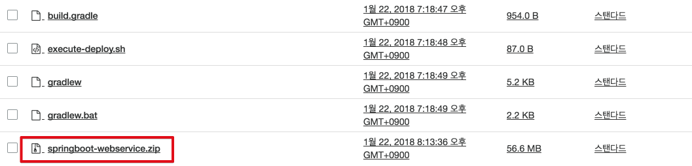

zip파일이 전송된것을 확인할 수 있습니다.  
zip파일 외에는 이제 필요없으니 다 지우셔도 됩니다.  
Travis CI와 S3까지 연동되었습니다!

### 6-4-2. Travis CI & S3 & CodeDeploy 연동

이제는 Travis CI와 S3, CodeDeploy까지 같이 연동해보겠습니다.  
먼저 AWS 웹 콘솔에서 **CodeDeploy**를 검색해서 이동합니다.  

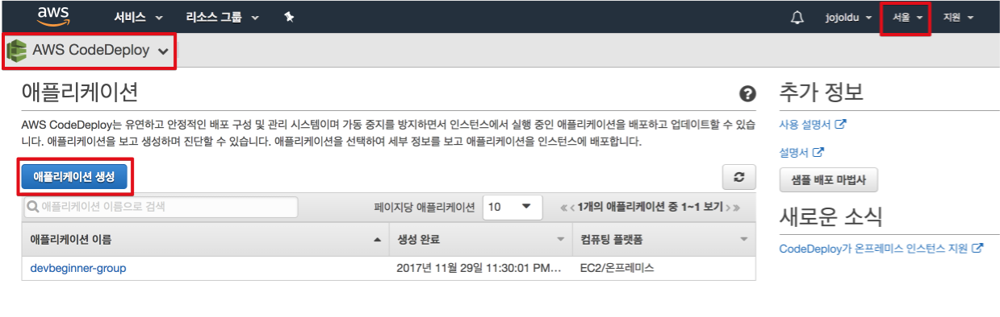

리전이 **서울**인지 확인하신뒤, **애플리케이션 생성**버튼을 클릭합니다.  
아래와 같이 설정합니다.

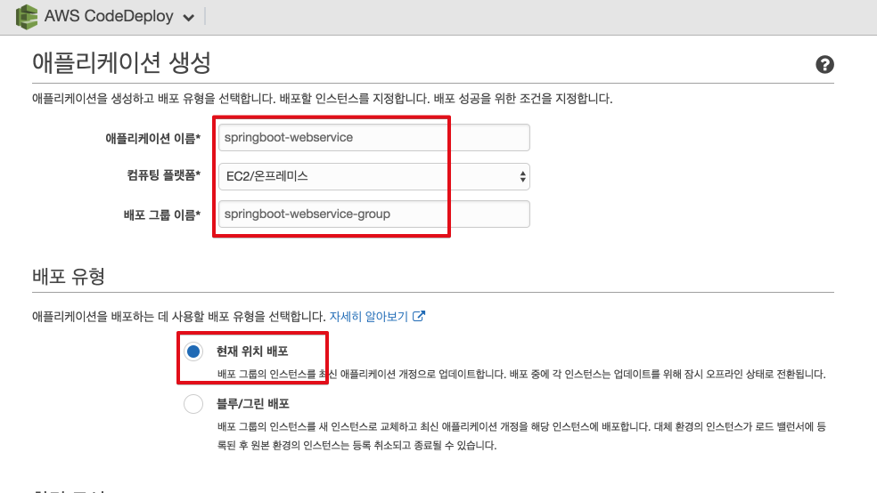

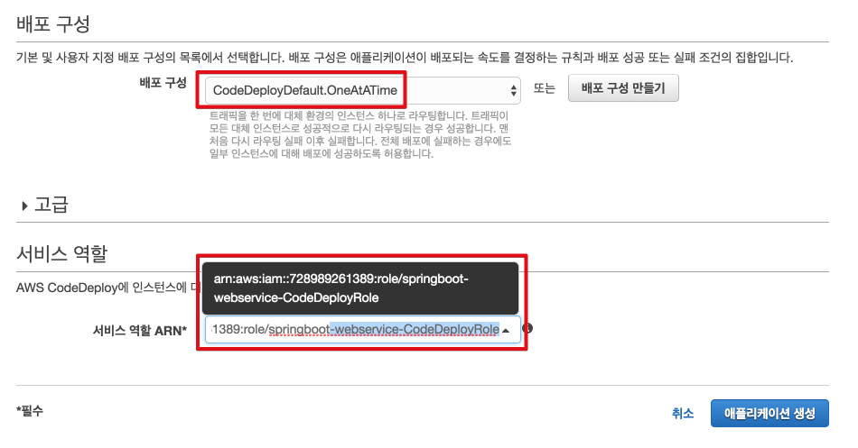

가장 마지막 설정값들은 아래와 같습니다.


여기서 ARN은 기존에 생성해둔 ```CodeDeployRole```을 선택하셔야 합니다.  
(```EC2CodeDeployRole```이 아닙니다.)  
  
AWS CodeDeploy 설정이 끝나셨으면, EC2로 접속해서 S3에서 zip를 받아올 디렉토리 하나를 생성하겠습니다.  

```bash
mkdir /home/ec2-user/app/travis
mkdir /home/ec2-user/app/travis/build
```

TravisCI가 Build가 끝나면 S3에 zip 파일이 전송되고, 이 zip파일은 ```/home/ec2-user/app/travis/build```로 복사되어 압축을 풀 예정입니다.  
  
TravisCI의 설정은 ```.travis.yml```로 진행했었는데요.  
AWS CodeDeploy의 설정은 ```appspec.yml```로 진행됩니다.  

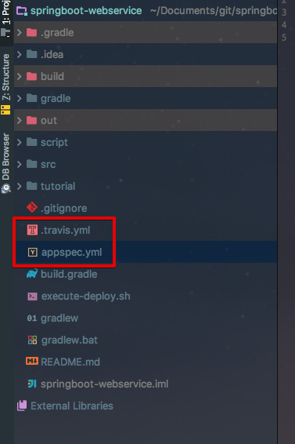

코드는 아래와 같습니다.

```yaml
version: 0.0
os: linux
files:
  - source:  /
    destination: /home/ec2-user/app/travis/build/
```

* ```version: 0.0```
  * CodeDeploy 버전을 얘기합니다.
  * 프로젝트 버전이 아니기 때문에 **0.0 외에 다른 버전을 사용하시면 오류가 발생**합니다.
* ```source```
  * S3 버킷에서 복사할 파일의 위치를 나타냅니다.
* ```destination```
  * zip 파일을 복사해 압축을 풀 위치를 지정합니다.

그리고 TravisCI가 CodeDeploy도 실행시키도록 아래와 같이 ```.travis.yml```에 설정을 추가합니다.

```yaml
  - provider: codedeploy
    access_key_id: $AWS_ACCESS_KEY # Travis repo settings에 설정된 값
    secret_access_key: $AWS_SECRET_KEY # Travis repo settings에 설정된 값
    bucket: springboot-webservice-deploy # S3 버킷
    key: springboot-webservice.zip # 빌드 파일을 압축해서 전달
    bundle_type: zip
    application: springboot-webservice # 웹 콘솔에서 등록한 CodeDeploy 어플리케이션
    deployment_group: springboot-webservice-group # 웹 콘솔에서 등록한 CodeDeploy 배포 그룹
    region: ap-northeast-2
    wait-until-deployed: true
    on:
      repo: jojoldu/springboot-webservice
      branch: master
```

최종 ```.travis.yml```의 코드는 아래와 같습니다.

```yaml
language: java
jdk:
  - openjdk8

branches:
  only:
    - master

# Travis CI 서버의 Home
cache:
  directories:
    - '$HOME/.m2/repository'
    - '$HOME/.gradle'

script: "./gradlew clean build"

before_deploy:
  - zip -r springboot-webservice *
  - mkdir -p deploy
  - mv springboot-webservice.zip deploy/springboot-webservice.zip

deploy:
  - provider: s3
    access_key_id: $AWS_ACCESS_KEY # Travis repo settings에 설정된 값
    secret_access_key: $AWS_SECRET_KEY # Travis repo settings에 설정된 값
    bucket: springboot-webservice-deploy # S3 버킷
    region: ap-northeast-2
    skip_cleanup: true
    acl: public_read
    local_dir: deploy # before_deploy에서 생성한 디렉토리
    wait-until-deployed: true
    on:
      repo: jojoldu/springboot-webservice
      branch: master

  - provider: codedeploy
    access_key_id: $AWS_ACCESS_KEY # Travis repo settings에 설정된 값
    secret_access_key: $AWS_SECRET_KEY # Travis repo settings에 설정된 값
    bucket: springboot-webservice-deploy # S3 버킷
    key: springboot-webservice.zip # S3 버킷에 저장된 springboot-webservice.zip 파일을 EC2로 배포
    bundle_type: zip
    application: springboot-webservice # 웹 콘솔에서 등록한 CodeDeploy 어플리케이션
    deployment_group: springboot-webservice-group # 웹 콘솔에서 등록한 CodeDeploy 배포 그룹
    region: ap-northeast-2
    wait-until-deployed: true
    on:
      repo: jojoldu/springboot-webservice
      branch: master

notifications:
  email:
    recipients:
      - jojoldu@gmail.com
```

여기까지 수행되셨으면 다시 Git Commit & Push를 진행합니다!

CodeDeploy 웹 콘솔에서도 배포 진행과정을 확인할 수 있습니다.

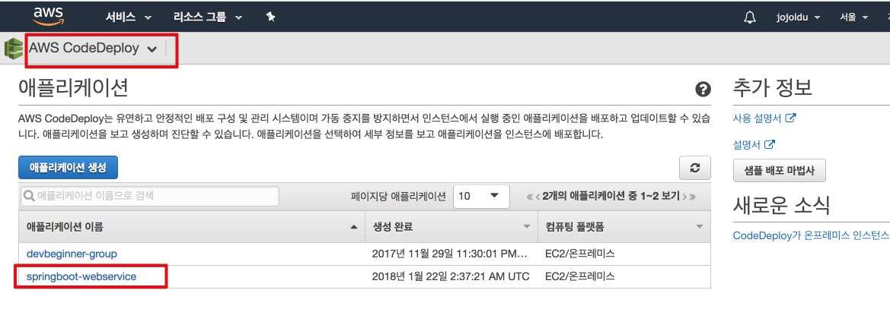

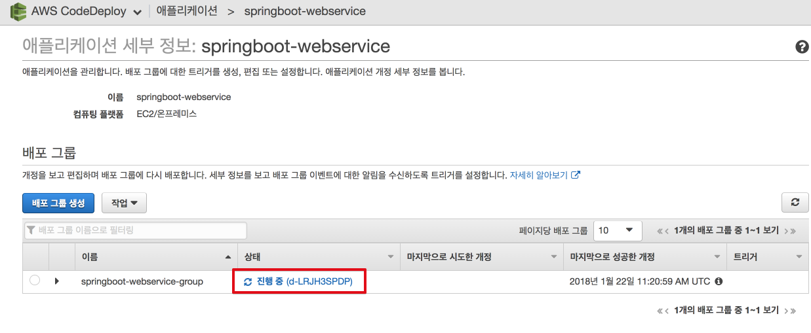

배포가 성공적으로 완료되시면!

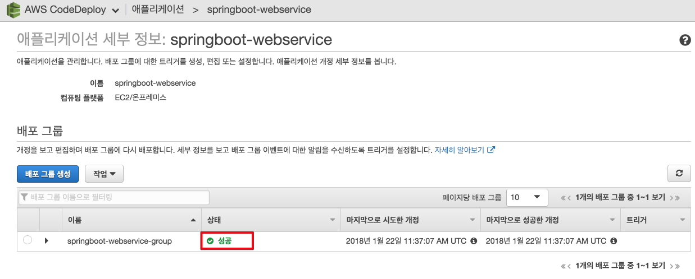


아름다운 **성공** 메세지를 볼 수 있습니다!  
EC2에 접속해서 배포가 잘 되었는지 확인해보겠습니다.  

```bash
cd /home/ec2-user/app/travis/build
ll
```

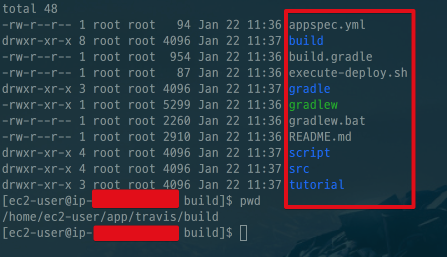

저희가 작성한 코드가 Git Push만으로 EC2에 전송까지 자동으로 진행되었습니다!

### 6-4-3. CodeDeploy로 스크립트 실행

코드만 전달되었다고해서 배포가 끝은 아니겠죠?  
**application.jar 파일을 실행**시키는것까지 되어야 합니다.  
그래서 EC2에 **AWS CodeDeploy로 받은 파일을 실행**시키는 배포 스크립트를 생성하겠습니다.  
먼저 jar파일들을 모아둘 디렉토리를 하나 생성합니다.

```bash
mkdir /home/ec2-user/app/travis/jar
```

그리고 jar 디렉토리에 옮겨진 application.jar를 실행시킬 ```deploy.sh``` 파일을 하나 생성합니다.

```bash
vim /home/ec2-user/app/travis/deploy.sh
```

스크립트의 코드는 아래와 같습니다.

```bash
#!/bin/bash

REPOSITORY=/home/ec2-user/app/travis

echo "> 현재 구동중인 애플리케이션 pid 확인"

CURRENT_PID=$(pgrep -f springboot-webservice)

echo "$CURRENT_PID"

if [ -z $CURRENT_PID ]; then
    echo "> 현재 구동중인 애플리케이션이 없으므로 종료하지 않습니다."
else
    echo "> kill -15 $CURRENT_PID"
    kill -15 $CURRENT_PID
    sleep 5
fi

echo "> 새 어플리케이션 배포"

echo "> Build 파일 복사"

cp $REPOSITORY/build/build/libs/*.jar $REPOSITORY/jar/

JAR_NAME=$(ls $REPOSITORY/jar/ |grep 'springboot-webservice' | tail -n 1)

echo "> JAR Name: $JAR_NAME"

nohup java -jar $REPOSITORY/jar/$JAR_NAME &
```

[이전에](http://jojoldu.tistory.com/263) 작성된 git/deploy.sh와 크게 다르지 않습니다.  
단지, ```git pull```해서 직접 build했던 부분을 제거하고, 이미 받아놓은 build 파일을 복사해 실행하는것만 다릅니다.  
  
일단 이 스크립트가 잘 작동되는지 먼저 테스트해보겠습니다.  
아래 명령어로 이미 받아놓은 build 파일들로 실행이 잘되는지 테스트합니다.

```bash
/home/ec2-user/app/travis/deploy.sh
```

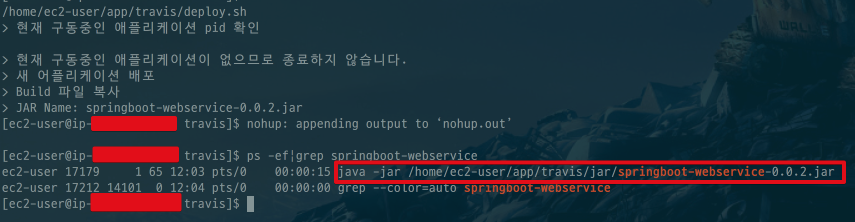

스크립트가 정상적으로 실행되는게 확인되었습니다!  
자 그럼 **AWS CodeDeploy가 배포가 끝나면, ```deploy.sh```를 실행**하도록 설정을 변경하겠습니다.  
  
이전에 생성한 ```appspec.yml```에 아래 코드를 추가합니다.

```yaml
hooks:
  AfterInstall: # 배포가 끝나면 아래 명령어를 실행
    - location: execute-deploy.sh
      timeout: 180
```

전체 코드는 아래와 같습니다.

```yaml
version: 0.0
os: linux
files:
  - source:  /
    destination: /home/ec2-user/app/travis/build/

hooks:
  AfterInstall: # 배포가 끝나면 아래 명령어를 실행
    - location: execute-deploy.sh
      timeout: 180
```

CodeDeploy에서 바로 ```deploy.sh```를 실행시킬수 없어 우회하는 방법으로 ```deploy.sh```를 실행하는 ```execute-deploy.sh```파일을 실행하도록 설정하였습니다.  
기타 yml들과 마찬가지로 ```execute-deploy.sh``` 역시 프로젝트 내부에 생성해서 CodeDeploy가 실행할수 있도록 합니다.  
스크립트의 코드는 아래가 전부입니다.

```bash
#!/bin/bash
/home/ec2-user/app/travis/deploy.sh > /dev/null 2> /dev/null < /dev/null &
```

deploy.sh를 백그라운드로 실행한뒤, 로그나 기타 내용을 남기지 않도록 처리하였습니다.  
자 그래서 프로젝트 전체 구조를 보면 아래와 같이 됩니다.

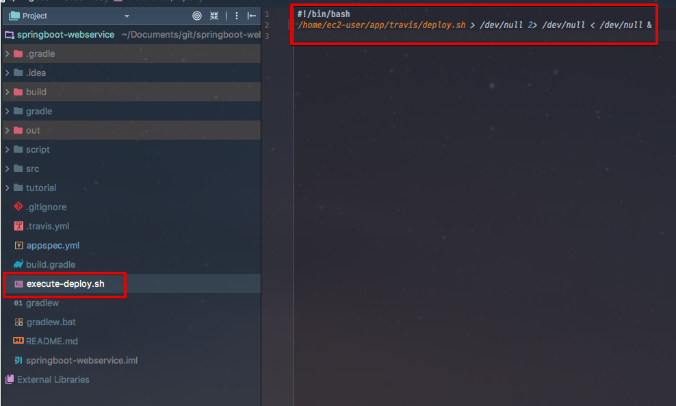

모든 설정이 완료되었습니다!  
진짜 배포처럼 한번 진행해보겠습니다.  

### 6-4-4. 실제 배포 과정 진행

build.gradle에서 프로젝트 버전을 변경합니다.

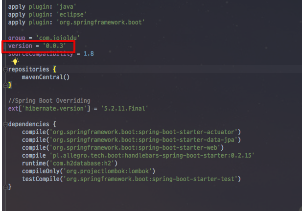

간단하게나마 변경된 내용을 알 수 있게 src/main/resources/templates/main.hbs 내용에 아래와 같이 ```Ver.2```를 추가합니다.

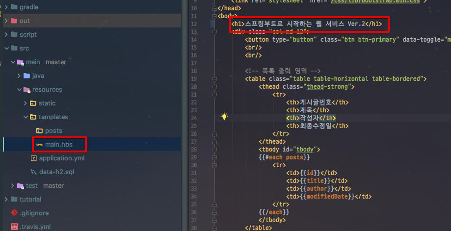

자 그럼 마지막으로 Commit & Push를 합니다!  
배포가 다 끝나시면 저희의 웹 서비스 주소를 새로고침 해봅니다.

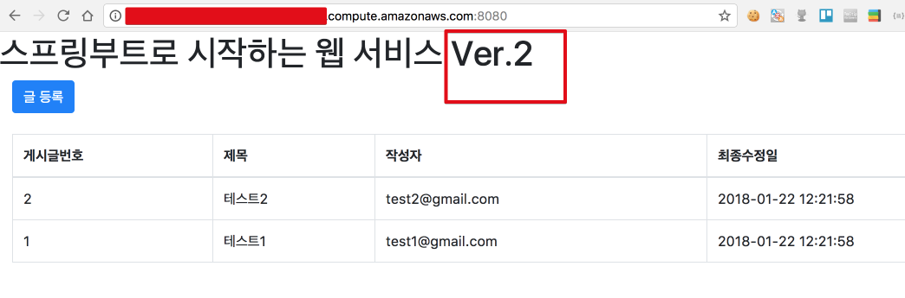

신규 버전이 정상적으로 잘! 배포 되었습니다!  
  
> Tip)  
TravisCI와 다른 클라우드 서비스 (Azure, GCP, Heroku 등)가 연동하는 방법은 [공식 문서](https://docs.travis-ci.com/user/deployment/codedeploy/)를 참고하시길 추천드립니다.

## 6-5. 마무리

**테스트, 빌드, 배포까지 전부 자동화** 되었습니다!  
이젠 작업이 끝난 내용을 **Master 브랜치에 Push만 하면 자동으로 EC2에 배포**가 됩니다.  
  
하지만 문제가 한가지 남았습니다.  
**배포하는 동안 스프링부트 프로젝트는 종료상태가 되어 서비스를 이용할수 없다**는 것입니다.  
어떻게 하면 배포하는 동안에도 서비스는 계속 유지될 수 있을까요?  
다음 시간에는 이 문제를 해결하기 위해 **무중단 배포** 방법을 소개드리겠습니다.
  
이번 강좌는 특히나 **인프라 내용이 많아서** 정말 고생하셨을것 같습니다!  
다하셨다면 배포 구조나 인프라에 대해 조금이나마 알게 되셨을것 같습니다.  
끝까지 따라와주셔서 감사합니다!  
다음 시간에 더 쉽게 익히실 수 있도록 준비하겠습니다.  
감사합니다!

## 참고

* [TeamApex Wiki](https://github.com/airavata-courses/TeamApex/wiki/Milestone-5-Guide-to-Setting-Up-Amazon's-CodeDeploy-Travis-Integration)

* [Travis CI 설정 Sample](https://github.com/travis-ci/cat-party)
