# 7. Nginx를 활용한 무중단 배포 구축하기

이번 시간엔 무중단 배포 환경을 구축하겠습니다.
(모든 코드는 [Github](https://github.com/jojoldu/springboot-webservice/tree/feature/7)에 있습니다.)  

## 7-1. 이전 시간의 문제점?

[이전 시간](http://jojoldu.tistory.com/265)에 저희는 스프링부트 프로젝트를 Travis CI를 활용하여 배포 자동화 환경을 구축해보았습니다.  
이젠 Master 브랜치에 Push만 되면 자동으로 빌드 & 테스트 & 배포가 자동으로 이루어집니다.  
하지만!  
배포하는 시간 동안은 어플리케이션이 종료가 됩니다.  
긴 시간은 아니지만, 새로운 Jar가 실행되기 전까진 기존 Jar를 종료시켜놓기 때문에 **서비스가 안됩니다.**  
하지만 **최근 웹 서비스들은 대부분 배포하기 위해 서비스를 정지시키는 경우가 없습니다**.  
어떻게 서비스의 정지 없이 배포를 계속 할 수 있는지 이번 시간에 확인하고 서비스에 적용해보겠습니다.

## 7-2. 무중단 배포?

예전에는 배포라고 하면 팀의 아주 큰 이벤트이기 때문에 다같이 코드를 합치는 날과 배포를 하는 날을 정하고 배포했습니다.  
(**배포만 전문으로 하는 팀**이 따로 있었습니다.)  
특히 배포일에는 사용자가 적은 **새벽 시간에 개발자들이 모두 남아 배포**를 해야만 했습니다.  
잦은 배포가 있어야 한다면 매 새벽마다 남아서 배포를 해야만 했는데, 배포를 하고나서 정말 치명적인 문제가 발견되면 어떻게 해야할까요?  
새벽시간에 부랴부랴 문제를 해결하다가, 사용자 유입이 많아 지는 아침이 되면 긴급점검을 올리고 수정해야만 했습니다.  
이렇게 배포가 서비스를 정지해야만 가능할때는 롤백조차 어렵기 때문에 개발자들이 정말 많이 고생하게 됩니다.  
그리고 서비스 입장에서도 배포만 했다하면 서비스가 정지되야 하니 곤혹스럽습니다.  
그래서 서비스를 정지하지 않고, 배포할 수 있는 방법들을 찾기 시작했는데요.  
이렇게 서비스를 정지시키지 않고, 배포를 계속하는 것을 **무중단 배포**라고 합니다.  


### 7-2-1. 무중단 배포 방법 소개

무중단 배포 방식에는 몇가지가 있습니다.

* [AWS 에서 Blue-Green 무중단 배포 구현](https://sangwook.github.io/2014/01/28/zero-downtime-blue-green-deployments-aws.html)
* [도커를 이용한 웹서비스 무중단 배포하기](https://subicura.com/2016/06/07/zero-downtime-docker-deployment.html)

이외에도 **L4 스위치를 이용한 무중단 배포**와 같이 IDC를 이용한 서비스에서 무중단 배포하는 방법등도 있지만, L4가 워낙 고가의 장비이다보니 대형 인터넷 기업외엔 쓸일이 잘 없습니다.  


> Tip)  
개인적으로 AWS 책 중 [실전 AWS 워크북](https://books.google.co.kr/books?id=v34zDwAAQBAJ&pg=PA147&lpg=PA147&dq=ELB%EB%A5%BC+%ED%99%9C%EC%9A%A9%ED%95%9C+%EB%B8%94%EB%A3%A8+%EA%B7%B8%EB%A6%B0+%EB%B0%B0%ED%8F%AC&source=bl&ots=ZjPWJeNiCX&sig=AiLs1WPKDM1W7gP-MeEfxRT3D3k&hl=ko&sa=X&ved=0ahUKEwjA2pqU-vvYAhWJgrwKHUn4C9AQ6AEIRDAF#v=onepage&q=ELB%EB%A5%BC%20%ED%99%9C%EC%9A%A9%ED%95%9C%20%EB%B8%94%EB%A3%A8%20%EA%B7%B8%EB%A6%B0%20%EB%B0%B0%ED%8F%AC&f=false)이 가장 도움이 많이 됐습니다.  
위 링크는 무중단 배포 (블루/그린 배포) 방식을 소개하고 있으니 꼭 참고하시면 좋을것 같습니다.

저희가 시도할 방법은 **Nginx를 이용한 무중단 배포** 입니다.

### 7-2-2. Nginx를 이용한 무중단 배포 방법 소개

Nginx를 이용한 무중단 배포를 하는 이유는 간단합니다.  
**가장 저렴하기 때문**입니다.  
(물론 사내에서 비용 지원이 빵빵하게 된다면 번거롭게 구축할 필요 없이 [AWS 블루그린 배포](https://books.google.co.kr/books?id=v34zDwAAQBAJ&pg=PA147&lpg=PA147&dq=ELB%EB%A5%BC+%ED%99%9C%EC%9A%A9%ED%95%9C+%EB%B8%94%EB%A3%A8+%EA%B7%B8%EB%A6%B0+%EB%B0%B0%ED%8F%AC&source=bl&ots=ZjPWJeNiCX&sig=AiLs1WPKDM1W7gP-MeEfxRT3D3k&hl=ko&sa=X&ved=0ahUKEwjA2pqU-vvYAhWJgrwKHUn4C9AQ6AEIRDAF#v=onepage&q=ELB%EB%A5%BC%20%ED%99%9C%EC%9A%A9%ED%95%9C%20%EB%B8%94%EB%A3%A8%20%EA%B7%B8%EB%A6%B0%20%EB%B0%B0%ED%8F%AC&f=false) 방식을 선택하시면 됩니다.)  

기존에 쓰던 EC2에 그대로 적용하면 되기 때문에 **배포를 위해 AWS EC2 인스턴스가 하나더 필요하지 않습니다**.  
추가로 이 방식은 꼭 AWS와 같은 **클라우드 인프라가 구축되있지 않아도 쓸수 있는 범용적인 방법**입니다.  
즉, 개인 서버 혹은 사내 서버에서도 동일한 방식으로 구축할 수 있기 때문에 사용처가 많습니다.  
(옛 고대의 선배님들이 많이들 쓰셨다고...)  
  
구조는 간단합니다.  
하나의 EC2 혹은 리눅스 서버에 **Nginx 1대와 스프링부트 jar를 2대를 사용하는 것**입니다.  
Nginx는 80(http), 443(https) 포트를 할당하고,  
스프링부트1은 8081포트로,  
스프링부트2는 8082포트로 실행합니다.  
그럼 아래와 같은 구조가 됩니다.

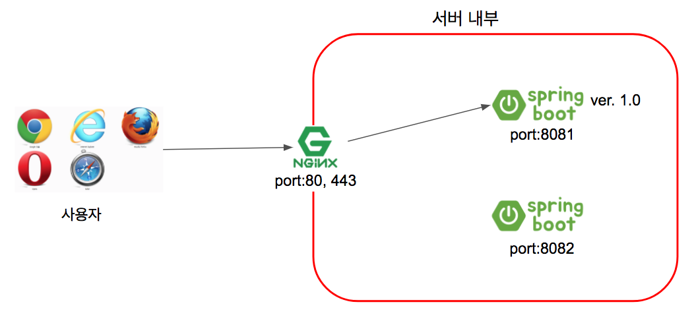

운영 과정은 다음과 같습니다.

* 사용자는 서비스 주소로 접속합니다 (80 혹은 443 포트)
* Nginx는 사용자의 요청을 받아 **현재 연결된 스프링부트로 요청을 전달**합니다.
  * 스프링부트1 즉, 8081 포트로 요청을 전달한다고 가정하겠습니다.
* 스프링부트2는 Nginx와 연결된 상태가 아니니 요청을 받지 못합니다.

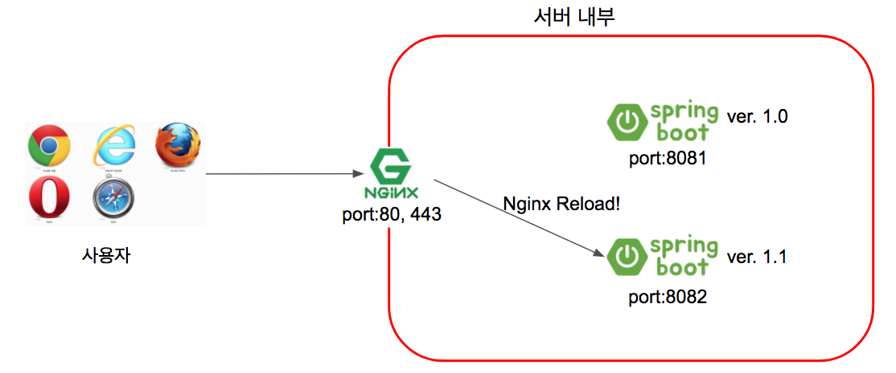

* 1.1 버전으로 신규 배포가 필요하면 **Nginx와 연결되지 않은** 스프링부트2 (8082)로 배포합니다.
* 배포하는 동안에도 서비스는 중단되지 않습니다.
  * Nginx는 스프링부트1을 바라보기 때문입니다.
* 배포가 끝나고 정상적으로 스프링부트2가 구동중인지 확인합니다.
* 스프링부트2가 정상 구동중이면 ```nginx reload```를 통해 8081 대신에 8082를 바라보도록 합니다.
* **Nginx Reload는 1초 이내에 실행완료**가 됩니다.

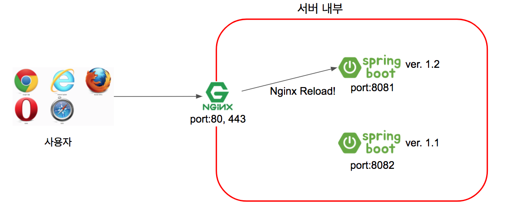

* 또다시 신규버전인 1.2 버전의 배포가 필요하면 이번엔 스프링부트1로 배포합니다.
  * 현재는 스프링부트2가 Nginx와 연결되있기 때문입니다.
* 스프링부트1의 배포가 끝났다면 Nginx가 스프링부트1을 바라보도록 변경하고 ```nginx reload```를 실행합니다.
* 1.2 버전을 사용중인 스프링부트1로 Nginx가 요청을 전달합니다.

만약 배포된 1.2 버전에서 문제가 발생한다?  
그러면 바로 Nginx가 8082 포트(스프링부트2)를 보도록 변경하면 됩니다.

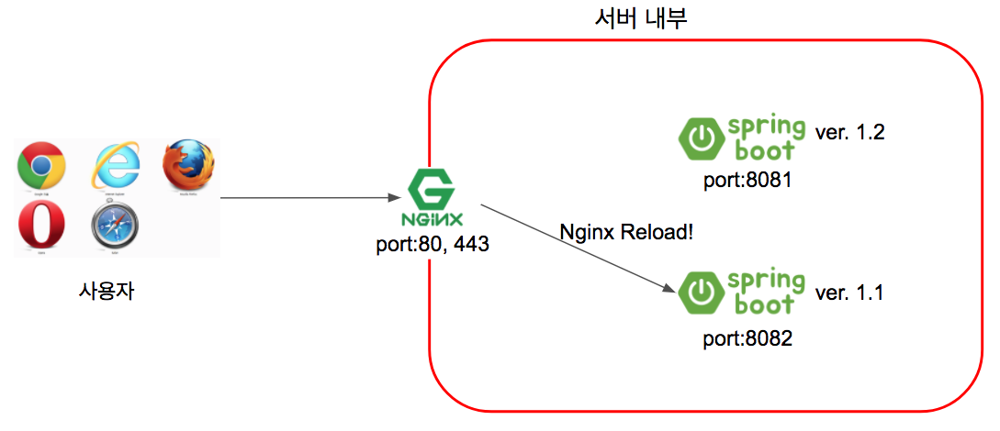

롤백 역시 굉장히 간단하게 처리할수 있습니다.  
대략 감이 오시나요?  

> Tip)  
이렇게 Nginx가 외부의 요청을 받아 뒷단 서버로 요청을 전달하는 행위를 **리버스 프록시**라고 합니다.  
이런 리버스 프록시 서버(Nginx)는 요청을 전달하고, 실제 요청에 대한 처리는 뒷단의 웹서버들이 처리합니다.  
대신 외부 요청을 뒷단 서버들에게 골고루 분배한다거나, 한번 요청왔던 js, image, css등은 캐시하여 리버스 프록시 서버에서 바로 응답을 주거나 등의 여러 장점들이 있습니다.  
자세한 설명은 [NginX로 Reverse-Proxy 서버 만들기 - Joinc](https://www.joinc.co.kr/w/man/12/proxy)를 참고하시면 좋습니다.

### 7-2-3. 무중단 배포 전체 구조

위 내용으로 무중단 배포까지 구축하게 되면 전체 구조는 아래처럼 됩니다.

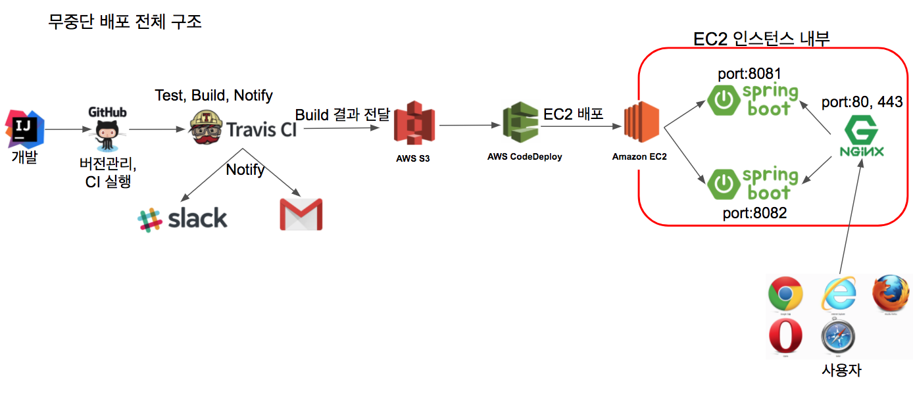

(인프라 전체구조)  
  
기존 구조에서 EC2 내부의 구조만 변경되었으니 너무 크게 걱정하지 않으셔도 됩니다!  
자 그럼 이제 시작하겠습니다!

## 7-3. 무중단 배포 구축하기

먼저 Nginx를 설치하겠습니다.  

### 7-3-1. Nginx 설치

EC2에 접속해서 아래 명령어로 Nginx를 설치합니다.

```bash
sudo yum install nginx
```

설치가 완료되셨으면 아래 명령어로 Nginx를 실행합니다.

```bash
sudo service nginx start
```

Nginx 잘 실행되었는지 아래 명령어로 확인해봅니다.

```bash
ps -ef | grep nginx
```


Nginx가 잘 실행되었습니다!  
자 그럼 이제 외부에서 잘 노출되는지 확인해보겠습니다.  
AWS에서 EC2 Public DNS를 복사합니다.

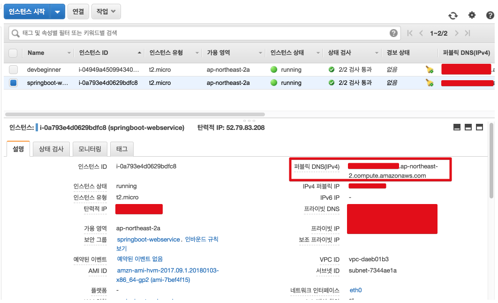

(이제부터는 자주 접속할테니 즐겨찾기에 추가하시는걸 추천드립니다.)  
  
브라우저에 URL을 입력해보시면!


Nginx가 잘 설치된것을 확인할 수 있습니다.  
이 Nginx가 현재 실행중인 스프링부트 프로젝트를 바라볼수 있도록 (리버스 프록시) 설정하겠습니다.  
nginx 설정 파일을 열어서

```bash
sudo vi /etc/nginx/nginx.conf
```

설정 내용 중 server 아래의 ```location /``` 부분을 찾아서 아래와 같이 추가합니다.

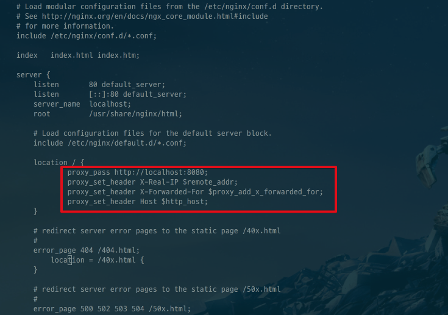

```bash
proxy_pass http://localhost:8080;
proxy_set_header X-Real-IP $remote_addr;
proxy_set_header X-Forwarded-For $proxy_add_x_forwarded_for;
proxy_set_header Host $http_host;
```

* proxy_pass : 요청이 오면 ```http://localhost:8080```로 전달
* proxy_set_header XXX : 실제 요청 데이터를 header의 각 항목에 할당
  * ex) ```proxy_set_header X-Real-IP $remote_addr```: Request Header의 X-Real-IP에 요청자의 IP를 저장 

> Tip)  
Nginx에 대해 좀 더 자세히 알고 싶으신 분들은 [꿀벌개발일지-Nginx HTTP Server](http://ohgyun.com/477) 혹은 [엔진엑스로 운용하는 효율적인 웹사이트 ](http://www.acornpub.co.kr/book/nginx1)를 추천드립니다.

수정이 끝나셨으면 ```:wq```로 저장 & 종료 하시고, Nginx를 재시작하겠습니다.

```bash
sudo service nginx restart
```

다시 브라우저로 접속해서 Nginx 시작페이지가 보이던 화면을 새로고침해보시면!

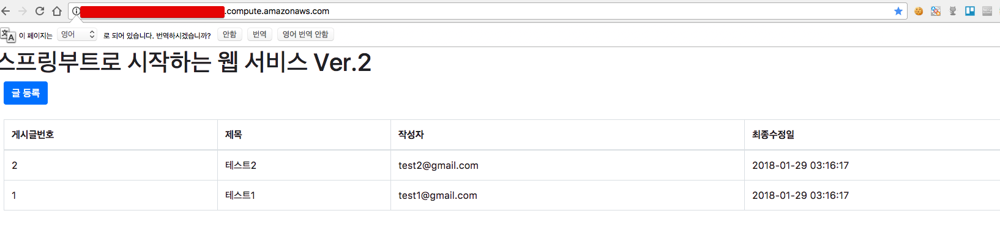

Nginx가 스프링부트 프로젝트를 프록시 하는것이 확인됩니다!  
  
본격적으로 무중단 배포 작업을 진행해보겠습니다.

### 7-3-2. set1, set2 Profile 설정

자 여기서 질문하나 드리겠습니다.  
실제 서비스에선 로컬, 개발서버, 운영서버 등으로 환경이 분리되어 접속하는 DB 값, 외부 API 주소등이 서로 다릅니다.  
하지만 **프로젝트의 코드는 하나인데, 어떻게 로컬, 개발, 운영 환경을 구분해서 필요한 값들을 사용할까요**?  
아주 오래전에는 이를 필요한 부분에서 전부 ```if ~ else```로 구분해서 사용했습니다.  
하지만 최근에는 이를 개선해서 **외부의 설정 파일을 통해 사용**하도록 하였습니다.  
스프링부트는 ```.properties```, ```.yml``` 파일을 통해 여러 설정값을 관리합니다.  
  
예를 들어 현재 프로젝트처럼 ```.yml```로 관리한다면 다음과 같이 될수 있습니다.

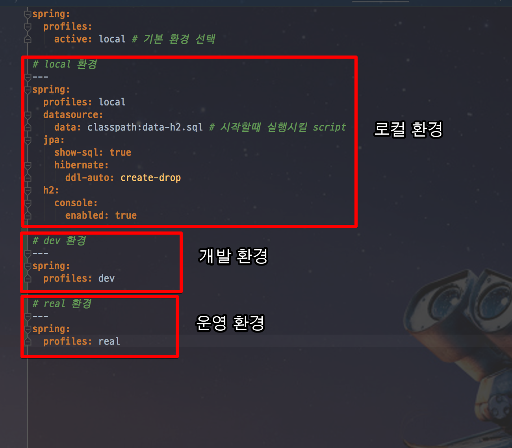

(따라 치진 마세요. 이렇게 하지 않을거에요!)  
  
이렇게 하면 ```---```를 기준으로 값들이 구분됩니다.  
그리고 ```spring.profiles: local, dev, real```등이 ```---```가 활성화되는 파라미터가 됩니다.  
즉, 스프링부트 프로젝트를 실행시킬때 ```nohup java -jar -Dspring.profiles.active=real```와 같이 사용하면 ```real```에 있는 값들이 프로젝트에 할당됩니다.  
설명만 하니 잘 이해가 안되시죠?  
하나씩 차근차근 진행하겠습니다.  
  
먼저 실행중인 프로젝트의 Profile이 뭔지 확인할 수 있는 API를 만들겠습니다.  
WebRestController.java에 아래와 같이 API 메소드를 하나 추가합니다.

```java
@RestController
@AllArgsConstructor
public class WebRestController {

    private PostsService postsService;
    private Environment env;

    ... 

    @GetMapping("/profile")
    public String getProfile () {
        return Arrays.stream(env.getActiveProfiles())
                .findFirst()
                .orElse("");
    }
}
```

프로젝트의 환경설정 값을 다루는 ```Environment``` Bean을 DI받아 현재 활성화된 Profile을 반환하는 코드입니다.  
잘 수행되는지 테스트 코드를 생성해보겠습니다.  
src/**test**/java/com/jojoldu/webservice/web에 WebRestControllerTest를 생성해서 테스트 코드를 추가합니다.

```java
@RunWith(SpringRunner.class)
@SpringBootTest(webEnvironment = RANDOM_PORT)
public class WebRestControllerTest {

    @Autowired
    private TestRestTemplate restTemplate;

    @Test
    public void Profile확인 () {
        //when
        String profile = this.restTemplate.getForObject("/profile", String.class);

        //then
        assertThat(profile).isEqualTo("local");
    }
}
```

테스트 내용은 ```/profile```로 요청하면 현재 활성화된 Profile값 (local이) 반환되는지 비교하는 것입니다.  
근데 왜 테스트 코드에서 local일까요?  
이는 src/**test**/resources/application.yml 때문입니다.
테스트의 환경은 src/**test**/resources/application.yml에 의존하는데 이 yml에 ```spring.profile.active```가 local로 되있기 때문입니다.

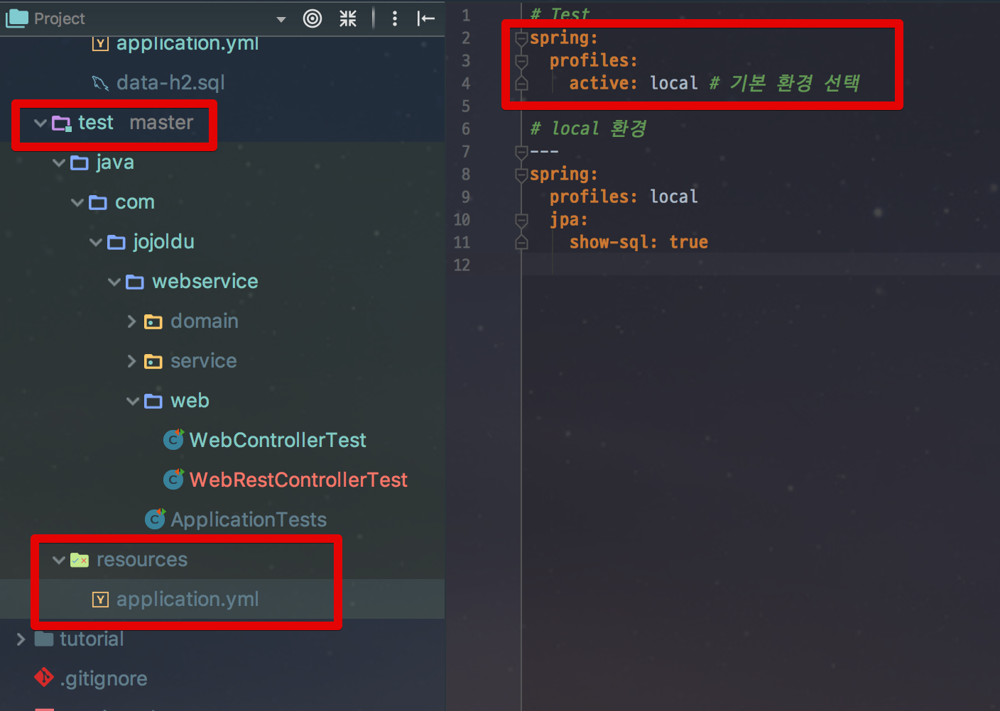

테스트를 수행해보시면!

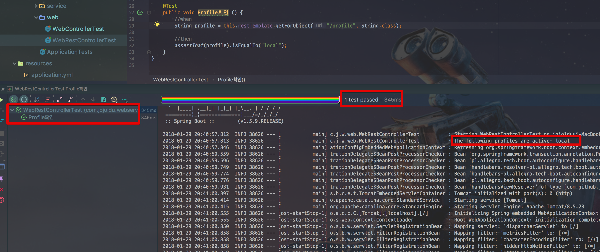

테스트가 잘 통과 되었습니다!  
profile값을 반환하는 API가 완성되었으니 운영 환경의 yml파일을 추가해보겠습니다.  
운영 환경의 yml은 프로젝트 내부가 아닌 **외부에 생성**하겠습니다.  
본인이 원하는 디렉토리에 ```real-application.yml```을 생성합니다.  
저는 ```/app/config/springboot-webservice/real-application.yml```위치에 생성했습니다.

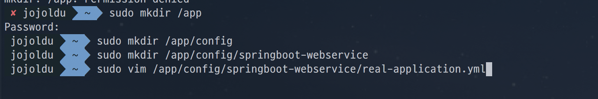

그리고 ```real-application.yml```에는 아래 코드를 등록합니다.

```yaml
---
spring:
  profiles: set1
server:
  port: 8081

---
spring:
  profiles: set2

server:
  port: 8082
```

즉, **set1/set2 profile을 8081, 8082 포트**를 갖도록 설정한 것입니다.  

> Tip)  
절대 **프로젝트 내부에 운영환경의 yml을 포함시키지 않습니다**.  
Git Push를 혹시나 한번이라도 하셨다면 프로젝트를 삭제하시는걸 추천드립니다.  
Git은 한번이라도 커밋 되면 이력이 남기 때문에 단순히 파일 삭제만 한다고 내용이 사라지지 않습니다.  
Github 같이 오픈된 공간에 운영환경의 설정 (Database 접속정보, 세션저장소 접속정보, 암호화 키 등등)
현재는 크리티컬한 정보를 다루지 않기 때문에 괜찮지만, 절대 주의해야합니다.

외부에 있는 이 파일을 프로젝트가 호출할 수 있도록 Application.java 코드를 아래와 같이 변경합니다.

```java

@EnableJpaAuditing // JPA Auditing 활성화
@SpringBootApplication
public class Application {

	public static final String APPLICATION_LOCATIONS = "spring.config.location="
			+ "classpath:application.yml,"
			+ "/app/config/springboot-webservice/real-application.yml";

	public static void main(String[] args) {
		new SpringApplicationBuilder(Application.class)
				.properties(APPLICATION_LOCATIONS)
				.run(args);
	}
}

```

스프링부트 프로젝트가 실행될때, 프로젝트 내부에 있는 ```application.yml```과 외부에 위치한 ```/app/config/springboot-webservice/real-application.yml```를 모두 불러오도록 하였습니다.  
자 그럼 한번 잘 불러오는지 확인해보겠습니다.  
IntelliJ에서 ```command+shift+a```를 사용해 ```Edit Configuration```을 검색합니다.

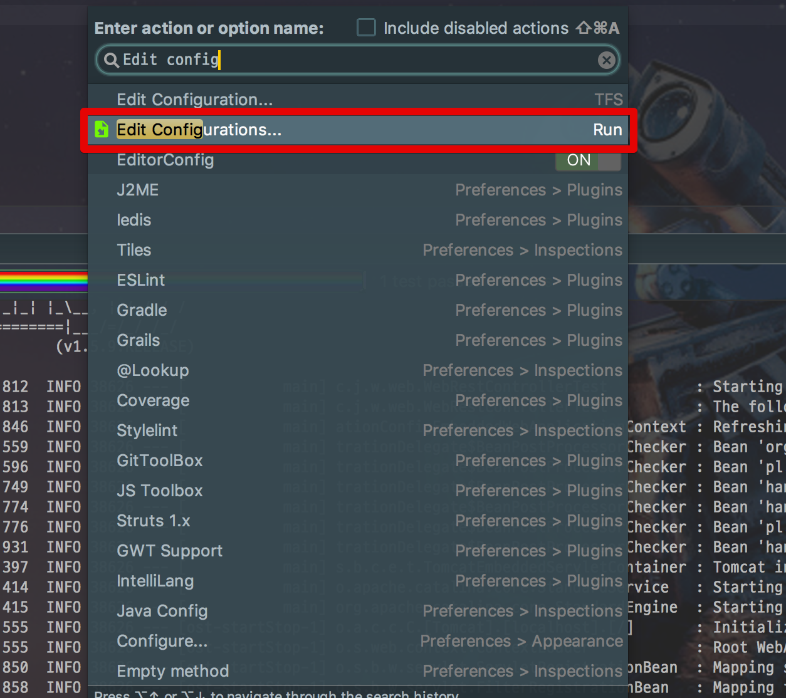

Application을 선택후 좌측 상단의 Copy 버튼을 클릭해서 설정 내용을 복사합니다.

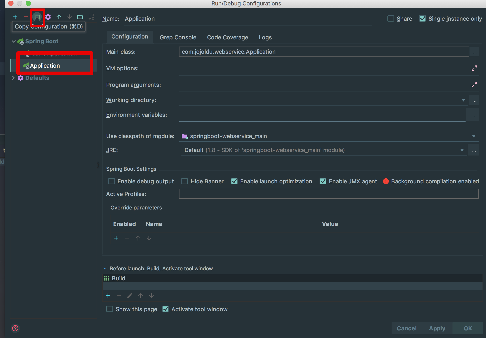

복사된 설정 내용을 아래와 같이 ```set1```을 Profile로 지정한 실행환경으로 수정합니다.

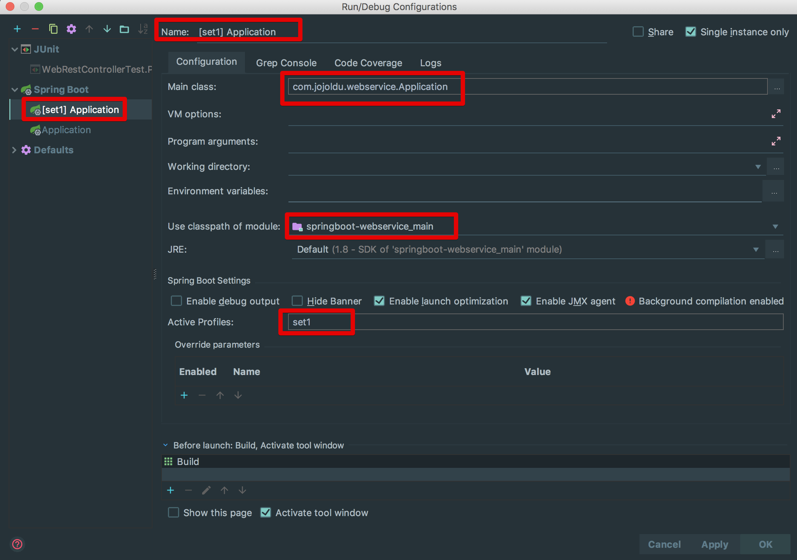

새로 생성된 실행환경을 선택하고 실행해보시면!

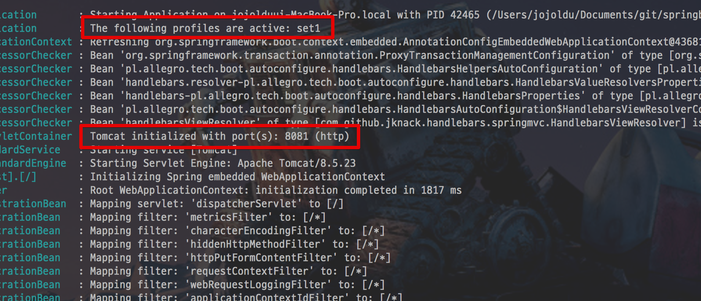

브라우저에서 localhost:8081/profile 로 접속해보시면!

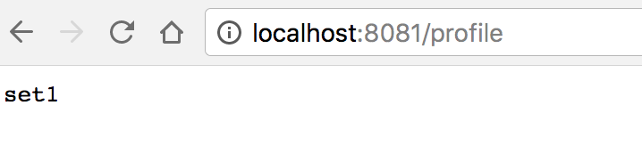

set1이 반환되는것이 확인 됩니다!  
set1, set2가 정상적으로 적용되는게 확인 되었으니 EC2 인스턴스에도 똑같이 설정파일을 추가하겠습니다.  
EC2에 접속하셔서 로컬에서 했던것과 마찬가지로 ```/app/config/springboot-webservice/real-application.yml```를 생성해 설정값을 등록합니다.


여기까지 하셨으면 모든 내용을 Git Commit & Push 하고 EC2에서도 profile이 잘되는지 확인합니다.

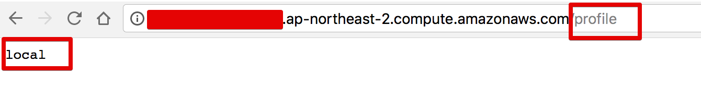

(EC2는 현재 profile 옵션을 주지 않고 실행했기 때문에 기본값인 local이 적용됩니다.)  
  
자 그럼! 이제 본격적인 배포 스크립트를 한번 생성해보겠습니다.

### 7-3-3. 배포 스크립트 작성

먼저 무중단 배포와 관련된 파일을 관리할 디렉토리와 스크립트 파일을 생성하겠습니다.  
1번째 배포 디렉토리로 ```git```  
2번째 배포 디렉토리로 ```travis```  
를 생성했습니다.  
3번째는 ```nonstop```으로 하겠습니다.  
  
EC2에 접속하셔서 아래 명령어를 실행합니다.

```bash
mkdir ~/app/nonstop
```

자 그리고 배포 스크립트가 정상적으로 되는지 테스트 해보기 위해 기존에 받아둔 스프링 프로젝트.jar를 복사하겠습니다.

```bash
mkdir ~/app/nonstop/springboot-webservice
mkdir ~/app/nonstop/springboot-webservice/build
mkdir ~/app/nonstop/springboot-webservice/build/libs
cp ~/app/travis/build/build/libs/*.jar ~/app/nonstop/springboot-webservice/build/libs/
```

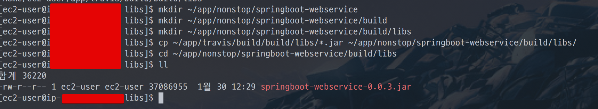

테스트할 jar가 있으니, 이제 배포 스크립트를 작성하겠습니다.  
  
jar파일을 모아둘 디렉토리를 생성하시고,

```bash
mkdir ~/app/nonstop/jar
```

스크립트 파일을 생성합니다.

```bash
vim ~/app/nonstop/deploy.sh
```

스크립트 내용은 아래와 같습니다.

```bash
#!/bin/bash
BASE_PATH=/home/ec2-user/app/nonstop
BUILD_PATH=$(ls $BASE_PATH/springboot-webservice/build/libs/*.jar)
JAR_NAME=$(basename $BUILD_PATH)
echo "> build 파일명: $JAR_NAME"

echo "> build 파일 복사"
DEPLOY_PATH=$BASE_PATH/jar/
cp $BUILD_PATH $DEPLOY_PATH

echo "> 현재 구동중인 Set 확인"
CURRENT_PROFILE=$(curl -s http://localhost/profile)
echo "> $CURRENT_PROFILE"

# 쉬고 있는 set 찾기: set1이 사용중이면 set2가 쉬고 있고, 반대면 set1이 쉬고 있음
if [ $CURRENT_PROFILE == set1 ]
then
  IDLE_PROFILE=set2
  IDLE_PORT=8082
elif [ $CURRENT_PROFILE == set2 ]
then
  IDLE_PROFILE=set1
  IDLE_PORT=8081
else
  echo "> 일치하는 Profile이 없습니다. Profile: $CURRENT_PROFILE"
  echo "> set1을 할당합니다. IDLE_PROFILE: set1"
  IDLE_PROFILE=set1
  IDLE_PORT=8081
fi

echo "> application.jar 교체"
IDLE_APPLICATION=$IDLE_PROFILE-springboot-webservice.jar
IDLE_APPLICATION_PATH=$DEPLOY_PATH$IDLE_APPLICATION

ln -Tfs $DEPLOY_PATH$JAR_NAME $IDLE_APPLICATION_PATH

echo "> $IDLE_PROFILE 에서 구동중인 애플리케이션 pid 확인"
IDLE_PID=$(pgrep -f $IDLE_APPLICATION)

if [ -z $IDLE_PID ]
then
  echo "> 현재 구동중인 애플리케이션이 없으므로 종료하지 않습니다."
else
  echo "> kill -15 $IDLE_PID"
  kill -15 $IDLE_PID
  sleep 5
fi

echo "> $IDLE_PROFILE 배포"
nohup java -jar -Dspring.profiles.active=$IDLE_PROFILE $IDLE_APPLICATION_PATH &

echo "> $IDLE_PROFILE 10초 후 Health check 시작"
echo "> curl -s http://localhost:$IDLE_PORT/health "
sleep 10

for retry_count in {1..10}
do
  response=$(curl -s http://localhost:$IDLE_PORT/health)
  up_count=$(echo $response | grep 'UP' | wc -l)

  if [ $up_count -ge 1 ]
  then # $up_count >= 1 ("UP" 문자열이 있는지 검증)
      echo "> Health check 성공"
      break
  else
      echo "> Health check의 응답을 알 수 없거나 혹은 status가 UP이 아닙니다."
      echo "> Health check: ${response}"
  fi

  if [ $retry_count -eq 10 ]
  then
    echo "> Health check 실패. "
    echo "> Nginx에 연결하지 않고 배포를 종료합니다."
    exit 1
  fi

  echo "> Health check 연결 실패. 재시도..."
  sleep 10
done
```

갑자기 쉘 스크립트 내용이 많아졌습니다!  
그래도 차근차근 한줄씩 설명을 읽어보시면서 따라오시면 됩니다.

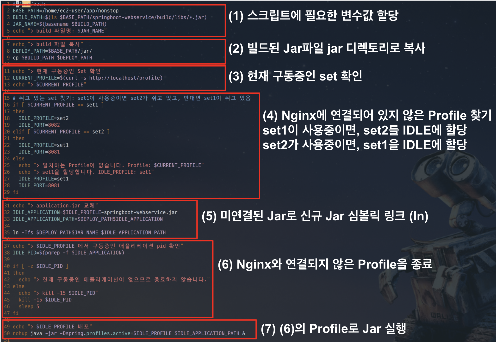

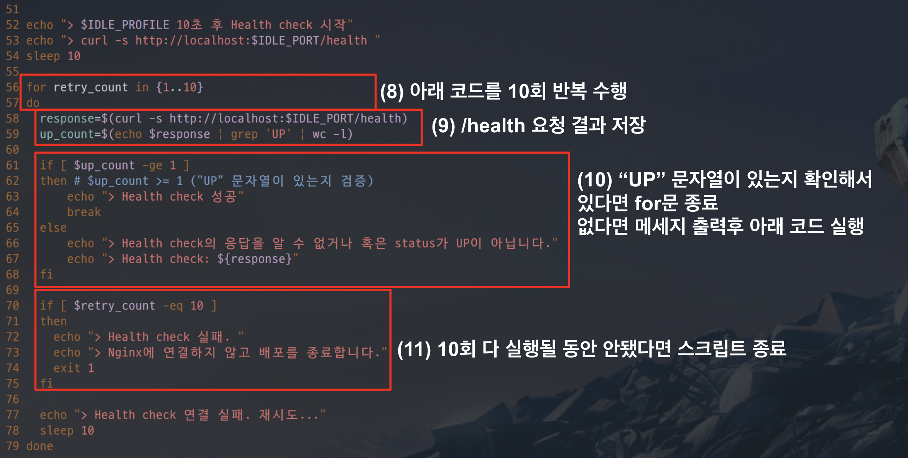


* (3) ```CURRENT_PROFILE=$(curl -s http://localhost/profile)```
  * 현재 Profile을 ```curl```을 통해 확인합니다.
  * ```curl```에서 ```-s``` 은 silent란 뜻으로 **상태진행바를 노출시키지 않는 옵션**입니다.
  * 만약 이 옵션을 주지 않은채 사용하시면 아래와 같은 화면이 ```curl``` 실행시 노출됩니다.


(예시)

* (8) ```response=$(curl -s http://localhost:$IDLE_PORT/health)```
  * ```/health```의 결과는 ```{"status":"UP"}```와 같이 나옵니다.
  * 이는 저희가 처음에 추가한 ```org.springframework.boot:spring-boot-starter-actuator``` 의존성 덕분입니다.
  * **스프링부트 프로젝트의 여러 상태를 확인**해줄 수 있는 의존성입니다. 
  * 좀더 자세한 내용은 이전에 작성한 [포스팅](http://jojoldu.tistory.com/43)을 한번 참고하시면 좋을것 같습니다.  
* (8) ```up_count=$(echo $response | grep 'UP' | wc -l)```
  * response 결과에 "UP"이 있는지 확인합니다.
  * ```echo $response | grep 'UP'```을 하면 **UP가 포함된 문자열을 필터링**해줍니다.
  * ```| wc -l```로 **필터링된 문자열의 갯수**가 몇개인지 확인합니다.
  * 즉, UP가 있다면 1개 이상이겠죠?

스크립트가 다 작성되셨으면 저장(```:wq```)합니다.  
자 그럼 실제로 이 스크립트를 한번 실행해볼까요?  
아래 명령어로 스크립트를 실행합니다.

```bash
~/app/nonstop/deploy.sh
```

결과를 보시면!!

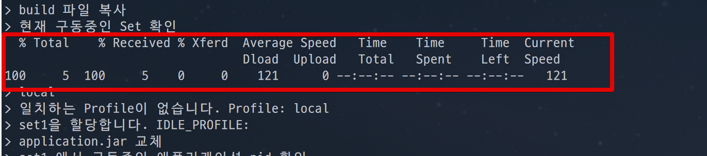

짠! 성공적으로 set1을 profile을 가진 스프링부트 프로젝트가 실행되었습니다!  
하지만 여기서 끝이 아니겠죠?  
**Nginx가 set1과 set2를 번갈아가면서 바라볼 수 있는(프록시)** 환경이 필요합니다!

### 7-3-4. Nginx 동적 프록시 설정

배포가 완료되면 어플리케이션 실행 된후, **Nginx가 기존에 바라보던 Profile의 반대편을 바라보도록 변경**하는 과정이 필요합니다.  
먼저 Nginx의 설정쪽으로 한번 가볼까요?  

```bash
cd /etc/nginx
ll
```

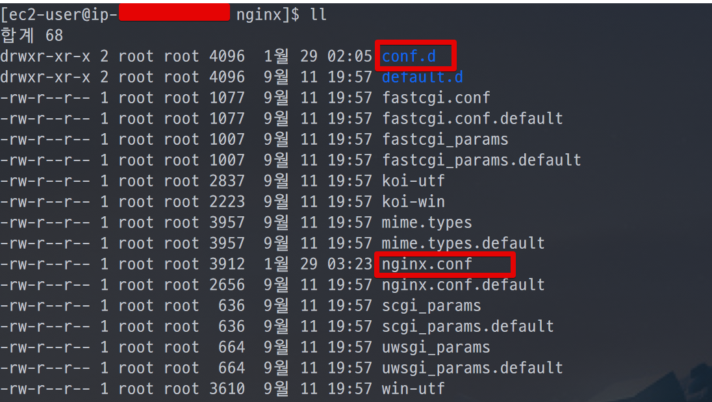

여기가 Nginx의 설정에 관련된 모든 정보가 담겨 있는 디렉토리입니다.  
Nginx 설정을 변경하고 싶으실때는 여기로 와서 수정하시면 됩니다.  
먼저 Nginx가 **동적으로 Proxy Pass를 변경**할수 있도록 설정을 수정하겠습니다.  
  

```bash
sudo vim /etc/nginx/nginx.conf
```

그리고 ```location /``` 부분을 찾아 아래와 같이 변경합니다.

```bash

          include /etc/nginx/conf.d/service-url.inc;
 
          location / {
                  proxy_pass $service_url;

```

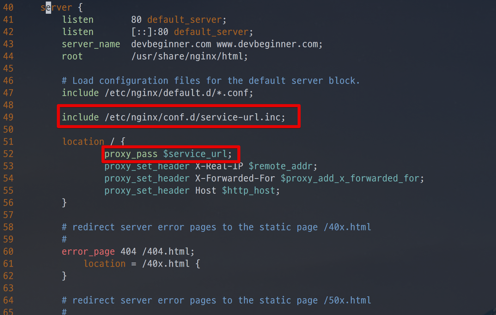

이 코드가 하는 일은 다음과 같습니다

* ```include /etc/nginx/conf.d/service-url.inc;```
  * service-url.inc 파일을 include 시킵니다.
  * Java로 치면 import 패키지와 같다고 보시면 됩니다.
  * 이렇게 할 경우 nginx.conf에서 **service-url.inc에 있는 변수들을 그대로 사용**할 수 있습니다.
* ```proxy_pass $service_url;```
  * service-url.inc에 있는 ```service_url``` 변수를 호출합니다.

자 그럼 service-url.inc 파일을 생성해보겠습니다.

```bash
sudo vim /etc/nginx/conf.d/service-url.inc
```

그리고 아래 코드를 입력합니다.

```bash
set $service_url http://127.0.0.1:8081;
```

저장하셨으면 변경 내용 반영을 위해 nginx restart를 실행합니다.

```bash
sudo service nginx restart
```

테스트를 위해 ```curl```을 수행해보면!

```bash
curl -s localhost/profile
```

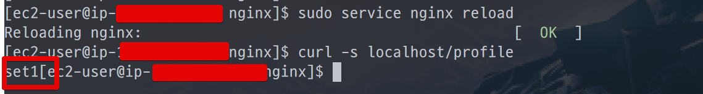

Nginx로 요청을 하면 set1로 Proxy가 가는것이 확인 됩니다!

### 7-3-5. Nginx 스크립트 작성

이제는 이렇게 동적 프록시 환경이 구축된 Nginx을 **배포 시점에 바라보는 Profile을 자동으로 변경**하도록 스위치 스크립트를 생성하겠습니다.

```bash
vim ~/app/nonstop/switch.sh
```

스크립트 내용은 아래와 같습니다.

```bash
#!/bin/bash
echo "> 현재 구동중인 Port 확인"
CURRENT_PROFILE=$(curl -s http://localhost/profile)

# 쉬고 있는 set 찾기: set1이 사용중이면 set2가 쉬고 있고, 반대면 set1이 쉬고 있음
if [ $CURRENT_PROFILE == set1 ]
then
  IDLE_PORT=8082
elif [ $CURRENT_PROFILE == set2 ]
then
  IDLE_PORT=8081
else
  echo "> 일치하는 Profile이 없습니다. Profile: $CURRENT_PROFILE"
  echo "> 8081을 할당합니다."
  IDLE_PORT=8081
fi

echo "> 전환할 Port: $IDLE_PORT"
echo "> Port 전환"
echo "set \$service_url http://127.0.0.1:${IDLE_PORT};" |sudo tee /etc/nginx/conf.d/service-url.inc

PROXY_PORT=$(curl -s http://localhost/profile)
echo "> Nginx Current Proxy Port: $PROXY_PORT"

echo "> Nginx Reload"
sudo service nginx reload
```

대부분의 스크립트는 ```deploy.sh```와 비슷해서 눈에 익으실텐데요.  
몇가지만 처음 보실것 같습니다.

* ```echo "set \$service_url http://127.0.0.1:${IDLE_PORT};" |sudo tee /etc/nginx/conf.d/service-url.inc```
  * ```set \$service_url http://127.0.0.1:${IDLE_PORT};```라는 문자열을 ```tee```명령어를 통해 출력과 ```/etc/nginx/conf.d/service-url.inc```에 쓰기를 함께 합니다.
  * 좀 더 자세한 설명은 [제타위키](https://zetawiki.com/wiki/%EB%A6%AC%EB%88%85%EC%8A%A4_tee,_%ED%99%94%EB%A9%B4%EA%B3%BC_%ED%8C%8C%EC%9D%BC%EC%97%90_%EB%8F%99%EC%8B%9C_%EC%B6%9C%EB%A0%A5%ED%95%98%EA%B8%B0)를 참고하세요! 

* ```sudo service nginx reload```
  * Nginx는 restart와 reload가 있습니다.
  * reload는 설정만 재적용하기 때문에 바로 적용됩니다. 
  * restart는 **Nginx 데몬 자체를 재실행**합니다.

저장하신뒤 ```switch.sh```에 실행권한을 줍니다.

```bash
chmod +x ~/app/nonstop/switch.sh
```

자 그럼 한번 스위치 스크립트를 실행해볼까요?  
먼저 현재는 set1만 실행된 상태인데 set2도 실행시키겠습니다.

```bash
~/app/nonstop/deploy.sh
```

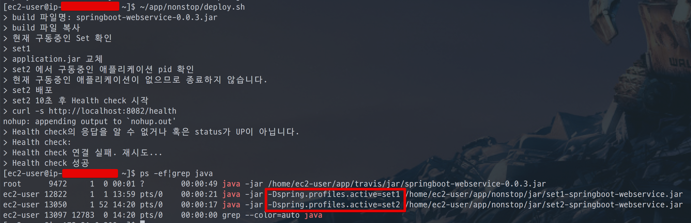

set1과 set2가 둘다 올라간 상태이고, 현재 Nginx는 set1을 보고 있습니다.  
이제 ```switch.sh```를 실행해보겠습니다.  
다운타임 없이 바로 전환되는지 확인하기 위해서 브라우저에서 바로 실시간으로 확인해보겠습니다.

```bash
~/app/nonstop/switch.sh
```

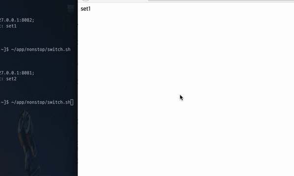

 ```switch.sh```도 기능이 정상적으로 작동되는게 확인됩니다!  
자 이제 그럼 ```deploy.sh```와 ```switch.sh```를 합쳐 ```deploy.sh```가 실행되면 다음으로 switch.sh가 자동으로 실행되도록 변경하겠습니다.

```bash
vim ~/app/nonstop/deploy.sh
```

스크립트 가장 하단에 다음의 코드를 추가합니다.

```bash
echo "> 스위칭"
sleep 10
~/app/nonstop/switch.sh
```

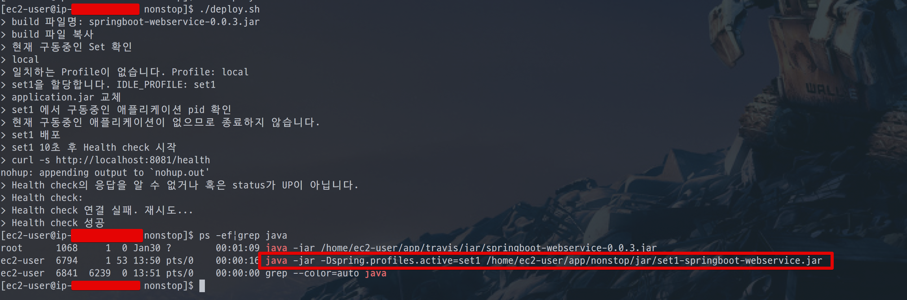

그럼 이제 ```deploy.sh```를 실행시키면 ```switch.sh```도 실행되는지 확인해보겠습니다.

```bash
~/app/nonstop/deploy.sh
```

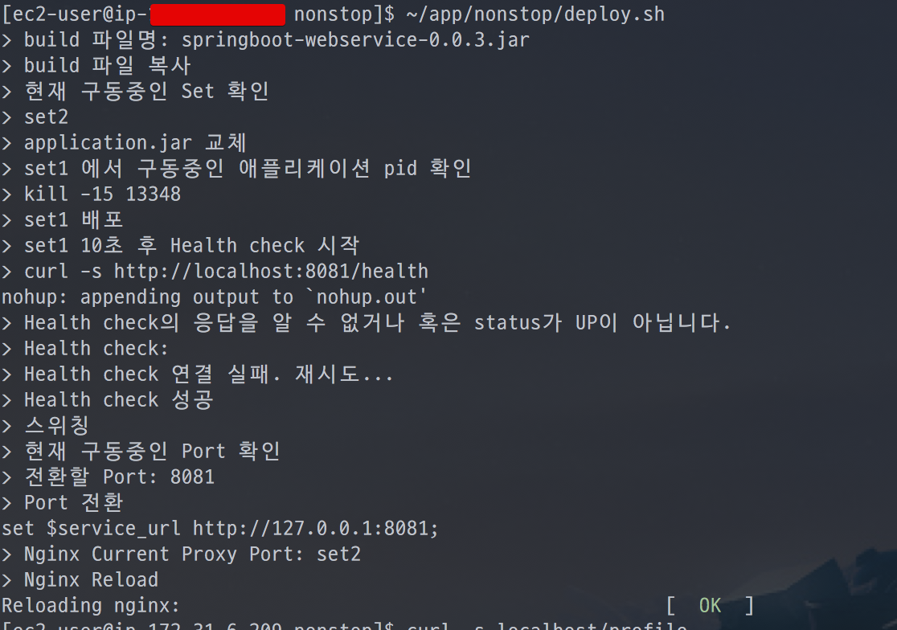

모든 스크립트 작업이 완료되었습니다!
이제 전체 배포 과정에 적용해서 테스트해보겠습니다!

## 7-4. 실제 배포에 적용

먼저 기존에 배포된 jar를 삭제합니다.  
(0.0.3 버전의 빌드파일을 제거합니다.)  

```bash
rm ~/app/nonstop/springboot-webservice/build/libs/*.jar
```

기존에 ```/travis```로 되어있는 배포 설정들을 변경합니다.  
프로젝트 폴더의 ```execute-deploy.sh``` 코드를 아래와 같이 변경합니다.

```bash
#!/bin/bash
/home/ec2-user/app/nonstop/deploy.sh > /dev/null 2> /dev/null < /dev/null &
```

* ```travis```로 잡혀있던 deplosy.sh 디렉토리를 nonstop으로 변경합니다.

그리고 프로젝트 폴더의 ```appspec.yml```도 아래와 같이 ```/nonstop/springboot-webservice/```로 변경합니다.


변경 사항을 좀 더 잘 확인하기 위해 ```build.gradle```과 ```main.hbs```를 아래와 같이 변경합니다.

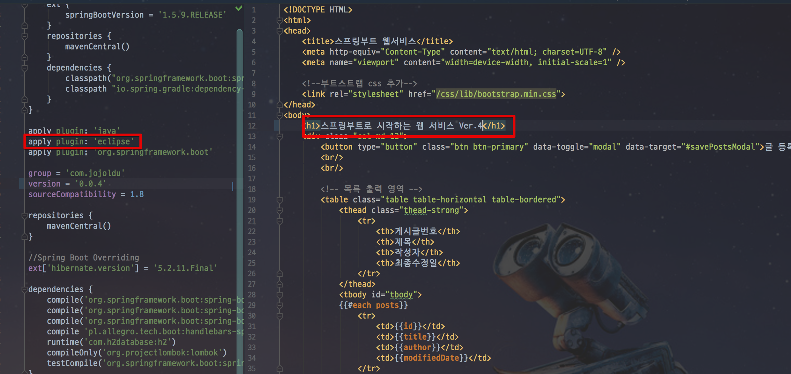

(좌측이 ```build.gradle```, 우측이 ```main.hbs```입니다.)  
  
자! 모두다 수정하셨으면 git commit & push를 실행합니다.  
브라우저를 열어 저희의 웹 사이트 주소로 접속해보시면!


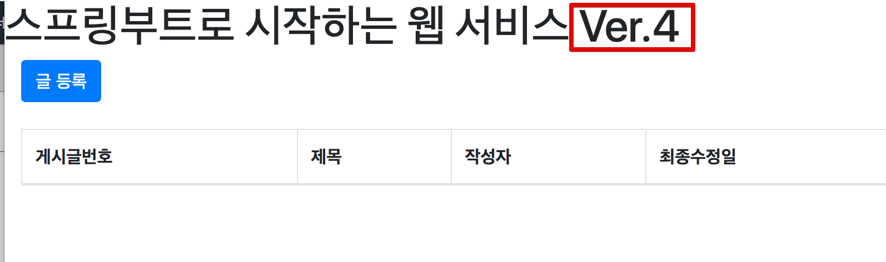

버전4로 정상적으로 전환되었습니다!  

## 마무리

어떠셨나요?  
이제 저희는 배포하는 과정속에서도 **서비스 중단 없이** 됩니다!  
굉장히 긴 과정이였는데 끝까지 와주셔서 감사합니다!  
다음 시간엔 본격적으로 운영 환경 설정을 진행하겠습니다!  
감사합니다!


