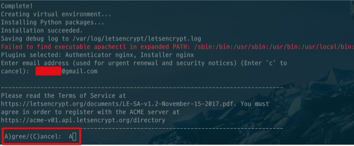

# 9. 도메인 구입 및 SSL 인증서 설치

이번 시간엔 지금까지 만든 프로젝트에 도메인을 연결해보겠습니다.
(모든 코드는 [Github](https://github.com/jojoldu/springboot-webservice/tree/feature/9)에 있습니다.)  

저는 회사에서도 구글 계정으로 모든 처리를 진행하고 있어 연습 삼아 구글 호스팅 서비스를 사용하겠습니다.  
다른 분들은 좀 더 저렴한 국내 서비스를 쓰셔도 됩니다.  
이번 과정부터는 **비용이 직접 청구되니** 당장 서비스하실게 아니라면 꼭 안하셔도 됩니다!
(준비물로 **Master** 혹은 **VISA 카드**가 하나 있어야 합니다.)

## 9-1. G Suite 가입

G Suite는 구글에서 제공하는 비지니스 서비스 입니다.  
회사에서 사용하기 위한 이메일과 도메인, 구글 앱스등을 제공하는데요.  
보통 회사에서 업무용 이메일을 구성원들에게 나눠주고, 회사내에서 사용할 문서들을 구글 드라이브에 올려서 사용하는 경우가 많은데요.  
이럴때 사용하는 서비스라고 보시면 됩니다.
여기서는 G Suite를 통해 비지니스 이메일 계정과 도메인 서비스를 이용하겠습니다.  
  
먼저 [링크](https://gsuite.google.com/intl/ko/)로 접속합니다.  
아래와 같이 G Suite의 메인 페이지에서 **무료평가판 시작**을 클릭합니다.


본인이 원하는 업체(서비스)이름을 등록하시고, 직원수는 1명으로 합니다.
(직원수에 따라 비용이 변경되니 최저인원인 1명을 선택하세요)


현재 사용중인 Email을 등록합니다.  
G Suite로 생성할 비지니스 이메일에 관련된 정보나 비용 청구서를 받아볼 계정이니 개인 계정을 등록하시면 됩니다.


현재 저희가 갖고 있는 도메인이 없기 때문에 우측을 선택합니다.  
만약 갖고 계신 도메인이 있다면 해당 도메인을 쓰시면 됩니다.  
여기선 G Suite에서 도메인 구입까지 한꺼번에 진행합니다.


저는 ```sprinboot-webservice.com```으로 도메인을 구매했습니다.  
이 글을 보시는 분들은 본인이 원하는 다른 도메인을 구매하시면 됩니다!  


우측 버튼을 클릭해서 검색하시면 아래와 같이 사용가능 여부와 비용이 함께 보입니다.  
선택한 도메인이 맞다면 **다음**을 클릭합니다.


업체 정보 입력란이 나오면,  
본인의 집 주소를 입력합니다.


본인 이름을 등록하시고


이제 사용하실 비지니스 이메일을 하나 생성합니다.  
보통 관리자 계정은 noreply 혹은 no-reply로 되어있기 때문에 저 역시 여기에선 noreply로 하겠습니다.  
이렇게 생성하시면 ```noreply@springboot-webservice.com```이란 이메일이 생성됩니다.


도메인 구매를 진행하는데요.  
보통 ```.com``` 도메인은 년간 12달러(즉, 한화 약 12,000원) 정도합니다.  
크게 부담스러운 금액은 아니지만, 혹시나 테스트만 하신다면 나중에 자동갱신을 취소하셔야 합니다.


약관에 동의하시고


결제할 카드 정보를 등록합니다.


개인 이메일 계정으로 도메인 구매 인증 메일이 도착했을테니 확인합니다.


이메일 주소가 인증되셨으면 다시 원래 G Suite 가입 페이지로 가보시면 확인 안내가 있습니다.  
**계속** 버튼을 클릭합니다.


자 그럼 저희가 G Suite를 통해 구매한 내역이 나옵니다.


G Suite 비지니스 계정은 현재 14일 무료평가판을 사용중이며, 도메인은 구매해서 년간 ```$12```로 청구될 예정입니다. (```$12```를 분할해서 매월 청구되는 방식입니다. 월 ```$1```가 되겠죠?)  
  
자 그럼 비지니스 이메일 계정이 잘 생성되었는지 확인해보겠습니다.  
브라우저를 열어 구매한 비지니스 계정으로 로그인해봅니다.


로그인이 잘 되네요!  
자 그럼 이메일 수신도 잘되는지 한번 테스트 해봅니다.  


개인 이메일로 방금 구매한 비지니스 이메일 계정에 테스트 메일을 발송해봅니다.  
그러면!


테스트 메일이 잘 도착합니다.  
즉, 앞으로 서비스를 운영하면서 외부와 이메일을 주고 받을때는 이 비지니스 계정으로 진행하시면 되겠죠?
자 그럼 이제 구매한 도메인을 AWS EC2에 연결해보겠습니다!

## 9-2. AWS Route 53 연결

먼저 AWS의 [Route53](https://console.aws.amazon.com/route53/home)으로 이동합니다.


좌측의 사이드바부터 시작해서 **Hosted zones** -> **Create Hosted Zone** -> 우측 사이드바의 **Domain Name**을 차례로 클릭 & 입력합니다.


자 그럼 차례로 도메인을 추가해보겠습니다.

### 9-2-1. EC2와 도메인 연결

Hosted Zone이 생성되었으면 해당 Hosted Zone을 클릭합니다.


그동안 배포해왔던 EC2 IP를 G Suite에서 구매한 도메인에 연결하겠습니다.  
[EC2](https://ap-northeast-2.console.aws.amazon.com/ec2/v2/home?region=ap-northeast-2#Instances:sort=desc:instanceId)의 EIP를 복사해서


**Create Record Set**을 클릭해 우측의 **Value**에 EIP를 붙여넣기 합니다.  
여기서 **Name에는 아무것도 입력하지 않습니다**.


Name에 아무것도 입력하지 않았기 때문에 ```springboot-webservice.com```이 EC2에 연결되었음을 알 수 있습니다.


하나더 추가해서 이번엔 ```www.springboot-webservice.com```을 연결하겠습니다.


그리고 Google에서 구매한 도메인의 Name Server를 AWS용으로 변경하겠습니다.  

> Tip)  
Name Server에 대한 좀 더 자세한 정보는 [생활코딩-네임서버](https://opentutorials.org/course/228/1455) 영상을 참고하시면 좋습니다!

Route53 페이지를 보시면 저희가 등록한 것 외에 생성된 2개 값이 있는데요.  
여기서 Type이 **NS** (Name Server)를 보시면 4개의 값들이 있습니다.  
이게 AWS Name Server입니다.  


이 값들을 복사해서 구글 도메인 서비스의 Name Server로 등록합니다.  
[구글 도메인](https://domains.google.com/registrar)으로 접속하시면 다음과 같은 화면이 노출되는데요.


**DNS**버튼을 클릭 하시면 다음과 같이 도메인에 대한 정보가 나옵니다.  


여기서 **맞춤 네임서버 사용**을 선택하셔서 Route53에 있던 Name Server정보를 하나씩 등록합니다.


자! 그리고 Name Server가 반영될 시간(약 1~2분) 기다리신뒤, 해당 도메인으로 접속해보시면!!


드디어 저희 서비스가 외부에 오픈되었습니다!

### 9-2-2. Google 이메일 연결


## 9-3. HTTPS 연결

### Let's Encrypt 설치

Nginx가 설치되었으니 우리 서비스의 보안을 위해 SSL 인증서를 설치하겠습니다. 

> Tip)  
HTTP와 HTTPS에 대한 차이점을 알고싶으신 분들은 [HTTP 프로토콜 - joinc](https://www.joinc.co.kr/w/Site/Network_Programing/AdvancedComm/HTTP#s-5.)를 참고하시거나 가장 추천하는 네트워크 교재인 [그림으로 배우는 HTTP & Network Basic](http://www.kyobobook.co.kr/product/detailViewKor.laf?barcode=9788931447897)를 읽어보시면  좋습니다!

예전에는 비용을 지불해서 유료 인증서를 구입했지만, 최근 오픈소스 인증서인 [Let's Encrypt](https://blog.outsider.ne.kr/1178)가 등장해서 무료로 HTTPS를 사용할수 있게 되었습니다.  
특히 Let's Encrypt 설치 및 업데이트를 쉽게 해주는 certbot이 등장해서 사용하기도 굉장히 수월해졌습니다.  

* [certbox](https://certbot.eff.org/#centosrhel6-nginx)
* [Amazon Linux에서 Certbot의 Let's Encrypt](https://docs.aws.amazon.com/ko_kr/AWSEC2/latest/UserGuide/SSL-on-an-instance.html#letsencrypt)

여기선 Amazon Linux 2017.09 버전의 EC2로 진행됩니다.  
만약 본인의 서버 혹은 EC2의 버전이 다르시다면 위 링크를 참고해서 설치를 진행하셔도 됩니다.  
  
먼저 EC2의 Fedora 프로젝트로부터 EPEL(Extra Packages for Enterprise Linux) 저장소를 활성화합니다. EPEL의 패키지는 Certbot 설치 스크립트를 실행할 때 필요합니다.

```bash
sudo yum-config-manager --enable epel
```

Certbot 최신버전을 다운로드 합니다.

```bash
wget https://dl.eff.org/certbot-auto
```

다운로드가 다 되셨으면 설치 파일에 실행권한을 줍니다.

```bash
chmod a+x certbot-auto
```

sudo로 ```--debug``` 옵션을 주어 설치파일을 실행합니다.

```bash
sudo ./certbot-auto --debug
```

"Is this ok [y/d/N]"가 나오면 "y"를 입력하고 기다립니다.  
"Enter email address (used for urgent renewal and security notices)"가 나오면 Email 주소를 입력하라는 메세지이니, 본인의 Email주소를 입력하시면 됩니다.
"(A)gree/(C)ancel"가 나오면 Let's Encrypt 서비스 계약 조건에 동의여부를 묻는것이니, A를 입력합니다. (동의)  



AWS에서

```bash
sudo vi /etc/nginx/nginx.conf
```

```bash
sudo nginx -t
```

```bash
sudo service nginx reload
sudo service nginx stop
```

```bash
wget https://dl.eff.org/certbot-auto
chmod a+x certbot-auto
sudo ./certbot-auto --nginx
```

### Let's Encrypt 인증서 갱신

```bash
crontab -e
```

```bash
# Begin Let's encrypt renew
0 4 1 */3 * /bin/bash -l -c '/home/ec2-user/certbot-auto renew --quiet --no-self-upgrade'
# End Let's encrypt renew
```

### 인증서 갱신 중 오류 발생시

```bash
sudo rm -rf /root/.local/share/letsencrypt/
sudo rm -rf /opt/eff.org/certbot/
```

```bash
/home/ec2-user/certbot-auto renew -v --debug
```

## 참고

* [Email 연결](https://blog.andrewray.me/setting-up-gsuite-gmail-custom-domains-with-aws-route53/)
* [Amazon Linux에서 Certbot의 Let's Encrypt](https://docs.aws.amazon.com/ko_kr/AWSEC2/latest/UserGuide/SSL-on-an-instance.html#letsencrypt)

